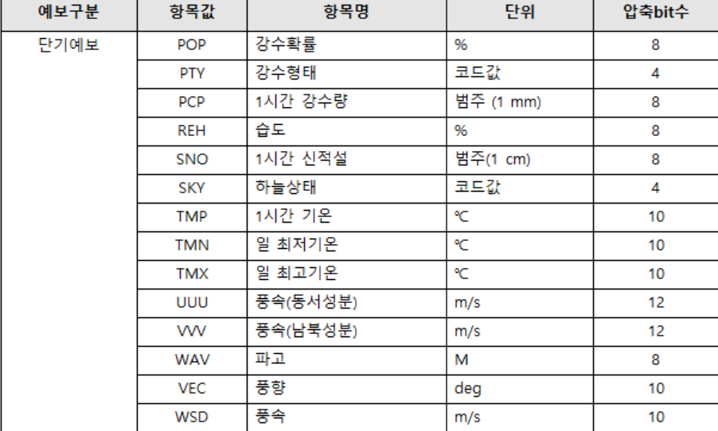
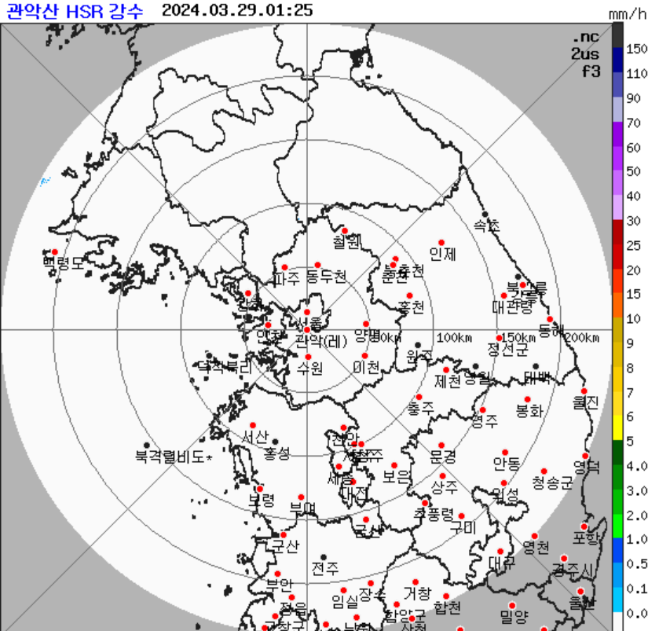
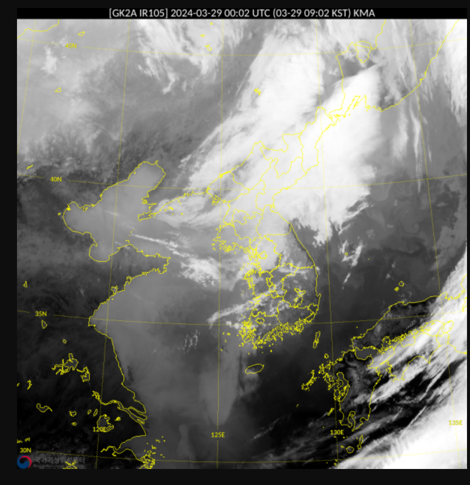
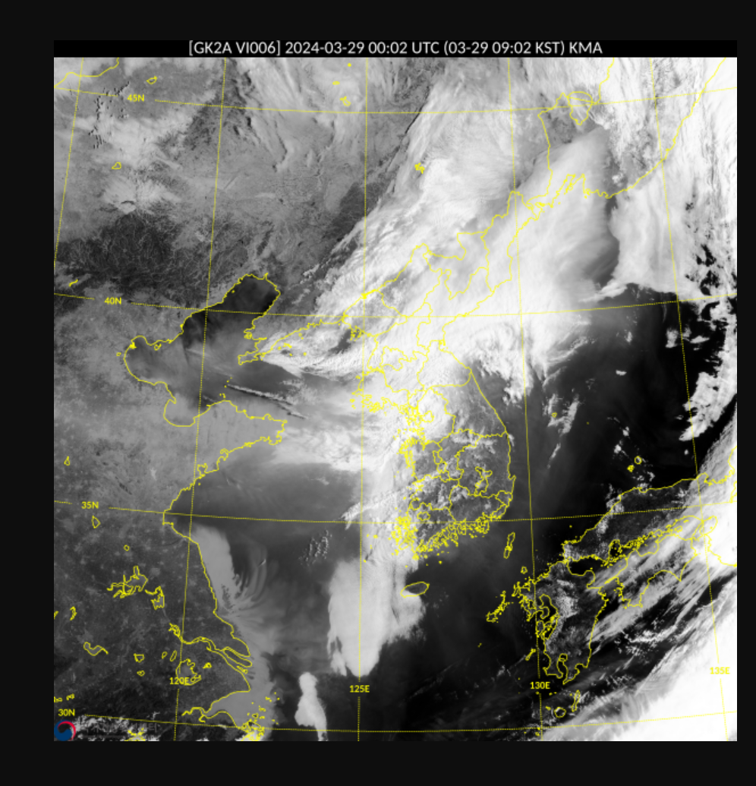
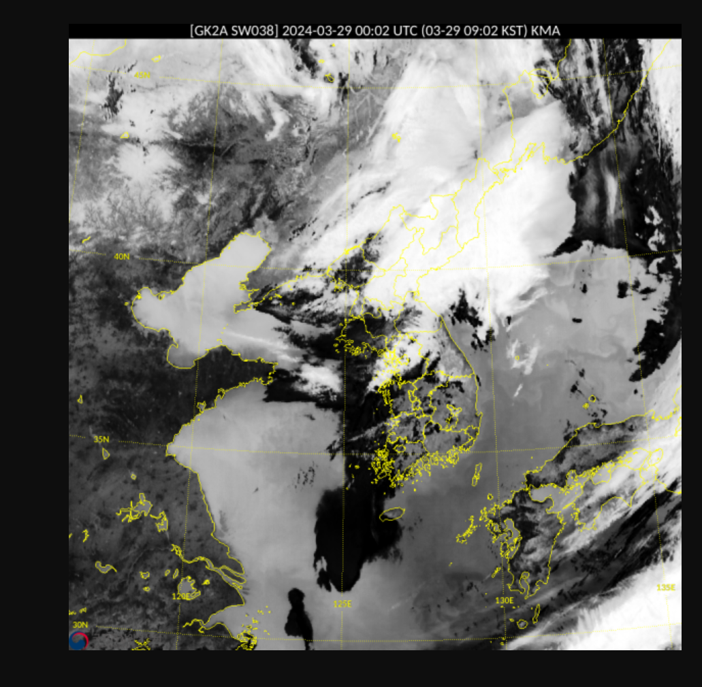
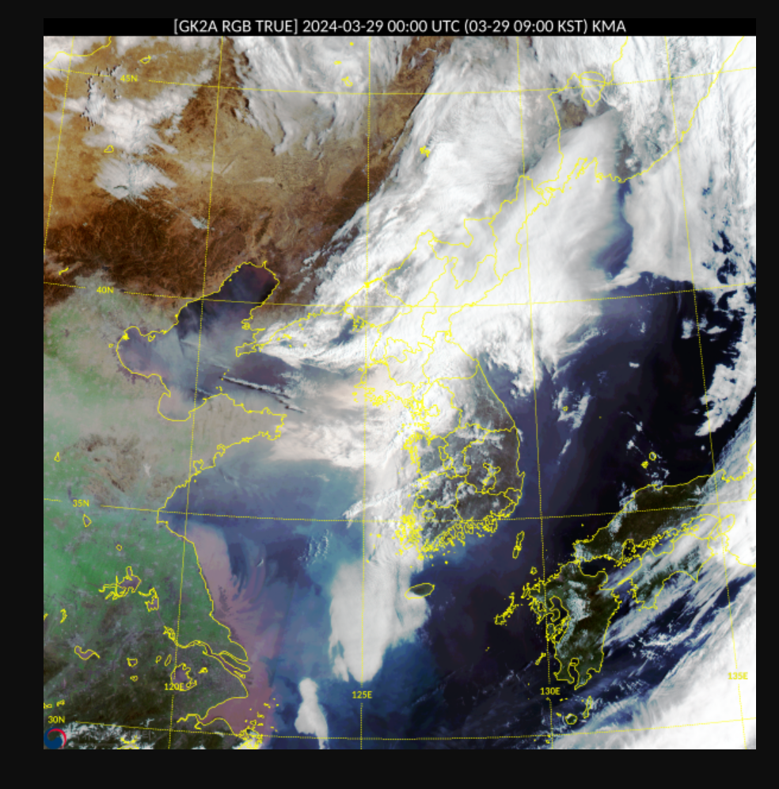
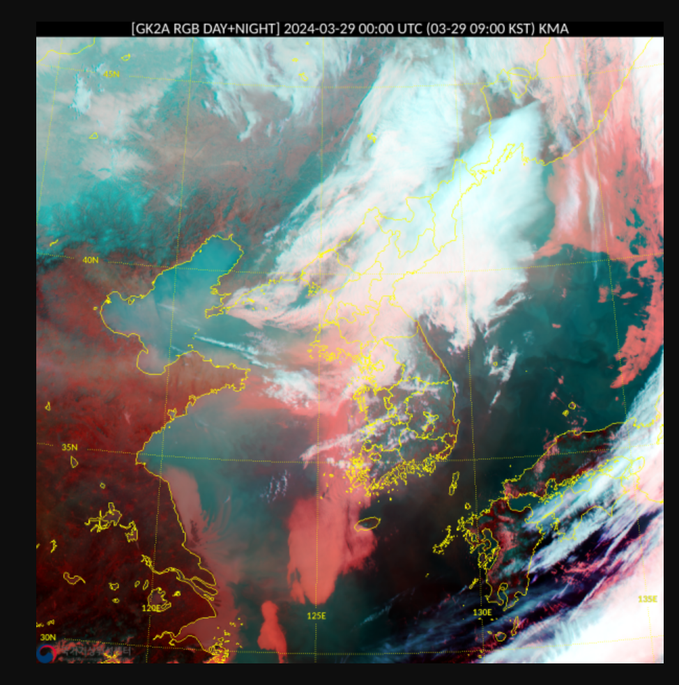
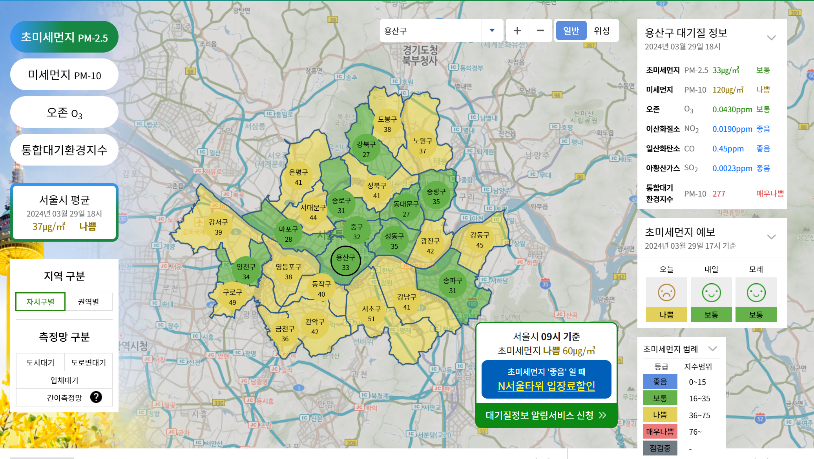

# `API` 정보

공공 데이터 포탈 : https://www.data.go.kr/index.do

> 기상청 API 허브를 사용 할 수도 있었으나 해당 사이트는 `CORS` 로 인해 로컬 개발 환경에서 프록시 서버를 이용해야 했으며
> 중요한 것은 데이터를 `JSON` 형태로 받아오는 것이 불가능했다.
>
> > 방법이 있을 수 있었으나 사이트를 아무리 찾아봐도 해당 내용이 존재하지 않았다.

이에 개발이 편한 공공 데이터 포탈을 이용하도록 하자.

# 사용 할 `API` 주소 목록

## 기상청\_단기예보 조회 서비스

https://www.data.go.kr/data/15084084/openapi.do

### 제공 데이터



## 기상청\_지상(종관 , ASOS) 일자료 조회 서비스

https://www.data.go.kr/data/15059093/openapi.do

### 제공 데이터

양이 너무 많아 첨부 할 수 없다.

하지만 다양한 기상청 별로 관측한 **전 날** 까지의 기상 정보를 자세한 내용으로 알려준다.

## 기상청\_기상특보 조회 서비스

https://www.data.go.kr/data/15000415/openapi.do

### 기상속보조회

```json
{
  "response": {
    "header": {
      "resultCode": "00",
      "resultMsg": "NORMAL_SERVICE"
    },
    "body": {
      "dataType": "JSON",
      "items": {
        "item": [
          {
            "stnId": "108",
            "tmFc": 202403291710,
            "tmSeq": 74,
            "ann": "\u003C황사 현황과 전망\u003E\n○ (현황) 최근 내몽골고원 부근에서
             발원한 황사가 북서풍을 타고 유입되어,
              현재(17시) 동쪽 지역을 중심으로 황사가 관측되는 곳이 있고
              ....
            "cnt": 4
          }
```

처럼 일자를 기준으로 시간 별 기상 특보에 대한 정보를 제공함

카드 뉴스 처럼 유용하게 쓸 수 있을 것이라 생각됨

### 특보 현황 조회

```json
{
  "response": {
    "header": {
      "resultCode": "00",
      "resultMsg": "NORMAL_SERVICE"
    },
    "body": {
      "dataType": "JSON",
      "items": {
        "item": [
          {
            "other": "o 없음",
            "t6": "o 강풍주의보 : 강원도(강릉평지, 동해평지, 태백, 삼척평지, 속초평지,
             고성평지, 양양평지, 정선평지, 강원북부산지, 강원중부산지, 강원남부산지),
              충청북도(영동, 제천, 단양), 전라남도(여수, 거문도.초도) ..
            "t7": "o 없음",
            "tmEf": "202403291800",
            "tmFc": 202403291600,
            "tmSeq": 237
          }
        ]
      },
      "pageNo": 1,
      "numOfRows": 10,
      "totalCount": 1
    }
  }
}
```

다음처럼 주의보를 기점으로 관련된 텍스트 문서를 제공함

이 또한 카드뉴스처럼 사용하기 좋을 것으로 생각됨

## 관광코스별 관광지 상세 날씨 조회 서비스

https://www.data.go.kr/data/15056912/openapi.do

시군구별관광기후지수조회는 시군구 아이디를 통해 해당 시군구의 관광기후지수를 조회하는 것이 가능함

동네예보조회는 관광 코스ID 에 따라 관광지에 대한 날씨를 알려줌

## 기상청\_생활기상지수 조회서비스

https://www.data.go.kr/data/15085288/openapi.do

## 기상청\_레이더영상 조회 서비스

https://www.data.go.kr/data/15056924/openapi.do

조회 시 레이더 영상의 주소가 담긴 `JSON` 파일을 주며 이미지 파일은 다음과 같이 생김



## 기상청\_위성영상 조회 서비스

https://www.data.go.kr/iim/api/selectAPIAcountView.do

이건 좀 쓸만하다.

적외영상 , 가시영상 , 수증기영상 , 단파적외선양상 , RGB 컬러 , RGV주야간합성 등의 파라미터를 사용 가능

- 적외영상
  
- 가시영상
  
- 수증기 영상
  
- RGB 컬러
  
- RGB 주야간 합성
  

## 기상청\_레이더관측좌료 조회 서비스

- 얘는 미세먼지 영상 데이터를 제공 안한다.

https://cleanair.seoul.go.kr/?area=111131&type=pm25

그런데 서울특별시 대기환경정보를 보니

지도에다가 미세먼지 정도에 따라 대시보드를 표현하는게 이쁜거 같다.



이 부분은 나중에 개발해보도록 해야겠다. 파이썬에선 해봤는데 리액트로도 해봐야지
