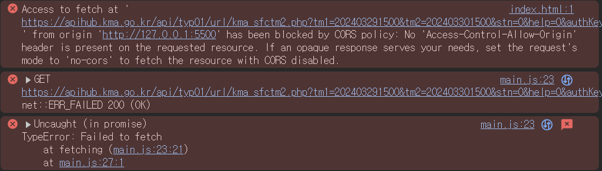
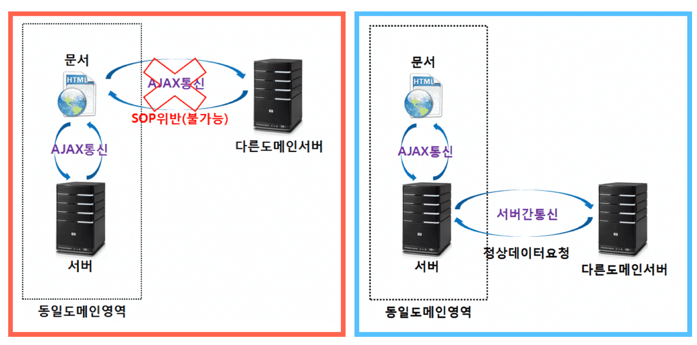

# Problem : LocalHost 환경에서 `CORS` 문제

## 문제 정의

```js
const fetching = async (domain, params) => {
  const urlParams = makeUrlParams(params);

  const res = await fetch(domain + urlParams);
};

fetching(ASOS_DOMAIN, params);
```



로컬 호스트 개발 환경에서 직접 공공 `API` 를 `fetching` 해오려 하니 `CORS` 문제가 발생했다.



이는 서버간 통신에서는 `CORS` 정책이 작동하지 않으나 직접 문서와 공공 API 서버 간의 통신은

`CORS` 정책으로 인해 정보 공유가 불가능하기 때문이다.

## 문제 해결 과정

배포 전 `localhost` 개발 환경에서 개발하기 위해서는 다음과 같은 순서를 밟아야 한다.

1. 같은 도메인 주소인 서버 (이하 서버 로컬호스트)를 `express` 를 이용해 개설한다.
2. 같은 도메인 주소인 웹 페이지 (이하 클라이언트 로컬호스트) 가 공공 `API` 에게 직접적으로 요청을 보내는 것이 아니라 서버 로컬 호스트에게 요청을 보내도록 한다.
3. 서버 로컬 호스트는 클라이언트 로컬 호스트의 요청을 공공 API 에게 전송하고 응답 값을 클라이언트 로컬 호스트에게 전송한다.

### 개발 환경에서 사용 할 서버 로컬 호스트 개설하기

`/server` 폴더를 만들어 주고 서버 로컬 호스트를 `express` 를 이용해개설해준다.

```js
const express = require('express');
const cors = require('cors');
const app = express();
const PORT = 8888;

app.use(express.json()); // application/json parsing
app.use(express.urlencoded({ extended: true })); // parsing
app.use(cors()); // CORS middle ware

app.listen(PORT, (req, res) => {
  console.log(`Server is running on http://localhost:${PORT}`);
});

app.get('/', (req, res) => {
  res.send('Hello world');
});
```

> ### 중단

---

# 문제 해결 결과

`express` 로 프록시 서버를 개설하였으나

기상처 허브 API주소가 아닌 공공데이터 포탈에서 데이터를 가져오니 `CORS` 문제가 발생하지 않았다.

기존 작성했던 프록시 서버 데이터는 삭제해야겠다.
