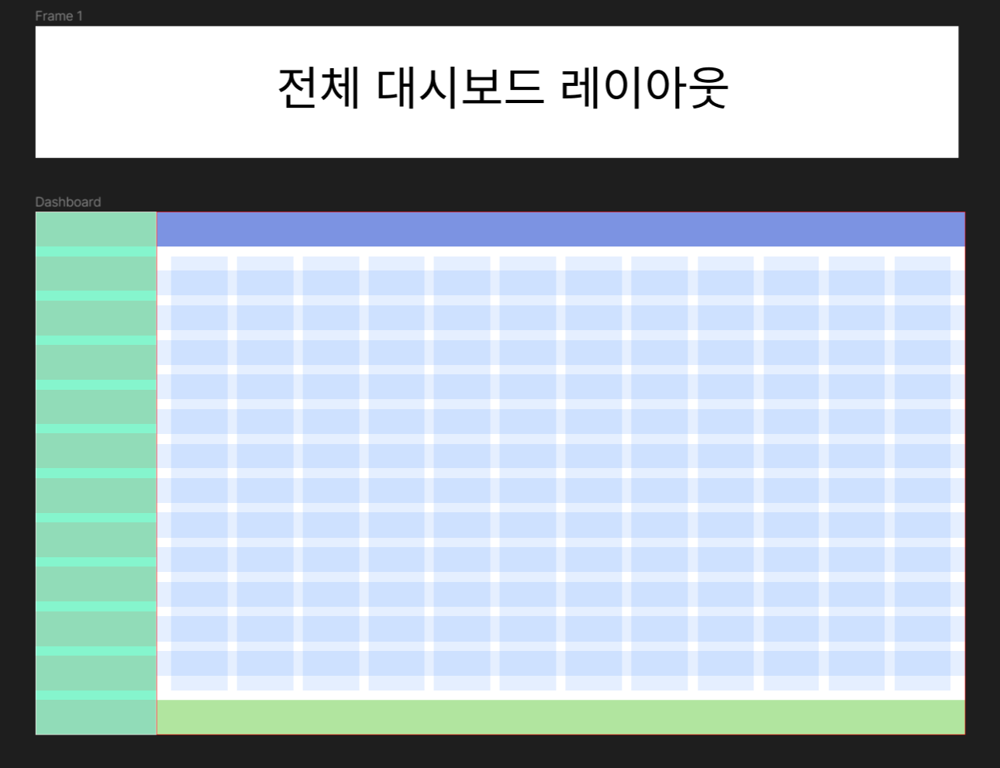
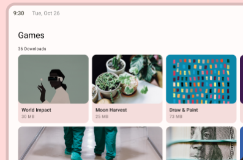
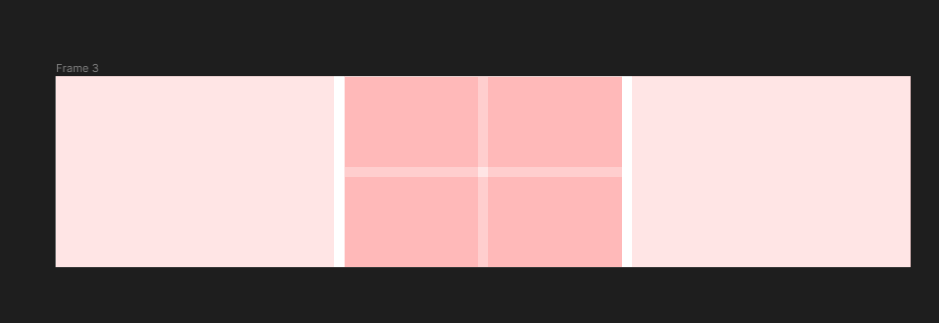
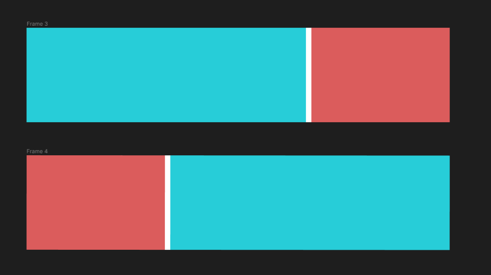
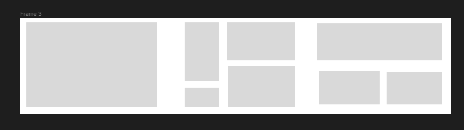

# 대시보드 레이아웃 잡기

피그마를 이용해 대시보드의 레이아웃을 잡자

`Layout Grid` 를 이용해 구간을 잡아주자

참고 강의 영상 : https://www.youtube.com/watch?v=oE3m1vD-CSA

> ### 용어 정리
>
> 피그마에선 `column , gutter , margin , container` 언어를 이용한다.
> `gutter` 는 `column` 사이 간의 간격을 의미한다.

# `Breakpoint system`


`MATERIAL DESIGN` 에서 제시하는 브레이크 포인트 시스템을 통해 레이아웃을 구성 할 수 있다.

우선 나는 반응형 웹페이지는 나중에 할 것이기 때문에 거대한 데스크탑 기준으로

`12 column` 을 기준으로 레이아웃을 우선 잡아주자

디자인 시스템은 잘 모르기 때문에 최대한 지피티의 목을 졸라 디자인 시스템을 잡아보자

# 전체적인 레이아웃



1920 \* 1080 사이즈를 기준으로 생성하였다.

전체 대시보드를 우선 두 가지 영역으로 나눠주었다.

- `Sidebar` : 250 \* 1080
- `Content` : 1670 \* 1080

이후 `Content` 영역을 `Header , Main , Footer` 로 나눠 주었다.

- `Header` : 1670 \* 72
- `Main` : 1670 \* 896
- `Footer` : 1670 \* 72

다음과 같은 비율이 나온 이유는 `Content` 영역의 `12 layout` 을 `Gutter : 24,  Margin : 30` 으로 하여 하나의 `Layout` 만큼을 `Header , Footer` 에 할당하고

나머지 영역을 `Main` 에게 할당해주었다.

레이아웃 비율에 맞춰 카드 컴포넌트를 감싸줄 합성 컴포넌트 (`Wrapper Component`) 와 카드 컴포넌트들을 만들어보기 전

실제 저 비율이 어떤 모습일지 간단하게 퍼블리싱을 통해 만들어보자


괜찮은 것 같다.

```css
* {
  margin: 0px;
  padding: 0px;
}

div {
  box-sizing: border-box;
}

body {
  width: 100vw;
  height: 100vh;
  display: flex;
}

.side-bar {
  width: 13vw;
  height: 100%;
  border: 1px solid black;
  background-color: aquamarine;
}

.content {
  width: calc(100vw - 13vw);
  height: 100%;
  border: 1px solid black;
}

.header,
.footer {
  height: 6.6vh;
  border: 1px solid black;
  background-color: green;
}

.header {
  background-color: blue;
}

.main {
  height: calc(100vh - 13.3vh);
  border: 1px solid black;
  background-color: skyblue;
  padding: 3.34vh;
}

.content-main {
  height: 100%;
  background-color: burlywood;
}
```

대충 스타일은 이렇게 했다.

> - 현재는 단순하게 `div` 태그를 이용해서 뚝딱거렸지만 실제로 할 떄는 시멘틱태그를 적절하게 이용는 것이 목표다.
> - 레이아웃에서 황토색이 있는 부분은 카드들이 들어갈 영역이다.

# 카드 컴포넌트 랩퍼 레이아웃 고민하기

카드들을 어떻게 배치 할지 생각해봐야 한다.

카드 배치에 대한 아이디어를 얻기 위해 구글링 중

<a href = 'https://m3.material.io/components/cards/guidelines'>m3.material.io</a> 에서 카드에 대한 다양한 아이디어를 볼 수 있었다.


카드 배치를 수직적으로 배치 할 것인지



아니면 수평적 형태로 배치 할 것인지를 결정해야 카드를 감쌀 랩퍼 컴포넌트를 결정 할 수 있을 것 같다.

두 배치 방식의 장단점을 생각해보자

### 수직적 배치 장,단점

**장점**

- 랩퍼 컴포넌트의 구현이 간단하다. 그저 수직으로 사용 할 랩퍼 컴포넌트의 `width` 만 정해주고 안에 내용을 담은 컴포넌트를 담아주면 된다.
- **빠른 시간에 많은 양의 정보를 보여주는 것** 이 간단할 것 같다. 카드 컴포넌트들을 수직적 배치로 배치하는 가장 대표적인 사이트인 핀터레스트의 경우를 보면 핀터레스트는 관심사 별 여러 카드 컴포넌트들을 수직적으로 배치하여 빠르게 스크롤 하며 카드들을 확인 할 수 있게 한다.

  > 
  > 예를 들면 이런 식이다

- 내부에 담긴 컴포넌트들의 `width` 만 고정시켜주면 카드들의 `height` 에는 신경 쓸 필요가 없으므로 다양한 형태의 카드들을 사용하는 것이 가능하다.

**단점**

- 단점으로는 정보를 **보여주는 것** 에는 효과적이지만 정보 전달 측면에선 효과적이지 않다. 주로 우리는 정보를 읽을 때 왼쪽에서 오른쪽으로 책을 읽듯 정보를 습득하는데 카드들의 수평적 배치가 정렬되지 않은 상태에선 정보를 확인하는 것이 힘들다.

### 수평적 배치 장,단점

**장점**

- 내부 카드 컴포넌트들을 **수평적으로 정렬 시켜 정보를 효과적으로 전달 하는 것이 가능** 하다.
- 수평적으로 높이가 정렬된 카드들의 모습은 통일감 있는 모습을 보여준다.

**단점**

- 랩퍼 내부의 카드들은 모두 동일한 높이를 가져야 한다. (만일 랩퍼 내부의 카드들의 높이가 모두 다르다면 빈공간들이 생겨 미관상 좋지 않다.)
- 수직적 배치에 비해 구현 상 생각해야 할 것들이 많다.
  
  예를 들어 3장의 카드를 수평적으로 배치하던 중 두 번째 카드는 4개의 카드를 격자 형태로 배치한 카드를 사용하고 싶다고 한다면 두 번째 카드 내부의 카드들의 사이즈는 어떻게 할 것인지도 생각해야 한다.

  
  또한 만약 두 장의 카드를 배치 할 것인데 카드들의 너비 비율이 다르다면 어떻게 할 것인지 ?

  > 카드들의 너비를 모두 통일 시켜버리는 것이 구현하기에는 쉬울 수 있지만 그러면 재미 없을 것 같다.
  > 그리고 주 목표는 **수정에 용이한 컴포넌트 디자인 패턴** 을 연습해보는 것이니 다양한 경우의 수를 유동적으로 받을 수 있는 해결법을 도출해보는걸 목표로 해보자

  등등 신경써야 할 부분이 수직적 배치에 비해 많다.

### 내가 고른 배치 방식

10분정도 고민해봤는데 두 배치를 함께 써보려고 한다. 격자 형태로 말이다.



기본 레이아웃은 수평적 배치를 통해 맞춰주고 내부에서 **1 가지 이상의 배치 형태를 중첩 가능하게 사용 할 수 있게** 해야겠다.

이러면 전체적으로 통일감을 줄 수 있을 뿐더러 배치가 단순한 느낌을 주지 않을 것이다.

# 랩퍼 컴포넌트들을 어떻게 구성 할 것인지에 대한 생각

1. 랩퍼 컴포넌트는 **수평적 배치 , 수직적 배치** 들이 가능하도록 해야겠다.
   1.1 하지만 가장 외부에 존재하는 컴포넌트는 수평적 배치로 이뤄진 랩퍼 컴포넌트여야 한다.
   1.2 내부에서 랩퍼 컴포넌트는 1번만 사용 가능하도록 해야겠다.
   <br/>
2. 랩퍼 컴포넌트의 높이는 3가지로 해야겠다. 비율 정도는 확실하게 하지 않았지만 우선 부모 영역의 `30 , 50 , 70 %` 로 하고 프로토타입을 만들어봐야겠다.
   <br/>
3. **랩퍼 컴포넌트에서 카드의 너비를 결정해주도록 하자**. 이를 통해 카드를 디자인 할 때 다양한 크기의 `width` 버전의 카드들을 만들어 둘 필요가 없을 것이다. (그냥 랩퍼 컴포넌트에서 카드를 배치 할 때 크기를 결정해버리면 된다.)
   <br/>
4. 랩퍼 컴포넌트의 `gutter` 는 (`css 에선 flex-gap`) 비율로 정의해주도록 하고 모든 랩퍼 컴포넌트의 `gutter` 비율은 하나로 통일 시켜주자
