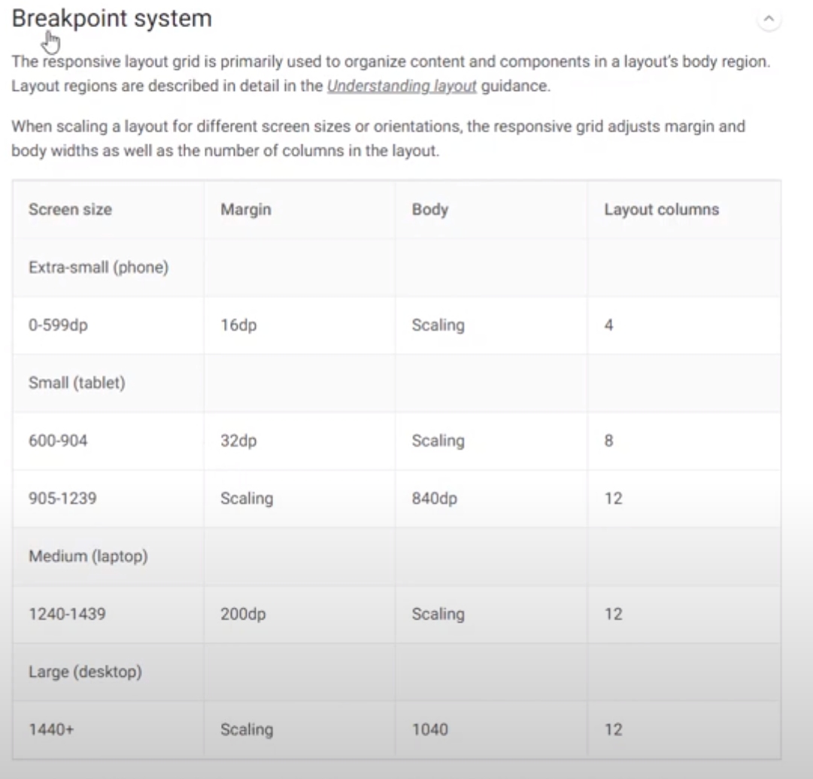
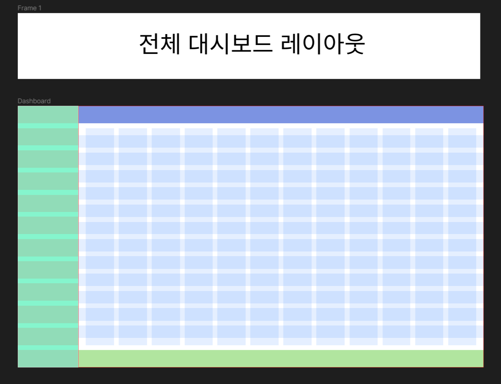
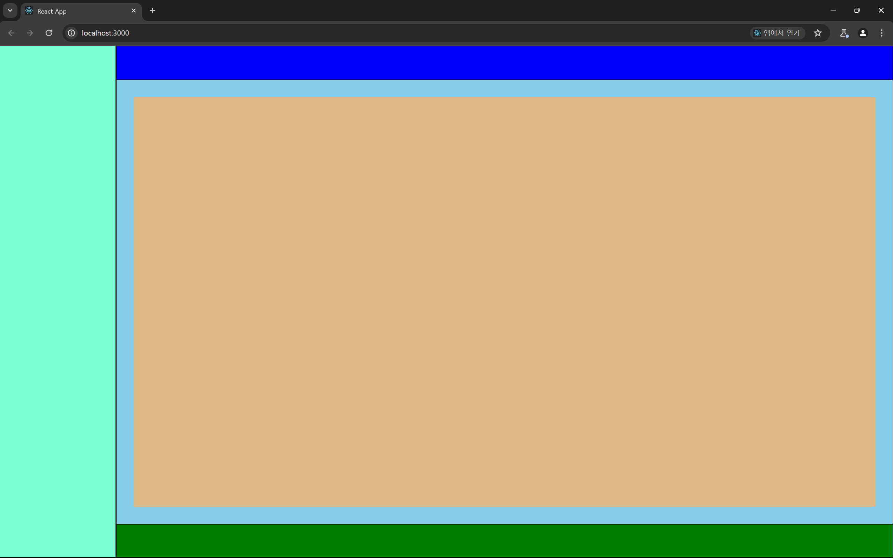

# 대시보드 레이아웃 잡기

피그마를 이용해 대시보드의 레이아웃을 잡자

`Layout Grid` 를 이용해 구간을 잡아주자

참고 강의 영상 : https://www.youtube.com/watch?v=oE3m1vD-CSA

> ### 용어 정리
>
> 피그마에선 `column , gutter , margin , container` 언어를 이용한다.
> `gutter` 는 `column` 사이 간의 간격을 의미한다.

# `Breakpoint system`



`MATERIAL DESIGN` 에서 제시하는 브레이크 포인트 시스템을 통해 레이아웃을 구성 할 수 있다.

우선 나는 반응형 웹페이지는 나중에 할 것이기 때문에 거대한 데스크탑 기준으로

`12 column` 을 기준으로 레이아웃을 우선 잡아주자

디자인 시스템은 잘 모르기 때문에 최대한 지피티의 목을 졸라 디자인 시스템을 잡아보자

# 전체적인 레이아웃



1920 \* 1080 사이즈를 기준으로 생성하였다.

전체 대시보드를 우선 두 가지 영역으로 나눠주었다.

- `Sidebar` : 250 \* 1080
- `Content` : 1670 \* 1080

이후 `Content` 영역을 `Header , Main , Footer` 로 나눠 주었다.

- `Header` : 1670 \* 72
- `Main` : 1670 \* 896
- `Footer` : 1670 \* 72

다음과 같은 비율이 나온 이유는 `Content` 영역의 `12 layout` 을 `Gutter : 24,  Margin : 30` 으로 하여 하나의 `Layout` 만큼을 `Header , Footer` 에 할당하고

나머지 영역을 `Main` 에게 할당해주었다.

레이아웃 비율에 맞춰 카드 컴포넌트를 감싸줄 합성 컴포넌트 (`Wrapper Component`) 와 카드 컴포넌트들을 만들어보기 전

실제 저 비율이 어떤 모습일지 간단하게 퍼블리싱을 통해 만들어보자



괜찮은 것 같다.

```css
* {
  margin: 0px;
  padding: 0px;
}

div {
  box-sizing: border-box;
}

body {
  width: 100vw;
  height: 100vh;
  display: flex;
}

.side-bar {
  width: 13vw;
  height: 100%;
  border: 1px solid black;
  background-color: aquamarine;
}

.content {
  width: calc(100vw - 13vw);
  height: 100%;
  border: 1px solid black;
}

.header,
.footer {
  height: 6.6vh;
  border: 1px solid black;
  background-color: green;
}

.header {
  background-color: blue;
}

.main {
  height: calc(100vh - 13.3vh);
  border: 1px solid black;
  background-color: skyblue;
  padding: 3.34vh;
}

.content-main {
  height: 100%;
  background-color: burlywood;
}
```

대충 스타일은 이렇게 했다.

> - 현재는 단순하게 `div` 태그를 이용해서 뚝딱거렸지만 실제로 할 떄는 시멘틱태그를 적절하게 이용는 것이 목표다.
> - 레이아웃에서 황토색이 있는 부분은 카드들이 들어갈 영역이다.

# 카드 컴포넌트 랩퍼 레이아웃
