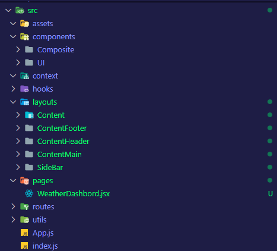

# 폴더 구조 잡기

## 문제를 알아차리기 전 생각

리액트 공식문서에서는 폴더 구조를 생각하는데 5분 이상 쓰지 말라고 한다.

그런데 나는 1시간 넘게 썼다.

맨 처음에는 페이지 별로 다른 내용이 담긴 대시보드를 만들려고 하니

폴더를 **전체 공유 자료가 담긴 폴더와 페이지-페이지별 폴더** 이런 식으로 나눈 후

두 폴더들에 동일하게 `components , layout , hooks , utils , assets ... ` 등등을 넣어줬었다.

이렇게 넣으려고 했던 이유는 해당 페이지에서만 사용하는 데이터들이 존재 할 텐데

그 데이터를 한 폴더 안에 넣어두면 관리가 힘들지 않을까 ? 라는 생각때문이였다.

그리고 `components` 는 `atomic` 패턴을 사용할까 ? 하고 `atoms , molecules , organisms , templates` 폴더 별로 다 만들어줬었다.

```
│  └─ src
│     ├─ App.js
│     ├─ index.js
│     ├─ pages
│     │  ├─ Home
│     │  │  ├─ components
│     │  │  │  ├─ layout
│     │  │  │  └─ UI
│     │  │  │     ├─ atoms
│     │  │  │     ├─ composite
│     │  │  │     ├─ molecules
│     │  │  │     └─ organism
│     │  │  ├─ Home.module.css
│     │  │  └─ HomePage.js
│     │  └─ WeatherDashboard
│     │     ├─ components
│     │     │  ├─ layout
│     │     │  │  ├─ footer.jsx
│     │     │  │  ├─ header.jsx
│     │     │  │  └─ main.jsx
│     │     │  └─ UI
│     │     │     ├─ atoms
│     │     │     ├─ composite
│     │     │     ├─ molecules
│     │     │     └─ organism
│     │     ├─ Dahsboard.module.css
│     │     ├─ DashboardPage.js
│     │     └─ utils
│     ├─ routes
│     │  └─ router.js
│     └─ shared
│        ├─ layout
│        │  ├─ Composite
│        │  └─ UI
│        └─ utils
```

> 폴더들끼리 계층 구조를 잘 나눈 것만 같아서 만족스러웠었다.

## 문제를 알아차림

### 폴더 구조가 너무 깊어지기 쉬운 구조

그런데 생각해보면 한 페이지 폴더에서 또 다른 생길 수 있는거 아닌가 ?

그럼 페이지의 페이지 폴더가 생성되면 이런 계층 구조가 중첩되어 쌓이게 된다.

그러면 하나의 페이지가 생성 될 때 마다 폴더의 깊이와 무게가 너무 깊어질 거 같았다.

### 폴더 구조가 깊어지고 뚱뚱해질 수록 어디에 저장해야 할지 더 헷갈린다.

처음에 저런 폴더 구조를 이용해서 일단 진행해보려고 사이드 바 컴포넌트를 하나 딱 만들려고 하는 순간

**아..사이드바 컴포넌트는 어디에 만들어야 하지? 사이드바에 들어갈 링크 컴포넌트는..?**

이런 폴더 구조에 생각이 머리 속을 스쳤다.

이렇게 시작 할 때 부터 고민인데 나중에 진행되다보면 풀지 못할 정도로 복잡해지는게 아닐까 ? 하는 생각이 머리를 강타했다.

### 깊은 계층 구조가 필요한 만큼 프로젝트가 복잡한가 ?

생각해보면 내가 지금 만들 예정인 프로젝트에서 컴포넌트를 만들어봤자 몇 개나 만들까 생각해봤다.

아무리 많아봤자 30개 남짓 일 것 같더라

그래서 그냥 다 집어치우고 모듈식 폴더구조로 돌아왔다.

## 모듈식 폴더 구조로 회귀



계층적 구조를 최대한 제거하고 평평하게 만들어줬다.

일단은 이렇게 단순하게 해보고 어떤지 한 번 느껴봐야겠다.
