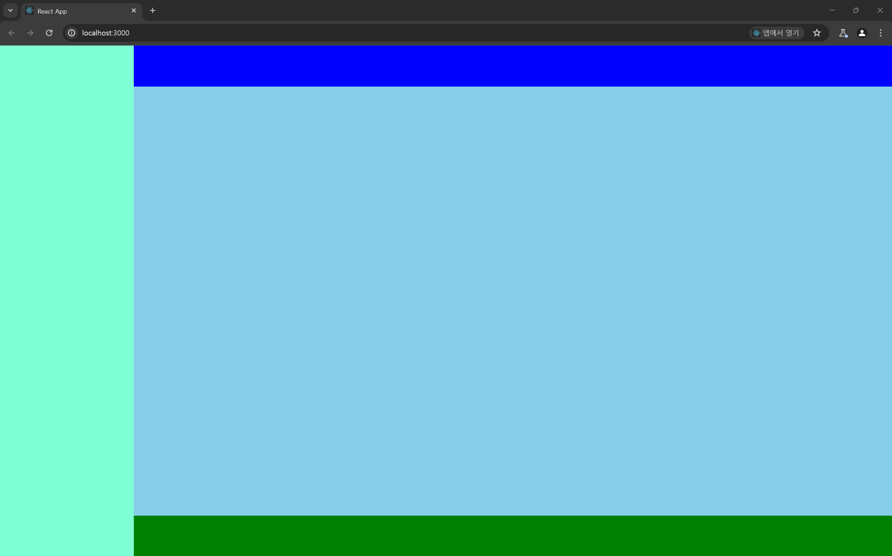

# 전체적인 레이아웃 잡기

```jsx
const DashboardPage = () => {
  return (
    <section className={style.dashBoard}>
      /* height : 100 vh */
      <Sidebar /> // width : 15%
      <Content /> // width : 85%
    </section>
  );
};
```



전체적인 레이아웃은 다음과 같다.

맨 처음 피그마로 `px` 단위로 레이아웃을 잡았었지만 컴포넌트 크기를 만들 때 좀 더 용이하게 하기 위해서

`vw , vh , %` 와 같은 단위로 구성하기로 하였다.

가장 기본적인 단위가 될 `dashBoard` 의 크기는 `100vw , 100vh` 로 해주고 내부 자식 컴포넌트들의 크기를 `%` 단위로 만들어주었다.

이후 `Content` 영역의 레이아웃을 한 번 더 나눠주었다.

```jsx
const Content = () => {
  return (
    <section className={style.Content}>
      <ContentHeader /> // height : 8% (사실상 8vh)
      <ContentMain /> // height : 84% (사실상 84vh)
      <ContentFooter /> // height : 8% (사실상 8vh)
    </section>
  );
};
```

> ### `article vs section` 태그
>
> 이번엔 최대한 무의미한 `div` 태그를 남발하기 보단 `SEO` 를 고려한 태그들을 이용해보려 한다.
> 그 중 블록 태그 요소인 `article , section` 을 자주 이용하게 될 것 같다.
>
> - `section` : 블록 태그 별로 주제 별로 구분 가능한 요소들을 품은 블록 레벨 태그
> - `article` : 독립적인 내용들을 담은 블록 레벨 태그
>
> 그러니 `section` 태그를 이용해서 컨텐츠를 그룹화 하고 (검색 컨텐츠, 카드들이 보이는 컨텐츠 , 저작권이 담긴 컨텐츠)
> `article` 태그를 이용해서 컨텐츠 별 독립적인 내용들을 그룹화 하자 (카드들이 보이는 컨텐츠에서 독립적인 카드들)
