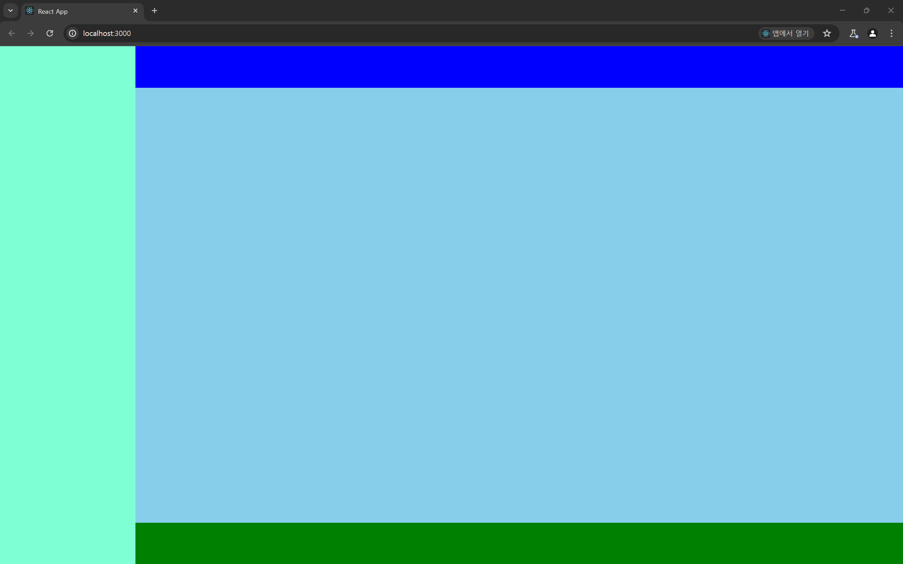
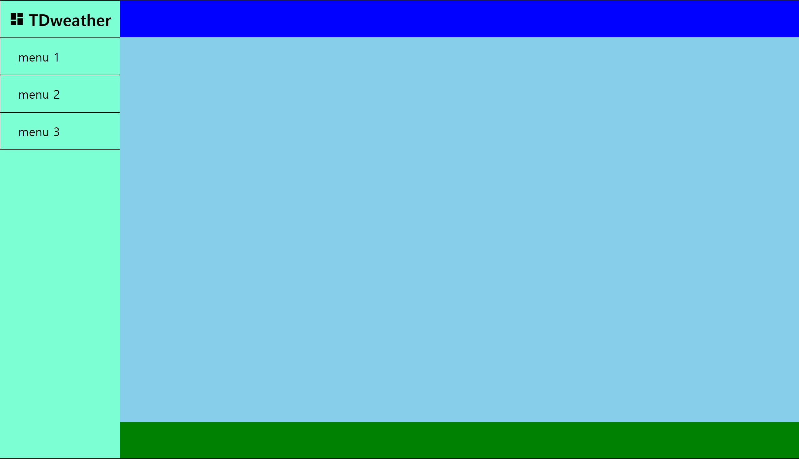

# 컴포넌트 구성하기

## 사이드바 컴포넌트 구성하기



이전에 이렇게 전체 대시보드의 레이아웃을 구성했으니 레이아웃 별 필요한 컴포넌트를 구성해보도록 하자

### 사이드바 레이아웃

```jsx
import style from './SideBar.module.css';
import React from 'react';

const SideBar = ({ TitleComponent, children }) => {
  return (
    <nav className={style.sideBar}>
      {TitleComponent}
      <ul>
        {React.Children.map(children, (child, id) => (
          <li key={id}>{child}</li>
        ))}
      </ul>
    </nav>
  );
};

export default SideBar;
```

```css
/* TODO width 상대적인 단위로 변경하기 생각하기 */
.sideBar {
  width: 15%;
  height: 100%;
  /* TODO 제거하기 */
  background-color: aquamarine;
}

.sideBar li {
  display: flex;
  align-items: center;
  padding-left: 15%;
  height: 8vh;
  font-size: 1.5vw;
  color: red;
  border: 1px solid black;
}
```

사이드바 레이아웃 자체는 다음처럼 만들었다. `nav` 태그 내부에서 사이드바의 타이틀 역할을 할 `TitleComponent` 와 `children props` 들을 `ul , li` 태그로 감싸 렌더링 하는

레이아웃 컴포넌트이다.

```jsx
<ul>
  // 만약 children 형태가 배열이 아니라면 ?
  {children.map((child, id) => (
    <li key={id}>{child}</li>
  ))}
</ul>
```

`React.Children.map` 을 사용한 이유는 만약 `children props` 가 배열이 아닐 때 (하나의 `children` 컴포넌트만 존재 할 때) 에는

`map` 함수를 적용 할 수 없기 때문에 명시적으로 `React.Children` 의 `map` 메소드를 사용해주었다.

### `Title` 컴포넌트

```jsx
const Title = ({ text, className, icon, Tag = 'h1' }) => {
  if (Tag.slice(Tag.length - 1) > 6)
    throw new Error('Tag는 h1 ~ h6 까지만 가능합니다');

  return (
    <Tag className={className}>
      {icon}
      {text}
    </Tag>
  );
};

export default Title;
```

가장 상위 수준에서 사용 할 `Title` 컴포넌트를 생성해주었다.

재사용이 용이하도록 `Tag props` 를 넣어주었다. 하나의 아티클 내에서 `h1,h2,h3` 등을 이용해서 여러 제목을 넣어주고 싶을 수도 있기 때문이다.

### `SidebarTitle` 컴포넌트

```jsx
import Title from '../Title/Title';
import style from './SidebarTitle.module.css';
import { RiDashboardFill } from 'react-icons/ri';

// TODO props 를 넘겨주는 방식에 대해 재고하기
const SidebarTitle = () => {
  return (
    <>
      <Title
        className={style.sideBarTitle}
        text='TDweather'
        icon={<RiDashboardFill />}
      ></Title>
    </>
  );
};

export default SidebarTitle;
```

```css
.sideBarTitle {
  height: 8vh;
  display: flex;
  justify-content: center;
  align-items: center;
  font-size: 2vw;
  border: 1px solid black;
}

.sideBarTitle svg {
  margin-right: 0.5vw;
}
```

이전에 만들어둔 `Title` 컴포넌트을 이용한 `SideBarTitle` 컴포넌트를 생성해주었다.

아이콘은 `react-icons` 에서 제공하는 아이콘을 이용해주기로 하였다.

### `SidebarList` 컴포넌트

```jsx
// TODO react-router-dom 설계하고 NavLink 로 변경하기
// import { NavLink } from 'react-router-dom';

import style from './SidebarList.module.css';

const SidebarList = ({ to, content }) => {
  return (
    <li key={content} className={style.SidebarList}>
      <a href={to}>{content}</a>
    </li>
  );
};

export default SidebarList;
```

```css
.SidebarList {
  display: flex;
  align-items: center;
  padding-left: 15%;
  height: 8vh;
  border: 1px solid black;
}

.SidebarList a {
  text-decoration: none;
  font-size: 1.5vw;
  color: black;
}

.SidebarList a:visited {
  color: black;
}
```

`SidebarList` 컴포넌트는 추후 `react-router-dom` 계층 구조를 완성하면 변경 할 예정이지만

우선 감만 잡을 수 있도록 프로토타입으로 만들어보앗다.

이름에서 볼 수 있듯 `SidebarList` 에 맞게 `li` 로 감싼 태그를 렌더링 하도록 하자

### `Sidebar` 레이아웃 리팩토링

```jsx
import style from './SideBar.module.css';
import React from 'react';

const SideBar = ({ title, children }) => {
  return (
    <nav className={style.sideBar}>
      {title}
      <ul>{children}</ul>
    </nav>
  );
};

export default SideBar;
```

`SideBar` 컴포넌트에는 그저 `SideBarTitle , SideBarList` 를 담기 위한 레이아웃 컴포넌트라는 점을 더 명확히 하기 위해

이전 `React.Children.map .. ` 이런식의 로직이 들어간 부분을 제거하여 역할을 명확하게 하였다.

### `SideBar` 페이지 모습 프로토타입으로 살펴보기

```jsx
// Layout import
import Sidebar from '../layouts/SideBar/Sidebar';
import Content from '../layouts/Content/Content';
// component import
import SidebarTitle from '../@components/UI/SidebarTitle/SidebarTitle';
import SidebarList from '../@components/UI/SidebarList/SidebarList';
// Style import
import style from './Page.module.css';

const DashboardPage = () => {
  // TODO react-router-dom 계층 만들고 NavLink 로 변경하기
  // TODO Sidebar 합성 컴포지션으로 변경 할 수 있도록 리팩토링 공부하기
  return (
    <section className={style.dashBoard}>
      <Sidebar title={<SidebarTitle />}>
        <SidebarList content='menu 1' to='/menu1' />
        <SidebarList content='menu 2' to='/menu2' />
        <SidebarList content='menu 3' to='/menu3' />
      </Sidebar>
      <Content />
    </section>
  );
};

export default DashboardPage;
```



오케이 ~~ 좋다.

- `react-router-dom` 으로 계층 구조를 명확하게 한 후에는 `SidebarTitle ,SidebarList` 내부의 `a` 태그를 `NavLink` 로 변경해주도록 하자

---

# Sidebar 리팩토링 : 잘못된 의존성 구조

### 문제 정의

나의 폴더 구조가 과연 컴포넌트의 계층적 구조를 잘 표현하고 있는지에 대한 생각이 들었다.

현재 `components , layouts` 에 있는 모든 컴포넌트를 `page` 에서 불러와 사용하고 있기 때문에

각 컴포넌트 간의 계층 구조가 명확히 보이는 것 같지 않았다.

각 계층이 본인의 상위 계층을 감싸 캡슐화하고 추상화 한 형태로 계층 구조가 나타나야 하는데

시간이 지나고 내가 한 코드를 보니 그래보이지 않았다.

```jsx
const DashboardPage = () => {
  return (
    <section className={style.dashBoard}>
      // page의 컴포넌트
      <Sidebar title={<SidebarTitle />}>
        // layouts 의 컴포넌트
        <SidebarList content='menu 1' to='/menu1' />
        <SidebarList content='menu 2' to='/menu2' />
        <SidebarList content='menu 3' to='/menu3' />
      </Sidebar>
      <Content /> // layouts 의 컴포넌트
    </section>
  );
};
```

전혀 캡슐화, 추상화 되어있지 않았다.

이에 계층 구조가 잘 표현 될 수 있도록 리팩토링 해주자

### 문제 원인

```jsx
import style from './SideBar.module.css';
import React from 'react';

const SideBar = ({ title, children }) => {
  return (
    <nav className={style.sideBar}>
      {title}
      <ul>{children}</ul>
    </nav>
  );
};

export default SideBar;
```

내 생각의 가장 큰 원인은 `layouts` 에 있던 `Sidebar` 컴포넌트가 레이아웃 컴포넌트가 아닌

그냥 컴포넌트였단 점이다.

내가 계층 구조에서 `layouts` 폴더에 존재하는 컴포넌트를 정말 말 그대로

**레이아웃을 시키는 컴포넌트** 로 생각을 했던 것이 문제였다.

레이아웃 컴포넌트는 상위 수준의 컴포넌트들을 캡슐화 하고 추상화 시킨 컴포넌트여야 한다.

기존에 만들어둔 컴포넌트를 `layouts` 에 넣어두지 말고 사이드바를 추상화 시키는 해당 컴포넌트를

`SidebarWrapper` 라는 컴포넌트로 변경하여 컴포넌트 계층에 넣어주자

```jsx
import style from './SidebarWrapper.module.css';
import React from 'react';

const SidebarWrapper = ({ title, children }) => {
  return (
    <nav className={style.sideBarWrapper}>
      {title}
      <ul>{children}</ul>
    </nav>
  );
};

export default SidebarWrapper;
```

```css
/* TODO width 상대적인 단위로 변경하기 생각하기 */
.sideBarWrapper {
  width: 15%;
  height: 100%;
  /* TODO 제거하기 */
  background-color: aquamarine;
}
```

이후 다시 `layouts` 계층에 있는 `Sidebar` 컴포넌트를 추상화 시킨 컴포넌트들의 모음으로 만들어보자

```jsx
import React from 'react';

import SidebarWrapper from '../../@components/UI/SidebarWrapper/SidebarWrapper';
import SidebarTitle from '../../@components/UI/SidebarTitle/SidebarTitle';
import SidebarList from '../../@components/UI/SidebarList/SidebarList';

const SideBar = () => {
  return (
    <SidebarWrapper title={<SidebarTitle />}>
      <SidebarList to='./menu1' content='menu1' />
      <SidebarList to='./menu2' content='menu2' />
      <SidebarList to='./menu3' content='menu3' />
    </SidebarWrapper>
  );
};

export default SideBar;
```

이후 다시 명확해진 `layouts` 의 컴포넌트인 `Sidebar` 를 이용해 `Page` 계층을 수정해보자

**변경 이후**

```jsx
// Layout import
import Sidebar from '../layouts/SideBar/Sidebar';
import Content from '../layouts/Content/Content';

import style from './Page.module.css';
...
const DashboardPage = () => {
  ...
  return (
    <section className={style.dashBoard}>
      <Sidebar />
      <Content />
    </section>
  );
};

export default DashboardPage;
```

**변경 이전**

```jsx
import Sidebar from '../layouts/SideBar/Sidebar';
import Content from '../layouts/Content/Content';

import SidebarTitle from '../@components/UI/SidebarTitle/SidebarTitle';
import SidebarList from '../@components/UI/SidebarList/SidebarList';
import style from './Page.module.css';

...
const DashboardPage = () => {
  ...
  return (
    <section className={style.dashBoard}>
      <Sidebar title={<SidebarTitle />}>
        <SidebarList content='menu 1' to='/menu1' />
        <SidebarList content='menu 2' to='/menu2' />
        <SidebarList content='menu 3' to='/menu3' />
      </Sidebar>
      <Content />
    </section>
  );
};
```

변경 이전에 비해 `Sidebar` 보다 상위 계층인 `SidebarTitle , SidebarList` 를 `import` 하는 문이 없어 의존성 관계를 좀 더 명확하게 표현 할 수 있게 되었다.

이는 `SidebarWrapper` 라는 인터페이스를 컴포넌트 계층에서 선언해주고 해당 인터페이스로 컴포넌트들을 조합해주었기 때문에

캡슐화를 해주는 것이 가능했다.

# `Dashboard` 리팩토링 : 추상화 하기

`Sidebar` 컴포넌트를 리팩토링 하면서 본 것은 `HTML element` 보다 `JSX` 구조로 추상화해두는 것이

컴포넌트의 흐름을 명확하게 표현해주는 것 같다는 느낌이 들었다.

```jsx

...
const DashboardPage = () => {
  ...
  return (
    <section className={style.dashBoard}>
      <Sidebar />
      <Content />
    </section>
  );
};
```

이 부분의 `HTML element` 인 `section` 엘리먼트를 `DashboardWrapper` 라는 컴포넌트로 추상화 시켜줄까한다.

이런 추상화가 지나친 추상화로 인해 흐름을 이해하기 힘들게 할지 , 쉽게 할지는 모르겠다. 우선 추상화 해보고 생각해보자

```jsx
import style from './DashboardWrapper.module.css';

const DashboardWrapper = ({ children }) => {
  return <section className={style.dashBoardWrapper}>{children}</section>;
};

export default DashboardWrapper;
```

```css
.dashBoardWrapper {
  display: flex;
  height: 100vh;
  box-sizing: border-box;
}
```

컴포넌트 단에 `DashboardWrapper` 컴포넌트를 만들어준 후

```jsx
// Component import
import DashboardWrapper from '../@components/UI/DashboardWrapper/DashboardWrapper';

// Layout import
import Sidebar from '../layouts/SideBar/Sidebar';
import Content from '../layouts/Content/Content';

const DashboardPage = () => {
  // TODO react-router-dom 계층 만들고 NavLink 로 변경하기
  // TODO Sidebar 합성 컴포지션으로 변경 할 수 있도록 리팩토링 공부하기
  return (
    <DashboardWrapper>
      <Sidebar />
      <Content />
    </DashboardWrapper>
  );
};

export default DashboardPage;
```

페이지 단에서 추상화 시킨 컴포넌트를 불러와주었다.

아직까진 현재의 아이디어가 괜찮은지 잘 모르겠다.

추상화시킴으로서 계층 구조가 복잡해진 것 같긴하다. 현재 `Page` 계층에서 두 단계 상위 계층인 `componeent` 계층의 `DashboardWrapper` 를 이용하고 있으니 말이다.

그리고 지나친 추상화로 인해 복잡성이 늘어난 것 같기는 한데

개인적인 취향으론 이게 더 가독성이 좋은 것 처럼 느껴진다.

> 다만 나중에 폴더 구조를 좀 변경할까 생각중이다.
> 이처럼 계층 구조를 뛰어넘는 컴포넌트를 모아둘까 한다.
