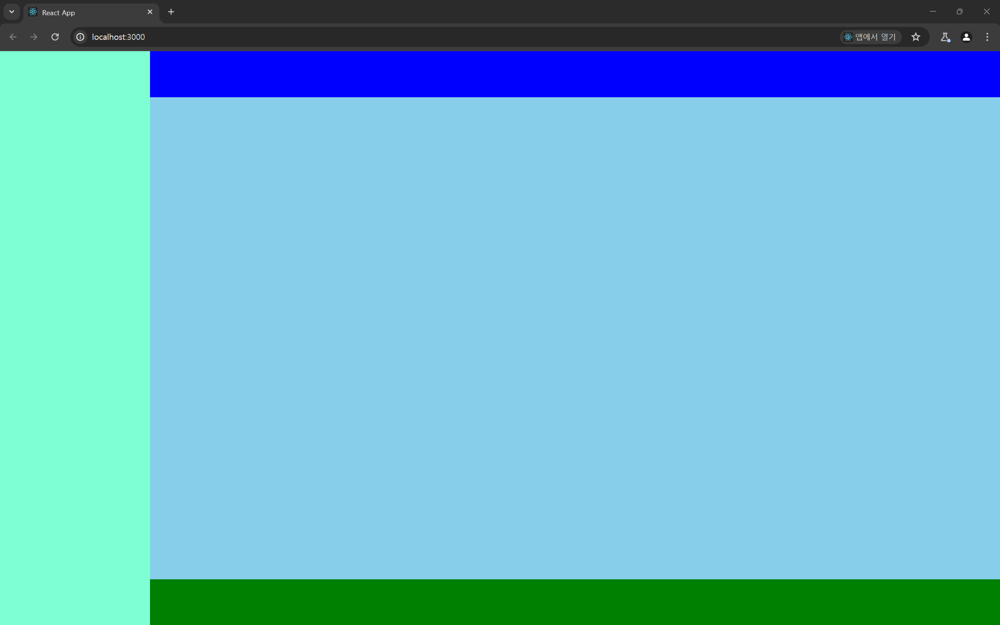
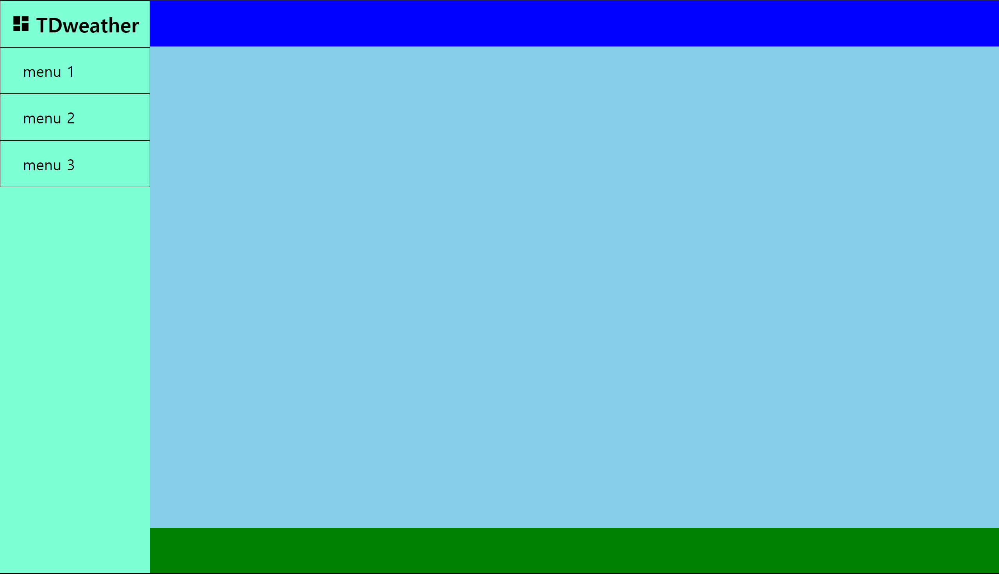

# 컴포넌트 구성하기

## 사이드바 컴포넌트 구성하기



이전에 이렇게 전체 대시보드의 레이아웃을 구성했으니 레이아웃 별 필요한 컴포넌트를 구성해보도록 하자

### 사이드바 레이아웃

```jsx
import style from './SideBar.module.css';
import React from 'react';

const SideBar = ({ TitleComponent, children }) => {
  return (
    <nav className={style.sideBar}>
      {TitleComponent}
      <ul>
        {React.Children.map(children, (child, id) => (
          <li key={id}>{child}</li>
        ))}
      </ul>
    </nav>
  );
};

export default SideBar;
```

```css
/* TODO width 상대적인 단위로 변경하기 생각하기 */
.sideBar {
  width: 15%;
  height: 100%;
  /* TODO 제거하기 */
  background-color: aquamarine;
}

.sideBar li {
  display: flex;
  align-items: center;
  padding-left: 15%;
  height: 8vh;
  font-size: 1.5vw;
  color: red;
  border: 1px solid black;
}
```

사이드바 레이아웃 자체는 다음처럼 만들었다. `nav` 태그 내부에서 사이드바의 타이틀 역할을 할 `TitleComponent` 와 `children props` 들을 `ul , li` 태그로 감싸 렌더링 하는

레이아웃 컴포넌트이다.

```jsx
<ul>
  // 만약 children 형태가 배열이 아니라면 ?
  {children.map((child, id) => (
    <li key={id}>{child}</li>
  ))}
</ul>
```

`React.Children.map` 을 사용한 이유는 만약 `children props` 가 배열이 아닐 때 (하나의 `children` 컴포넌트만 존재 할 때) 에는

`map` 함수를 적용 할 수 없기 때문에 명시적으로 `React.Children` 의 `map` 메소드를 사용해주었다.

### `Title` 컴포넌트

```jsx
const Title = ({ text, className, icon, Tag = 'h1' }) => {
  if (Tag.slice(Tag.length - 1) > 6)
    throw new Error('Tag는 h1 ~ h6 까지만 가능합니다');

  return (
    <Tag className={className}>
      {icon}
      {text}
    </Tag>
  );
};

export default Title;
```

가장 상위 수준에서 사용 할 `Title` 컴포넌트를 생성해주었다.

재사용이 용이하도록 `Tag props` 를 넣어주었다. 하나의 아티클 내에서 `h1,h2,h3` 등을 이용해서 여러 제목을 넣어주고 싶을 수도 있기 때문이다.

### `SidebarTitle` 컴포넌트

```jsx
import Title from '../Title/Title';
import style from './SidebarTitle.module.css';
import { RiDashboardFill } from 'react-icons/ri';

// TODO props 를 넘겨주는 방식에 대해 재고하기
const SidebarTitle = () => {
  return (
    <>
      <Title
        className={style.sideBarTitle}
        text='TDweather'
        icon={<RiDashboardFill />}
      ></Title>
    </>
  );
};

export default SidebarTitle;
```

```css
.sideBarTitle {
  height: 8vh;
  display: flex;
  justify-content: center;
  align-items: center;
  font-size: 2vw;
  border: 1px solid black;
}

.sideBarTitle svg {
  margin-right: 0.5vw;
}
```

이전에 만들어둔 `Title` 컴포넌트을 이용한 `SideBarTitle` 컴포넌트를 생성해주었다.

아이콘은 `react-icons` 에서 제공하는 아이콘을 이용해주기로 하였다.

### `SidebarList` 컴포넌트

```jsx
// TODO react-router-dom 설계하고 NavLink 로 변경하기
// import { NavLink } from 'react-router-dom';

import style from './SidebarList.module.css';

const SidebarList = ({ to, content }) => {
  return (
    <li key={content} className={style.SidebarList}>
      <a href={to}>{content}</a>
    </li>
  );
};

export default SidebarList;
```

```css
.SidebarList {
  display: flex;
  align-items: center;
  padding-left: 15%;
  height: 8vh;
  border: 1px solid black;
}

.SidebarList a {
  text-decoration: none;
  font-size: 1.5vw;
  color: black;
}

.SidebarList a:visited {
  color: black;
}
```

`SidebarList` 컴포넌트는 추후 `react-router-dom` 계층 구조를 완성하면 변경 할 예정이지만

우선 감만 잡을 수 있도록 프로토타입으로 만들어보앗다.

이름에서 볼 수 있듯 `SidebarList` 에 맞게 `li` 로 감싼 태그를 렌더링 하도록 하자

### `Sidebar` 레이아웃 리팩토링

```jsx
import style from './SideBar.module.css';
import React from 'react';

const SideBar = ({ title, children }) => {
  return (
    <nav className={style.sideBar}>
      {title}
      <ul>{children}</ul>
    </nav>
  );
};

export default SideBar;
```

`SideBar` 컴포넌트에는 그저 `SideBarTitle , SideBarList` 를 담기 위한 레이아웃 컴포넌트라는 점을 더 명확히 하기 위해

이전 `React.Children.map .. ` 이런식의 로직이 들어간 부분을 제거하여 역할을 명확하게 하였다.

### `SideBar` 페이지 모습 프로토타입으로 살펴보기

```jsx
// Layout import
import Sidebar from '../layouts/SideBar/Sidebar';
import Content from '../layouts/Content/Content';
// component import
import SidebarTitle from '../@components/UI/SidebarTitle/SidebarTitle';
import SidebarList from '../@components/UI/SidebarList/SidebarList';
// Style import
import style from './Page.module.css';

const DashboardPage = () => {
  // TODO react-router-dom 계층 만들고 NavLink 로 변경하기
  // TODO Sidebar 합성 컴포지션으로 변경 할 수 있도록 리팩토링 공부하기
  return (
    <section className={style.dashBoard}>
      <Sidebar title={<SidebarTitle />}>
        <SidebarList content='menu 1' to='/menu1' />
        <SidebarList content='menu 2' to='/menu2' />
        <SidebarList content='menu 3' to='/menu3' />
      </Sidebar>
      <Content />
    </section>
  );
};

export default DashboardPage;
```



오케이 ~~ 좋다.

- `react-router-dom` 으로 계층 구조를 명확하게 한 후에는 `SidebarList` 내부의 `a` 태그를 `NavLink` 로 변경해주도록 하자
