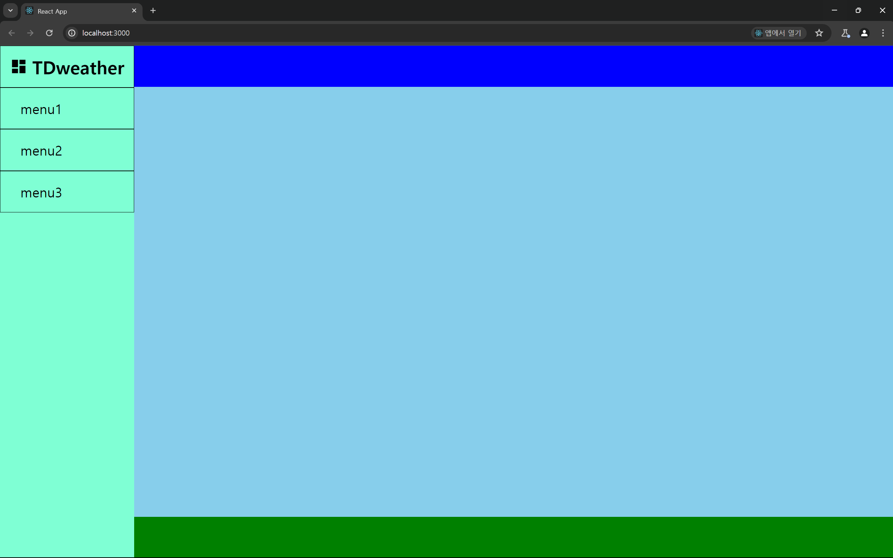
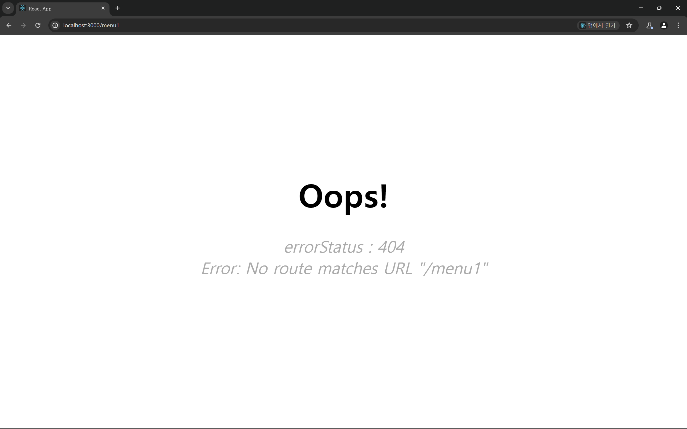
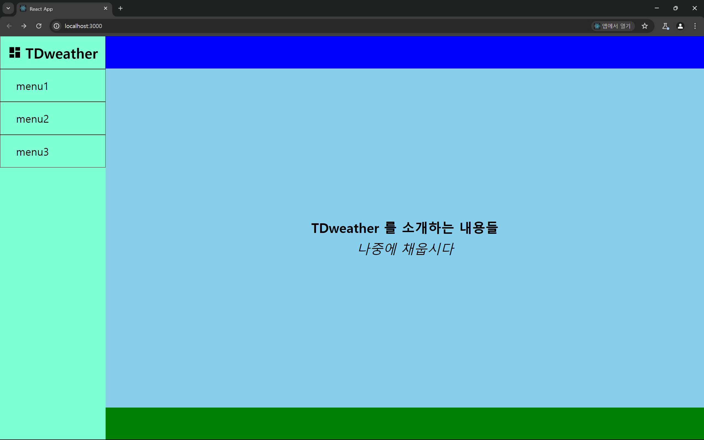

# `react-router-dom` 으로 레이어 구성하기



현재 만들고자 하는 프로젝트의 라우터 계층은 단순하기 때문에 금방 구성해주도록 하자

- `/` : 가장 기본이 되는 라우터 계층
- `/:menu` : 사이드바의 메뉴에 따라 라우팅 되는 계층
- `/:menu?location= ...` : 검색한 지역에 따라 변경되는 파라미터

고민중인거는 파라미터를 한국말로 하게 되면 `URL` 상에서 인코딩되어 매우 뚱둥하고 못생긴 `url` 이 되어버린다.

그래서 내 생각에는, 기상청 `API` 를 이용하기 위해서는 어차피 `nx,ny` 좌표로 요청을 보내야 하기 때문에

요청을 위해 지역명이 변환된 `nx, ny` 좌표값을 이용해 쿼리 파라미터로 사용할까 생각중이다.

그건 나중에 기능 구현 할 때 추가해주도록 하고

리액트 라우터로 계층을 구현해주자.

# `react-router-dom` 계층 구성

## `ErrorPage`

`react-router-dom` 을 이용하기 위해선 필수적으로 `errorElement` 를 지정해줘야 한다.

이전 `react-router-dom` 을 보면서 에러 페이지를 구현해봤던 경험이 있으니 뚝딱 만들어보자

```jsx
import { useRouteError } from 'react-router-dom';

import style from './ErrorPage.module.css';

const ErrorPage = () => {
  const error = useRouteError();
  console.error(error);
  return (
    <div className={style.errorPage}>
      <h1>Oops!</h1>
      <p>
        <i>errorStatus : {error.status}</i>
        <br />
        <i>{error.data}</i>
      </p>
    </div>
  );
};

export default ErrorPage;
```

```css
.errorPage {
  width: 100%;
  height: 100%;
  padding: 20%;
  display: flex;
  flex-direction: column;
  gap: 5vh;
  align-items: center;
}

.errorPage h1 {
  font-size: 5rem;
}

.errorPage p {
  text-align: center;
  font-size: 2.5rem;
  display: block;
  color: #aaa;
}
```

이후 만들어둔 `errorPage` 를 이용하여 계층만 빠르게 만들어보자

```jsx
import { createBrowserRouter } from 'react-router-dom';
import ErrorPage from '../pages/ErrorPage/ErrorPage.jsx';
import App from '../App.js'; // 엔트리 파일

const router = createBrowserRouter([
  { path: '/', element: <App />, errorElement: <ErrorPage /> },
]);

export default router;
```



아직 `/` 이후 라우팅 되는 주소에 대한 페이지를 만들어두지 않았으니 라우팅 되면 에러 페이지가 나타난다.

다만 엔트리파일을 조금 수정해보자

```jsx
import DashboardPage from './pages/DashboardPage';
import './App.css';

const App = () => {
  return <DashboardPage />;
};

export default App;
```

현재 `App` 컴포넌트는 단순하게 `DashboardPage` 를 그대로 리턴하는 불필요한 파일이다.

`DashboardPage` 를 `pages` 레이어에서 빼주고 `App` 파일을 제거해주자

### Dashboard 리팩토링 : 최하위 계층으로 이동

```jsx
// Component import
import DashboardWrapper from './@components/UI/DashboardWrapper/DashboardWrapper';

// Layout import
import Sidebar from './layouts/SideBar/Sidebar';
import Content from './layouts/Content/Content';

// Style import
import './Dashboard.module.css';

const Dashboard = () => {
  // TODO react-router-dom 계층 만들고 NavLink 로 변경하기
  // TODO Sidebar 합성 컴포지션으로 변경 할 수 있도록 리팩토링 공부하기
  return (
    <DashboardWrapper>
      <Sidebar />
      <Content />
    </DashboardWrapper>
  );
};

export default Dashboard;
```

기존 `DashboardPage` 로 작성되어 있던 컴포넌트를 `App` 컴포넌트 역할을 하도록 변경시켜주었다.

이후 불필요하던 `App.js` 파일을 제거해주엇다.

```jsx
import { createBrowserRouter } from 'react-router-dom';
import ErrorPage from '../pages/ErrorPage/ErrorPage.jsx';
import Dashboard from '../Dashboard.jsx';

const router = createBrowserRouter([
  { path: '/', element: <Dashboard />, errorElement: <ErrorPage /> },
]);

export default router;
```

그에 따라 `router.js` 파일내에서 메인 컴포넌트를 `App -> Dashboard` 로 변경해주었다.

# `Outlet` 영역 설정하기

`Single Page Routing` 을 구현 할 때 라우팅 되는 페이지를 어느 영역에 렌더링 할지를 정해줘야 한다.

나는 `Content` 영역 중 `ContentMain` 에 `Outlet` 컴포넌트를 넣어두고 모든 라우팅에 의한 렌더링은

해당 영역에 해주려고 한다.

```jsx
import ContentHeader from './ContentHeader/ContentHeader';
import ContentMain from './ContentMain/ContentMain';
import ContentFooter from './ContentFooter/ContentFooter';

const Content = () => {
  return (
    <section className={style.Content}>
      <ContentHeader />
      <ContentMain /> // Outlet 컴포넌트가 담길 영억
      <ContentFooter />
    </section>
  );
};

export default Content;
```

그러니 `ContentMain` 컴포넌트에 `<Outlet/>` 을 추가해주자

```jsx
import style from './ContentMain.module.css';
import { Outlet } from 'react-router-dom';

const ContentMain = () => {
  return (
    <main className={style.contentMain}>
      <Outlet />
    </main>
  );
};

export default ContentMain;
```

# `AboutPage` 생성하기

`<Outlet/>` 컴포넌트를 이용한 `SPR` 이 잘 작동하는지 확인하는 간단한 방법은 `/ path` 에서 `<Outlet/>` 부분에 렌더링 될 페이지를 하나 만들고 렌더링 해보는 것이다.

```jsx
import style from './AboutPage.module.css';

// TODO 내용 채우기
const AboutPage = () => {
  return (
    <section className={style.about}>
      <h1>TDweather 를 소개하는 내용들</h1>
      <p>
        <i>나중에 채웁시다</i>
      </p>
    </section>
  );
};

export default AboutPage;
```

`AboutPage` 컴포넌트를 하나 만들고 `router` 계층에서 `/ path` 의 `children` 레이어에 `AboutPage` 를 `index` 역할을 하도록 추가해주자

```jsx
import { createBrowserRouter } from 'react-router-dom';
// Element import
import Dashboard from '../Dashboard.jsx';

// Page import
import ErrorPage from '../pages/ErrorPage/ErrorPage.jsx';
import AboutPage from '../pages/AboutPage/AboutPage.jsx';

const router = createBrowserRouter([
  {
    path: '/',
    element: <Dashboard />,
    errorElement: <ErrorPage />,
    children: [
      {
        // index 에 추가된 AboutPage 는 상위 element 의 <Outlet/> 영역에 렌더링 됨
        index: true,
        element: <AboutPage />,
      },
    ],
  },
]);

export default router;
```



# `Side-bar NavLink` 추가하기

```jsx
import React from 'react';

import SidebarWrapper from '../../@components/UI/SidebarWrapper/SidebarWrapper';
import SidebarTitle from '../../@components/UI/SidebarTitle/SidebarTitle';
import SidebarList from '../../@components/UI/SidebarList/SidebarList';

const SideBar = () => {
  return (
    <SidebarWrapper title={<SidebarTitle />}>
      <SidebarList to='./menu1' content='menu1' />
      <SidebarList to='./menu2' content='menu2' />
      <SidebarList to='./menu3' content='menu3' />
    </SidebarWrapper>
  );
};

export default SideBar;
```

```jsx
import style from './SidebarList.module.css';

const SidebarList = ({ to, content }) => {
  return (
    <li key={content} className={style.SidebarList}>
      <a href={to}>{content}</a>
    </li>
  );
};

export default SidebarList;
```

이전 `SideBar` 컴포넌트에서 `SidebarList` 는 `a` 태그로 구성되어 있다.

`SPR` 에서는 `a` 태그가 아닌 `window.history` 조작과 조작 내용에 맞는 렌더링 동기화로 `SPR` 을 구현한다.

`react-router-dom` 에서 제공하는 컴포넌트인 `NavLink` 를 이용해주자
