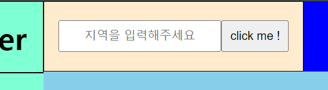
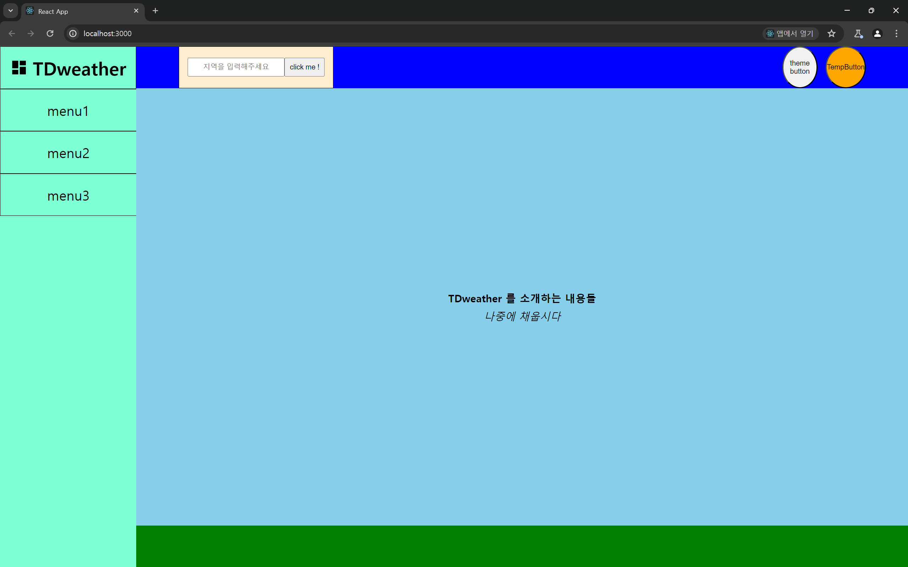

# 헤더 부분 컴포넌트 생성하기

헤더 부분에서 구현 해야 할 컴포넌트는 대표적으로 2가지이다.

1. 검색 컴포넌트
2. 다크모드 컴포넌트
3. 섭씨 화씨 변경 컴포넌트

우선 오늘은 (2024/04/01) 보이는 것에 집중하여 보이는 컴포넌트만 우선적으로 생성하고

기능과 관련된 것은 내일 (2024/04/02) 해주도록 하자

# 검색창 컴포넌트

검색창 컴포넌트를 어떻게 구성할까 생각했을 때

가장 기본이 되는 `Input , Button , Form` 컴포넌트를 조합해

`SearchForm` 컴포넌트를 생성해주기로 하였다.

> 추후 합성 컴포넌트 패턴으로 리팩토링 할 생각이 있기 때문에 더더욱 이런 방식을 택했다.

### 기본적인 컴포넌트들 생성하기 (버튼 , 인풋 , 폼)

그 전에 우선 필요한 기본적인 컴포넌트부터 생성해보자

```jsx
import style from './Button.module.css';

const Button = ({ onClick, className, item }) => {
  return (
    <button className={className || style.button} onClick={onClick}>
      {item}
    </button>
  );
};

export default Button;
```

```jsx
import style from './Input.module.css';

const Input = ({ placeHolder, onChange, className }) => {
  return (
    <input
      type='text'
      placeholder={placeHolder}
      onChange={onChange}
      className={className || style.input}
    />
  );
};

export default Input;
```

```jsx
import style from './Form.module.css';

const Form = ({ children, onSubmit, className }) => {
  // TODO useCallback 을 쓸까 ? 공부하고 나서 쓰자
  const handleSubmit = (e) => {
    e.preventDefault();
    if (onSubmit) onSubmit(e);
  };

  return (
    <form className={className || style.form} onSubmit={handleSubmit}>
      {children}
    </form>
  );
};

export default Form;
```

각 기본적인 컴포넌트들은 다음과 같이 본인만의 기본 `module.css` 를 가지고 있으나

`props` 로 `className` 을 내려 줄 수 있어 다른 곳에서 재사용 할 때엔 기본 스타일 속성이 아닌 다른 스타일 속성을 이용하게 해주었다.

### 검색창 컴포넌트 생성하기

이 또한 이전에 만들어둔 `Form  , input , button` 컴포넌트를 재활용해서 만들어보자

```jsx
// import Components
import Form from '../../UI/Form/Form';
import Input from '../../UI/Input/Input';
import Button from '../../UI/Button/Button';

// import style
import style from './SearchForm.module.css';

const SearchForm = ({ children }) => {
  return <Form className={style.searchForm}>{children}</Form>;
};

const SearchButton = () => {
  // TODO onClick , item , className 채우기
  return <Button item='click me !' className={style.searchButton} />;
};

const SearchInput = () => {
  // TODO placeHolder , onChange , className 채우기
  return (
    <Input placeHolder='지역을 입력해주세요' className={style.searchInput} />
  );
};

SearchForm.Button = SearchButton;
SearchForm.Input = SearchInput;

export default SearchForm;
```

다음처럼 기본적인 `Input , Button , Form` 컴포넌트를 조합하여 `SearchForm` 합성 컴포넌트를 생성해주었다.

다음처럼 `SearchForm.jsx` 파일 내부에서 `SearchForm` 과 관련된 스타일 속성, 추가로 더 채울 도메인 로직들을 해당 폴더 내에서 모두 처리 할 수 있도록 해주었다.

이렇게 합성 컴포넌트 패턴을 사용하여 실제로 렌더링 한 모습은 다음과 같다.

```jsx
import style from './ContentHeader.module.css';

import SearchForm from '../../../@components/Composite/SearchForm/SearchForm';

// TODO 내부에 컴포넌트들 집어넣기
const ContentHeader = () => {
  return (
    <header className={style.contentHeader}>
      <SearchForm>
        <SearchForm.Input />
        <SearchForm.Button />
      </SearchForm>
    </header>
  );
};

export default ContentHeader;
```

다른 장점들은 하단에서 설명하겠지만 가장 큰 장점으로 **잦은 수정에 있어서 유연하다.**



위 코드에서 다음과 같은 결과물이 보일 때

_아 .. 인풋하고 버튼의 순서를 바꿀까?_ 라는 고민이 든다면

그냥 코드를 여러 곳을 고칠 필요 없이

```jsx
      <SearchForm>
        <SearchForm.Input />
        <SearchForm.Button />
      </SearchForm>
에서

      <SearchForm>
        <SearchForm.Button />
        <SearchForm.Input />
      </SearchForm>
```

로 순서만 바꿔주면 된다.

> ### 합성 컴포넌트의 장,단점 정리
>
> 원소 단위의 작은 컴포넌트의 조합으로 합성 컴포넌트를 이용하게 되면 얻는 이점들은 다음과 같다.
>
> - **장점**
>
> - 동일한 네이밍 컨벤션을 이용함으로서 컴포넌트 구조의 흐름을 이해하기 쉽다.
> - 같은 관심사를 갖는 컴포넌트들을 한 곳에 모아둠으로서 필요한 로직과 상태 관리를 중앙 집중 식으로 관리하는 것이 가능하다.
> - 원소 단위의 작은 컴포넌트의 조합으로 이뤄져있기 때문에 기존에 만들어둔 컴포넌트를 재사용하여 사용하는 것이 가능하다.
> - 적절한 추상화를 통해 내부 복잡성을 감추고 본연의 목적인 렌더링에 집중 할 수 있게 한다.
> - 작은 단위로 나눈 컴포넌트들의 조합은 개별적인 테스팅을 용이하게 한다. (아쉽게도 나는 아직 테스팅 기법에 대해 잘 알지 못해 사용하지 못해보았다)
> - **단점**
> - 단점으로는 절대적인 코드의 줄 수가 늘어난다는 점이 있다.
> - 해당 패턴에 익숙치 않은 사람의 경우 이해하기 어려울 수 있다.
> - 많은 양의 코드는 성능과 직결된다. 또한 프로토타입을 통해 렌더링 되는 합성 컴포넌트 구조 상 일반적인 컴포넌트 구조에 비해 성능이 떨어질 수 밖에 없다.
> - `props drilling` 문제가 발생 할 수 있다. 합성 컴포넌트를 이용한 합성 컴포넌트를 이용한 합성 컴포넌트를 이용한 합성 컴포넌트가 존재한다고 할 경우 원소 단우의 작은 컴포넌트에 `props` 를 전달하기 위해선 `drilling` 이 일어나야 한다.

우선 나는 이번 프로젝트의 주 목표중 하나가 합성 컴포넌트 방식 사용이였으니 우선 이 방법을 이용해보도록 해야겠다.

> 사용하고자 하는 가장 큰 이유는 나에게 필요한 컴포넌트들이 대부분 같은 관심사를 가진 독립적인 컴포넌트들의 조합이기 때문이다 .
> 추가적으로 카드형의 컴포넌트의 특징 상 합성 컴포넌트를 이용하는 것이 만들기에도 편할 것 같았으며 디자인적 요소 (배치) 가 잦게 수정될 것 같기 때문에 선택하였다.

# 테마 버튼 , 섭씨 화도 버튼 생성

```jsx
// import style
import style from './ThemeButton.module.css';
// import Component
import Button from '../Button/Button';

const ThemeButton = () => {
  // TODO onCLick , item , className 채우기
  return <Button item='theme button' className={style.themeButton} />;
};

export default ThemeButton;
```

```jsx
// import styles
import style from './TempButton.module.css';
// import component
import Button from '../Button/Button';

const TempButton = () => {
  // TODO onClick , className , item 결정하기
  return <Button item='TempButton' className={style.tempButton} />;
};

export default TempButton;
```

두 버튼을 `Button` 컴포넌트를 재사용하여 만들었다. 컴포넌트의 존재 이유자체는 사실 `props` 를 건내받은 `Button` 컴포넌트를 반환하는 것 뿐이지만

이렇게 만듦으로서 해당 컴포넌트의 의미를 명확히 하고 싶었으며 관련된 스타일 속성이나 로직 속성을 해당 파일에서 관리 할 수 있게 되었다.

> 얘네들도 합성 컴포넌트로 만들까 ? 생각했었는데 불필요한 패턴의 남발은 더 관리를 어렵게 할 것 같았다. 뭐 `CustomButton.Theme ..` 이런식으로 할까 했는데 별로였다 하기



어쨋든 `Content Header` 영억에 필요한 컴포넌트는 모두 생성해주었다.

각 컴포넌트간 필요한 도메인 로직은 추후 뷰와 관련된 컴포넌트가 완성되고 나면 진행해주도록 하겠다.
