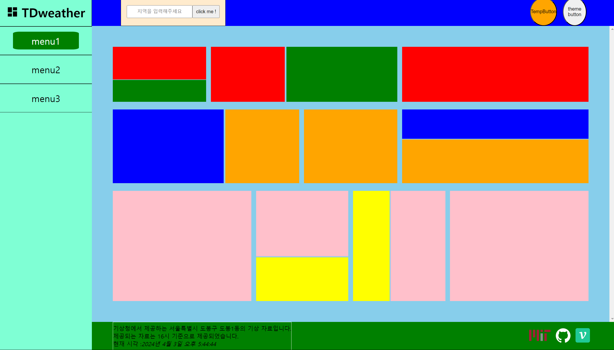

# `Content Footer` 컴포넌트 구성

`Footer` 에 들어가야 할 내용들에 대해 생각해보자

- 데이터 정보
  가져온 API 의 정보와 사용한 쿼리 문에 대한 정보를 나타내도록 하자 (쿼리문은 지역 , 발표 시각)
- 저작권
  가져온 API 의 저작권과 페이지에 대한 저작권도 표기하도록 하자 (하는김에 여러 라이센스에 대해서도 살짝 알아보자)
- 깃허브와 벨로그 링크 ><

### 데이터 정보

```jsx
import module from './Information.module.css';
import { getCurrentTime } from '../../../utils/DateUtils';
const Information = () => {
  // TODO 현재 사용중인 지역 정보 , 발표 시각 구하기
  const location = '서울특별시 도봉구 도봉1동';
  const anounceTime = '16시';

  const { year, month, date, time } = getCurrentTime();

  return (
    <section className={module.information}>
      <p>기상청에서 제공하는 {location}의 기상 자료입니다.</p>
      <p>제공되는 자료는 {anounceTime} 기준으로 제공되었습니다.</p>
      <p>
        현재 시각 :
        <i>
          {year}년 {month}월 {date}일 {time}
        </i>
      </p>
    </section>
  );
};

export default Information;
```

```jsx
const getCurrentTime = () => {
  const time = new Date();
  const currentTime = time
    .toLocaleString()
    .split('.')
    .map((str) => str.trim());
  // currentTime 예시 [ '2024', '4', '3', '오후 2:58:40' ]
  return {
    year: currentTime[0],
    month: currentTime[1],
    date: currentTime[2],
    time: currentTime[3],
  };
};

export { getCurrentTime };
```

현재 시간을 가져오는 `getCurrentTime` 유틸 함수를 이용해 `Information` 컴포넌트로

현재 가져오는 데이터의 출처와 사용하고자 하는 쿼리문 (검색 지역 , 발표 시각) 을 표현 하는 인포메이션 컴포넌트를 만들었다.

### 로고

```jsx
// import style
import style from './Logo.module.css';

// TODO 각 로고 별로 svg 로 아이콘 집어넣기
// TODO 선택된 테마별로 다른 로고 집어넣기
const GithubLogo = () => {
  return (
    <a href='https://github.com/yonghyeun/WeatherApp-React' target='_blink'>
      
    </a>
  );
};
const VelogLogo = () => {
  return (
    <a href='https://velog.io/@yonghyeun/posts' target='_blink'>
      
    </a>
  );
};

const LicenseLogo = () => {
  return (
    <a href='https://en.wikipedia.org/wiki/MIT_License' target='_blink'>
      
    </a>
  );
};

export { GithubLogo, VelogLogo, LicenseLogo };
```

로고들은 모두 구글에서 `png` 파일을 가져와 사용해주었다.

# 결과물

```jsx
import style from './ContentFooter.module.css';
import Information from '../../../@components/UI/Information/Information';
import Wrapper from '../../../@components/Composite/Wrapper/Wrapper';
import {
  GithubLogo,
  VelogLogo,
  LicenseLogo,
} from '../../../@components/UI/Logo/Logo';

const ContentFooter = () => {
  return (
    <footer className={style.contentFooter}>
      <section className={style.information}>
        <Information />
        <Wrapper.Parent className={style.logoWrapper}>
          <LicenseLogo />
          <GithubLogo />
          <VelogLogo />
        </Wrapper.Parent>
      </section>
    </footer>
  );
};

export default ContentFooter;
```

```css
/* TODO height 범위 결정하기 */
.contentFooter {
  height: 8%;
  align-items: center;
  overflow: hidden;
  /* TODO 삭제하기 */
  /* border: 1px solid black; */
  background-color: green;
}

.information {
  width: 92%;
  height: 100%;
  padding: 0 4%;
  display: flex;
  justify-content: space-between;
}

.logoWrapper {
  display: flex;
  height: 100%;
  align-items: center;
  justify-content: center;
  gap: 10%;
  padding-right: 2%;
}
```



다음처럼 `footer` 영역에 들어갈 내용들을 채워주었다.

이제 기능 구현을 해보도록 하자
