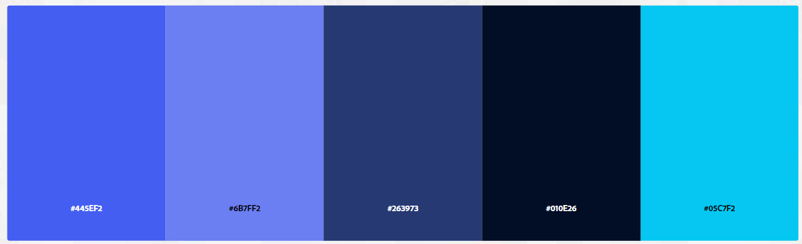
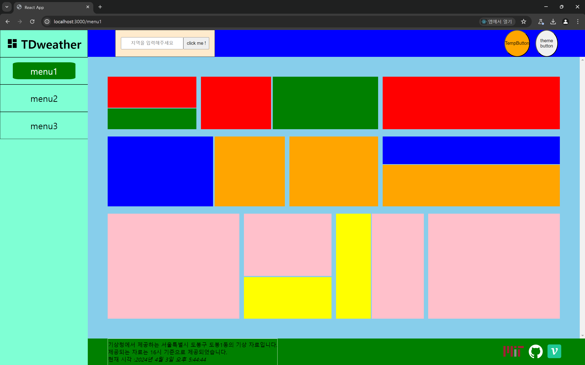

# ThemeButton 기능 구현

이번 프로젝트를 하며 가장 해보고 싶었던 기능으로

그건 바로 다크모드 기능이다.

키킥

## 다크모드 기능 둘러보기

우선 다른 사람들은 다크모드를 어떻게 구현하는지 여러 블로그를 뒤져보자

찾아보며 다크모드 기능을 구현하기 위해 필요한 스텝들은 다음과 같았다.

### 전체 상태 관리

전체 상태 관리 라이브러리를 이용해 현재의 테마를 컴포넌트들에게 전달해줘야 한다.

각 컴포넌트는 현재의 테마를 가지고 적절한 렌더링을 하도록 한다.

### 스타일 컴포넌트 vs 클래스 , 스타일

각 컴포넌트들은 테마와 관련된 상태를 전달 받아 렌더링 시 이용한다.

종종 스타일 컴포넌트 형태를 보곤 했는데 나는 이미 기본적으로 필요한 컴포넌트 들을 모두 구현해두었기 때문에

테마와 관련된 스타일을 컴포넌트 `props.style` 객체 내부에 집어 넣어주려고 한다.

### 테마의 세션 유지

테마를 로컬 스토리지에 저장하여 새로고침, 재접속 시 테마가 유지 될 수 있도록 한다.

### 테마 팔레트

테마를 효과적으로 유지하기 위해선 각 테마 별 색상 팔레트를 적절하게 생성하고

각 색상 팔레트를 적절한 **시멘틱 컬러** 로 네이밍 하여 관리하는 것이였다.

적절한 테마 팔레트와 시멘틱 컬러를 통해 관리 할 수 있도록 하자

## 색상 팔레트 구현하기

우선 다크모드가 아닌 디폴트 테마 일 때 사용할 색상 팔레트를 어도비 색상 팔레트 트렌드 테마에서

뒤적이면서 찾아봤다.

> 다크모드일 때 색상 팔레트 뭐할지 , 디폴트일 때는 뭐할지 팔레트만 30분 넘게 뒤져보다가 구현부터 하고 고민하기로 했다.

### 색상 팔레트 구현 시 유의해야 할 점들

출처 : https://leego.tistory.com/entry/React-%EB%8B%A4%ED%81%AC%EB%AA%A8%EB%93%9C-%EC%A0%81%EC%9A%A9%ED%95%98%EA%B8%B0-with-Styled-component-Context-API

해당 홈페이지에서 다크모드와 관련된 내용이 잘 정리되어 있었다.

다크모드를 이용 할 시 유의해야 할 점 몇 가지가 존재했다.

그 중 인상 깊었던 것만 정리해보자면 다음과 같다.

- 다크모드 사용 시 무작정 검정 화면에 하얀 글씨는 눈의 피로도를 높힌다. 가볍고 채도가 낮은 색상들을 이용해주도록 하자
- 색상을 이용해 레이어들의 깊이를 나타내 줄 수 있도록 하자. 상단의 레이어일 수록 밝은 색상을 사용해주면 좋다.
- 텍스트와 배경색의 대비는 최소 4.5 : 1 은 되어야 한다.
- 다크모드에서 밝은 색의 글자 색은 평소보다 두꺼워 보일 수 있다. 그럴 경운 평소보다 작은 글자 굵기를 이용해보자

### 색상 팔레트 준비하기

<a href = 'https://color.adobe.com/ko/trends/Ui/ux'>어도비 색상 팔레트 UI/UX 트렌드</a>



그 중 날씨 관련 대시보드에 사용하기 적절해 보이는 색상 팔레트를 발견해서 해당 팔레트를 이용하도록 하였다.



나의 이 형형색색의 대시보드에서 사용 할 색상 팔레트 들을 생각해보자

우선적으로 디폴트 모드에서 배경색은 하얀색을 이용해주도록 하자 :)

대시보드에서 각 `section` 별 사용하는 제목 글자 크기의 종류는 최대 3가지로 제한해주도록 하자

이후 큰 글씨부터 작은 글씨 순으로 색상의 채도가 낮아지도록 하자

큰 글씨일 수록 어두운 색을 사용하여 무게감을 주도록 하자

>  > https://uxdesign.cc/how-to-design-a-sleek-dashboard-ui-a90ba41f0af1
> 디자인적인 부분은 해당 이미지를 많이 참고하였다.

본문과 관련된 내용은 검정색으로 할지 ? 아니면 약간 회색 빛이 도는 색상을 사용할지는 추후에 생각해보도록 하자

```js
const light = {
  Title1: '#010E26',
  Title2: '#263973',
  Title3: '#6B7FF2',
  borderLine: '#aaa',
  backgroundColor: '#FAFAFA',
};

const dark = {};

const Theme = { light, dark };

export default Theme;
```

`asset/style` 폴더에서 테마와 관련된 색상 팔레트를 만들어주었다.

### 전역 상태 관리 만들기

`Redux` 를 사용해볼까 했다가 우선 먼저 구현부터 해보고 나중에 기능을 추가 할 때 해보도록 하자

```jsx
// TODO Redux 로 사용할까 ? 생각해보기
// import library
import { createContext } from 'react';
// import customHooks\
import useFirstTheme from '../hooks/useFirstTheme';

const ThemeContext = createContext(null);

const ThemeProvider = ({ children }) => {
  const { theme, setTheme } = useFirstTheme();

  return (
    <ThemeContext.Provider value={{ theme, setTheme }}>
      {children}
    </ThemeContext.Provider>
  );
};

export { ThemeContext, ThemeProvider };
```

```jsx
// import Context
import { ThemeProvider } from './context/ThemeProvider';
// import Component
import DashboardWrapper from './@components/UI/DashboardWrapper/DashboardWrapper';
// import Layout
import Sidebar from './layouts/SideBar/Sidebar';
import Content from './layouts/Content/Content';

// Style import
import './Dashboard.module.css';

const Dashboard = () => {
  return (
    <ThemeProvider>
      <DashboardWrapper>
        <Sidebar />
        <Content />
      </DashboardWrapper>
    </ThemeProvider>
  );
};

export default Dashboard;
```

전역 컨텍스트인 `ThemeContext` 를 만들어주고 해당 컨텍스트를 내려주는 컴포넌트인 `ThemeProvider` 컴포넌트를 생성해주었다.

이 때 `ThemeProvider` 는 `useFirstTheme` 이란 커스텀훅으로 `theme , setTheme` 값을 받은 후

하위 컴포넌트들에게 컨텍스트로 전달한다.

```jsx
import { useState, useEffect } from 'react';

import Theme from '../assets/style/Theme';

/**
 * useFirstTheme 은 첫 렌더링 시 ThemeProvider 에게 기본 테마 값을 지정해주는 커스텀 훅
 * 만약 로컬 스토리지에 저장된 값이 없다면 로컬 스토리지에 값을 추가하고 light theme 로 설정
 * @const {String} thmeStatus - light , dark 중 하나의 값을 의미
 * @returns {Object} - themeStatus 에 따른 테마 팔레트를 반환
 */
const useFirstTheme = () => {
  const [themeStatus, setTheme] = useState('light');
  const theme = Theme[themeStatus];

  useEffect(() => {
    const prevTheme = window.localStorage.getItem('themeStatus');
    setTheme(prevTheme || 'light');
    if (!prevTheme) window.localStorage.setItem('themeStatus', 'light');
  }, []);

  return { theme, setTheme };
};

export default useFirstTheme;
```

`useFirstTheme` 은 말 그대로 단 한 번 실행되는 커스텀 훅으로 로컬 스토리지에 저장된 값에 따라 `themeStatus` 값을 정하고 경우에 따라 로컬스토리지를 조작한다.

`useFirstTheme` 은 `ThemeProvider` 에게 로컬 스토리지의 값을 전달해주기 위한 커스텀 훅이다.

> `themeStatus` 값을 전달하는게 아니라 색상 팔레트 객체인 `theme` 객체를 전달한다.

### 커스텀 훅 만들기 : `useTheme`

```jsx
import { useContext } from 'react';
import { ThemeContext } from '../context/ThemeProvider';

/**
 * useTheme 값은 ThemeContext 가 제공하는 Context 값을 받아 사용하는 커스텀 훅
 * @returns
 */
const useTheme = () => {
  const { theme, setTheme } = useContext(ThemeContext);

  return { theme, setTheme };
};

export default useTheme;
```

`useTheme` 은 `ThemeProvider` 에서 내려주는 `value` 값을 가져오는 커스텀 훅이다.

`useTheme` 커스텀 훅을 통해 매번 컴포넌트에서 `useContext(ThemeContext)` 하는 것보다 어떤 값을 가져오는지를 명확하게 해주었다.

---

# 좀 갈아엎자

## 테마를 덮어 씌울 때 객체 오버라이딩으로 한 번에 덮어씌우자

나는 이전에 어떤 식으로 테마를 적용시키려 했냐면

```jsx
const SomeComponent = () => {
  const { theme } = useTheme(); // 테마를 불러와서
  /**
theme = {
  Title1: '#010E26',
  Title2: '#263973',
  Title3: '#6B7FF2',
  borderLine: '#aaa',
  backgroundColor: '#FAFAFA',
};
*/

  return (
    <div // 테마 값을 직접 스타일 객체에 집어 넣을 생각
      style={{ backgroundColor: theme.backgroundColor, color: theme.Title1 }}
    >
      ...
    </div>
  );
};
```

이런식으로 불러와 적용시키려고 했다.

이 코드는 조금 혼돈스러워보인다.

그 이유는

컴포넌트의 스타일 객체에서 다크모드 , 디폴트 모드일 때 글자 색을 다르게 하고 싶다고 해보자

글자 색을 다르게 하기 위해선 스타일 객체에서 글자 색은 그저 `color` 프로퍼티 값에 한 가지 값만 할당해주면 된다.

하지만 나는 색상 팔레트에서 글자 색상의 구성을 `Title1 , Title2 , Title3` 과 같이 글자 크기 별 색상으로 해뒀기 때문에

컴포넌트 내에서 색상을 적용 시킬 때 `color : theme.Title1` 과 같이 혼돈스러운 코드가 나타났다.

`color : theme.Title1` 처럼 **설정값이 직접적으로 드러남** 으로 인해 설정되는 테마 값이 무엇인지 한 눈에 파악하기 위해선

**스타일 객체의 모든 설정들을 하나 하나 읽어봐야 하기 때문에 혼돈스럽다.**

차라리 `style={ Theme.Global ,...Theme.Heading1 }` 처럼

`{...모드 별 적용되는 공통적인 테마 색상 , ...해당 컴포넌트 특성에 맞는 테마 }` 처럼

어떤 스타일이 적용되는지 캡슐화를 이용하여 한 눈에 알아 볼 수 있게 해보자

### 테마 색상 팔레트 양식 변경하기

```jsx
const Theme = {
  // TODO DarkMode 스타일 나중에 채우기
  Dark: {
    Default: {},
    Title1: {},
    Title2: {},
    Title3: {},
    Paragraph: {},
    Card: {},
  },
  Light: {
    Default: {
      backgroundColor: '#FAFAFA',
      color : 'black'
      borderLine: '#aaa',
    },
    Title1: {
      color: '#010E26',
    },
    Title2: {
      color: '#263973',
    },
    Title3: {
      color: '#6B7FF2',
    },
    Paragraph: {},
    Card: {},
  },
};
```

아직 완벽하게는 아니지만 색상 팔레트에서 원시값들로 이뤄진 시멘틱 코드들을

객체들로 이뤄진 시멘틱 코드로 변경하였다.

- `Default` : 테마 별로 공통적으로 적용되어야 하는 값들을 담은 객체
- `Others .. ` : 테마 별 & 컴포넌트 특성 별 적용되어야 하는 값들을 담은 객체, `Global` 이후에 오버라이딩 함으로서 `Default` 의 속성을 덮어 쓸 수 있다.

이를 통해 `style` 객체에 테마의 값을 덮어씌울 때 원시값을 하나씩 맵핑해줘야 하던 과거와 다르게

이제는 그저 객체를 오버라이딩 시키는 방식으로 깔끔하고 명확한 표현을 할 수 있게 되었다.

- `before` : `style = {{color : theme.Title1 , backgroundColor : theme.backgroundColor}}`
- `after` : `style = {{... theme.Defaeult , ...theme.Title1}}`
