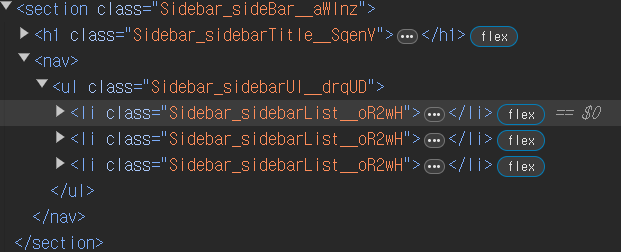
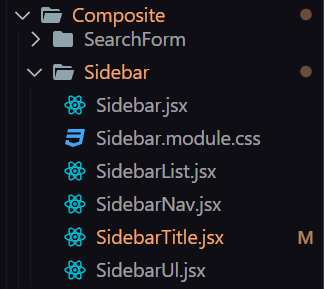
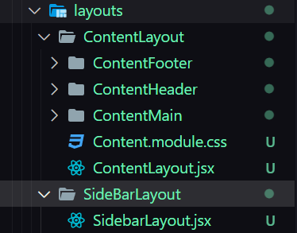

## Start Date : 2024-04-03

## End Date : YYYY-MM-DD

### 문제 정의

```jsx
import React from 'react';

import SidebarWrapper from '../../@components/UI/SidebarWrapper/SidebarWrapper';
import SidebarTitle from '../../@components/UI/SidebarTitle/SidebarTitle';
import SidebarList from '../../@components/UI/SidebarList/SidebarList';

// TODO 합성 컴포넌트 패턴으로 리팩토링 하기
const SideBar = () => {
  return (
    <SidebarWrapper title={<SidebarTitle />}>
      <SidebarList to='./menu1' content='menu1' />
      <SidebarList to='./menu2' content='menu2' />
      <SidebarList to='./menu3' content='menu3' />
    </SidebarWrapper>
  );
};

export default SideBar;
```

예전 합성 컴포넌트 패턴으로 사용하기로 하고 만들었던 사이드바 컴포넌트를

의미가 명확해질 수 있도록 , 또 디자인 패턴을 통일하기 위해 합성 컴포넌트 패턴으로 리팩토링 해보자

### 문제 진단



위 `SideBar` 컴포넌트의 실제 모습은 사실 이런 식을 추상화 시킨 컴포넌트이다.

다만 위 컴포넌트를 보고 예상되는 결과를 판단하기 쉽지 않다.

그 이유는 `nav , ul` 엘리먼트 존재를 알 수 없게 추상화되었기 때문이다.

> `SidebarWrapper` 라는 컴포넌트에서 `nav , ul` 태그를 이용해 `children` 으로 들어오는 `SidebarList` 들을 렌더링 해줬다.
>
> ```jsx
> import style from './SidebarWrapper.module.css';
> import React from 'react';
> // TODO Wrapper 인터페이스가 꼭 필요한가 ? 생각해보기
> const SidebarWrapper = ({ title, children }) => {
>   return (
>     <nav className={style.sideBarWrapper}>
>       {title}
>       <ul>{children}</ul>
>     </nav>
>   );
> };
> export default SidebarWrapper;
> ```

너무 과한 추상화로 인해 `SideBar` 컴포넌트의 실행 결과를 예상하기 쉽지 않아졌다.

그 뿐만 아니라 `SidebarWrapper` 컴포넌트가 너무 못생겼다.

### 해결 전략

과한 추상화를 지양하고 컴포넌트들의 의미를 명확하게 할 수 있도록 리팩토링 하도록 하자

1. `nav , ul` 컴포넌트 생성하여 과한 추상화 지양하기
2. `Sidebar` 컴포넌트의 프로퍼티로 자식 컴포넌트로 사용 될 컴포넌트들을 지정해줘 모듈을 조합하여 사용 시 의미를 명확하게 하기

### 해결 결과

#### 합성 컴포넌트 생성하기



우선 합성 컴포넌트 패턴으로 빼줄 수 있도록 `Composite` 폴더 냉서 `Sidebar` 컴포넌트와 해당 컴포넌트의 프로퍼티가 될

`SidebarNav , Ul , List , Title` 컴포넌트들을 생성해주었다.

```jsx
import style from './Sidebar.module.css';

import SidebarList from './SidebarList';
import SidebarNav from './SidebarNav';
import SidebarTitle from './SidebarTitle';
import SidebarUl from './SidebarUl';

const Sidebar = ({ children, className }) => {
  if (!children) throw new Error('Sidebar 는 단독으로 사용 될 수 없어요');
  return <section className={className || style.sideBar}>{children}</section>;
};

Sidebar.Nav = SidebarNav;
Sidebar.Ul = SidebarUl;
Sidebar.List = SidebarList;
Sidebar.Title = SidebarTitle;

export default Sidebar;
```

```jsx
import style from './Sidebar.module.css';
import Title from '../../UI/Title/Title';
import { Link } from 'react-router-dom';
import { RiDashboardFill } from 'react-icons/ri';

const SidebarTitle = ({ className }) => {
  return (
    <Title className={className || style.sidebarTitle}>
      <RiDashboardFill />
      <Link to='/'>TDWeather</Link>
    </Title>
  );
};

export default SidebarTitle;
```

```jsx
import style from './Sidebar.module.css';

const SidebarNav = ({ children, className }) => {
  return <nav className={className || style.sidebarNav}>{children}</nav>;
};

export default SidebarNav;
```

```jsx
import style from './Sidebar.module.css';

const SidebarUl = ({ children, className }) => {
  return <ul className={className || style.sidebarUl}>{children}</ul>;
};

export default SidebarUl;
```

```jsx
import { NavLink } from 'react-router-dom';
import style from './Sidebar.module.css';

const SidebarList = ({ to, content, className }) => {
  return (
    <li key={content} className={className || style.sidebarList}>
      <NavLink
        to={to}
        className={({ isActive }) =>
          isActive ? style.selected : style.notSelected
        }
      >
        {content}
      </NavLink>
    </li>
  );
};

export default SidebarList;
```

이후 각 컴포넌트들을 사이드바에서 사용할 클래스를 선택해준 후 `Sidebar` 컴포넌트를 완성해주었다.

#### 합성 컴포넌트 이용하여 레이아웃 구성하기



레이아웃 컴포넌트가 레이아웃이라는 의미가 작은 것 같아 `layouts` 폴더내에 존재하는 컴포넌트를 모두 `..Layout` 이름을 붙여 완성해주었다.

```jsx
import React from 'react';

import Sidebar from '../../@components/Composite/Sidebar/Sidebar';

const SidebarLayout = () => {
  return (
    <Sidebar>
      <Sidebar.Title />
      <Sidebar.Nav>
        <Sidebar.Ul>
          <Sidebar.List to='/menu1' content='menu1' />
          <Sidebar.List to='/menu2' content='menu2' />
          <Sidebar.List to='/menu3' content='menu3' />
        </Sidebar.Ul>
      </Sidebar.Nav>
    </Sidebar>
  );
};

export default SidebarLayout;
```

이후 `SidebarLayout` 컴포넌트에서 합성 컴포넌트 모듈들을 조립해 사용해주었다.

이전에 비하면 코드의 줄 수는 늘어났으나 확장성 및 유지 보수성은 더 올라갔다고 볼 수 있다.

예를 들어 `Sidebar.Title` 을 `Sidebar.Nav` 컴포넌트 내부에 넣어주고 싶다면 현재 패턴에선 그저

모듈의 조합 위치만 변경해주면 된다.

```jsx
const SideBar = () => {
  return (
    <SidebarWrapper title={<SidebarTitle />}>
      <SidebarList to='./menu1' content='menu1' />
      <SidebarList to='./menu2' content='menu2' />
      <SidebarList to='./menu3' content='menu3' />
    </SidebarWrapper>
  );
};

export default SideBar;
```

하지만 이전 패턴에서는 `SidebarWrapper` 에서의 코드를 변경해줘야 할 것이다.

> 물론 이는 `SidebarWrapper` 라는 컴포넌트가 너무나도 못생겼기 때문에 생긴 문제기도 하다.

### 배운점

이번 리팩토링에서 배운 점은 사실

합성 컴포넌트 패턴을 사용함으로서 생긴 장점에 대해 배웠다기보다

모듈들을 올바르게 잘게 나눠 구성해둘 경우에 재사용이 얼마나 간편하지 , 수정하기 간편한지를 알 수 있었다.

`SideBarWrapper` 컴포넌트를 정말 개떡같이 만들어놨더니 수정하기보다 갈아엎는게 나았다.

```jsx
const SidebarWrapper = ({ title, children }) => {
  return (
    <nav className={style.sideBarWrapper}>
      {title}
      <ul>{children}</ul>
    </nav>
  );
```

```jsx
<SidebarWrapper title={<SidebarTitle />}>...</SidebarWrapper>
```

어떻게 이따구로 만들 생각을 했을까 ?

ㅋㅋㅋㅋㅋㅋㅋㅋㅋㅋㅋㅋㅋㅋㅋㅋㅋㅋㅋ

반성하자
