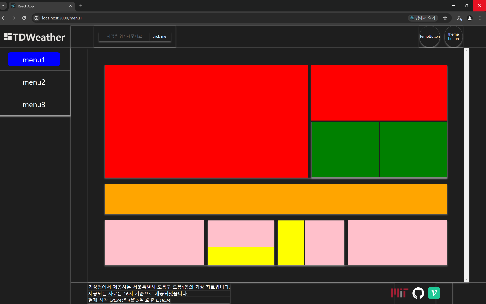
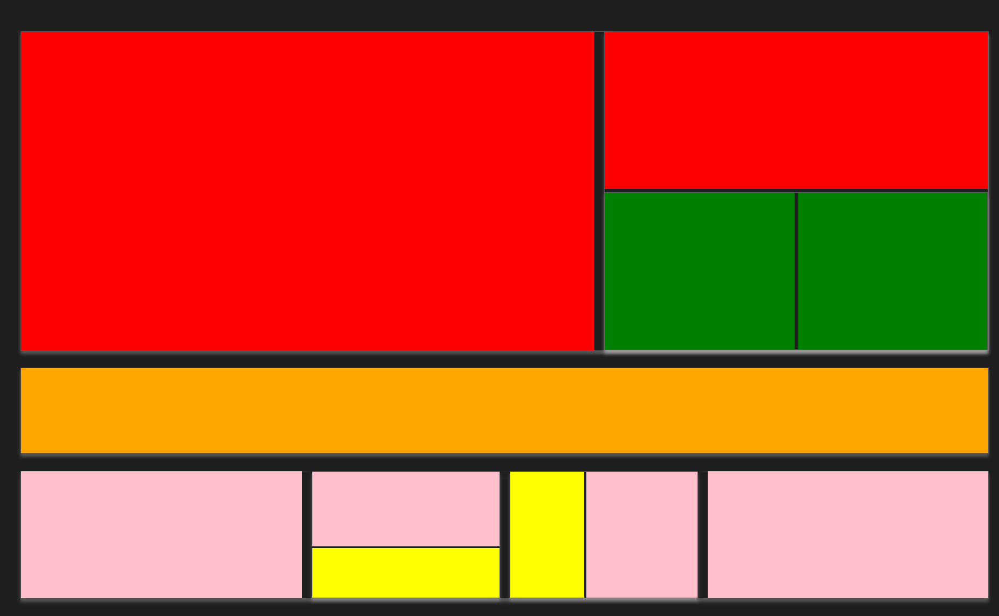
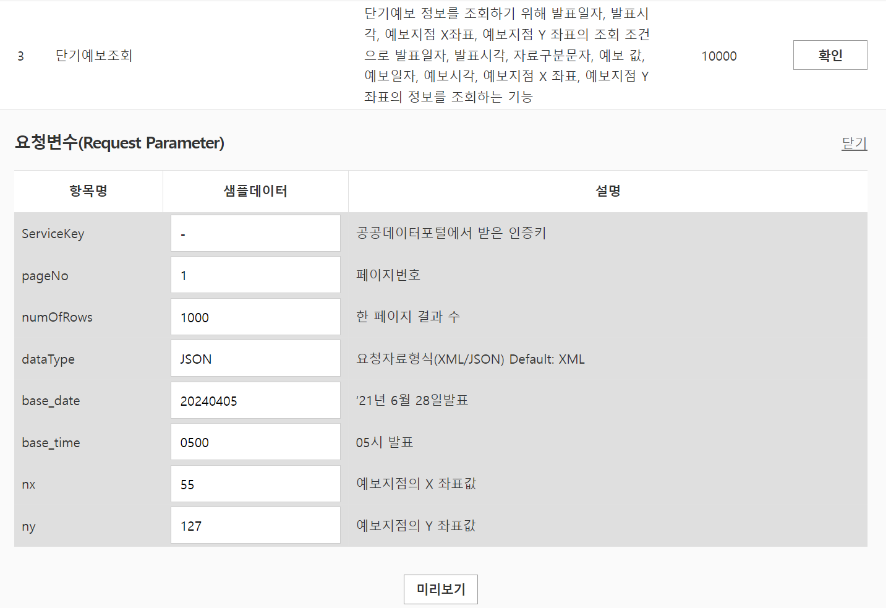
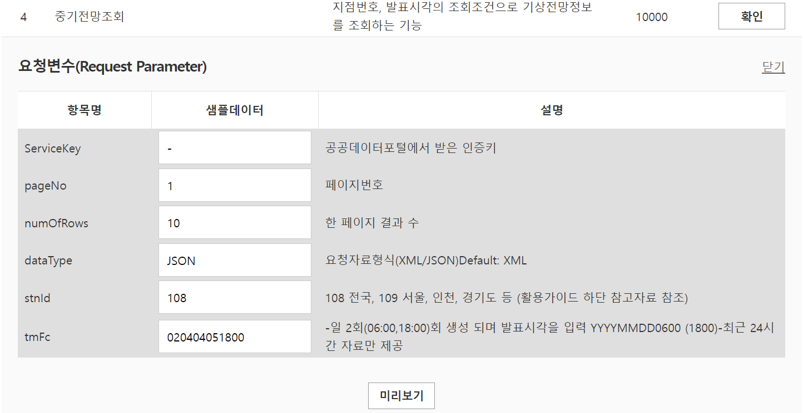

# 페이지 별 들어갈 주제 정하기

각 사이드 바의 메뉴 별 렌더링 되는 페이지들을 어떤 주제로 할 지 생각해보자

### 오늘의 날씨 페이지

우선 시간이 많지 않기 때문에 첫 번째 메뉴 페이지에 들어갈 주제를 결정하자

첫 번째 메뉴 페이지에 들어갈 주제는 첫 기획 단계 그대로 **오늘의 날씨** 로 하자

`01.[Feature] 사용 가능 API 확인` 에서 사용 가능한 `API` 명세서들은 대충 읽어봤기 때문에

어떤 정보들을 담을지만 결정하면 됐다.

맨 처음엔 메인 메뉴에 수 많은 카드들을 독특한 패턴들로 나열해서

있어보이게 만들려고 했다.

다만 막상 필요한 데이터들을 정리하다 생각해보니 굳이 수 많은 카드가 필요 없을 것 같았다.

상식적으로 누군가 날씨 어플리케이션을 볼 때 알고 싶은 정보들은 한정적이다.

풍속이나 풍향 등등이 궁금한 사람은 그다지 많지 않을 것이다.

적설량이나 , 뭐 이런 것들 또한 ..

그래서 굳이 여러 정보들을 많이 담으려 하지 말고 필요한 정보들을 크게 크게 큰 카드들로 배치하도록 하자

뭐 대충 이런식으로 레이아웃을 나열 한다 할 때

가장 첫 번째 네모 부분엔 오늘의 날씨 요약 (장소 , 시간 , 현재 기온 , 아이콘 .. etc )

두 번째 네모 부분엔 오늘의 날씨 텍스트 요약 (괜찮으면 타이핑 되는 듯한 애니메이션을 넣을까 생각중이다. )

그 밑 노란 박스엔 현재 날씨부터 시간대 별 날씨 요약

그 밑 핑크색 부분부터는 아까 말했던 기타 등등에 대한 이야기들을 담도록 해보자

모르겠다. 사실 레이아웃은 `Wrapper` 컴포넌트에서 좀만 만져서 설정하면 되기 때문에 그닥 어렵지 않을 것이다.

그럼 필요한 정보들의 엔드포인트들을 살펴보자

- 기상청 단기예보 조회 서비스 : 해당 서비스를 통해 오늘의 날씨와 관련된 데이터들을 패칭해오자
- 기상청 중기예보 조회 서비스 (중기전망조회) : 지점 번호 , 발표 시간을 통해 추후 10일 이내 예상되는 기후를 텍스트로 패칭해줌

두 데이터를 이용하여 첫 번째 메뉴 페이지를 꾸며주도록 하자

### 각 엔드포인트 별 필요한 쿼리문

#### 기상청 단기 예보 조회 서비스

- `base_date , base_time` : 현재 시각을 기준으로 가져오도록 하자
- `nx, ny` : 기상청에서 사용하는 `nx,ny` 는 위, 경도와 다른 기준점을 사용한다.
  이에 검색어를 기준으로 위경도를 먼저 계산하고 , 계산된 위경도를 다른 `API` 를 이용하여 `nx , ny` 값으로 변경해주도록 하자

#### 기상청 중기 예보 조회 서비스

- `stnId` : 위치 정보를 이용하여 사용해주면 될 것 같다.

---

다른 페이지는 첫 번째 페이지를 완성한 후에 생각해보도록 하자
