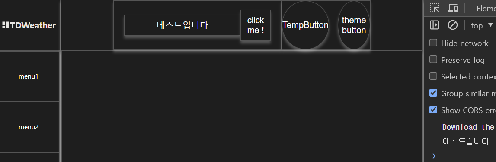

# Content-Header 검색 기능 구현하기


`Content Header` 영역에 존재하는 `SearchForm` 컴포넌트에서

1. 지역명을 입력하면
2. 지역명에 대한 위경도 데이터를 가져오고
3. 위경도 데이터를 기상청 API 에서 사용하는 `nx , ny` 좌표로 변환

하는 기능을 구현해보려 한다.

## 지역명 검색이 가능하도록 컴포넌트에 기능 부착하기

```jsx
import moduleCss from './ContentHeader.module.css';

import SearchForm from '../../../@components/Composite/SearchForm/SearchForm';
import ThemeButton from '../../../@components/UI/ThemeButton/ThemeButton';
import TempButton from '../../../@components/UI/TempButton/TempButton';

import useTheme from '../../../hooks/useTheme';

// TODO 내부에 컴포넌트들 집어넣기
const ContentHeader = () => {
  const { theme } = useTheme();
  return (
    <header style={{ ...theme.Default }} className={moduleCss.contentHeader}>
      <SearchForm>
        <SearchForm.Input /> // 2. Input 에 적혀있는 값으로 요청을 보내야 한다.
        <SearchForm.Button /> // 1. 버튼이 눌리면
      </SearchForm>
      <section style={{ ...theme.Default }} className={moduleCss.buttonWrapper}>
        <TempButton />
        <ThemeButton />
      </section>
    </header>
  );
};

export default ContentHeader;
```

1. `request` 요청에 사용될 지역명의 값은 `SearchForm.Input` 에 적힌 값을 사용하도록 한다.
2. `request` 요청을 보내는 이벤트 핸들러는 `SearchForm.Button` 에 부착하도록 한다.

### 위 로직들을 컴포넌트에 어떻게 전달할까 ?

검색된 값을 이용해 `request` 요청을 보내는 로직을 어느 단에서 정의 할까 생각해봤다.

`SearchForm.Input` 에서 `input` 태그 내에 `ref` 객체를 부착 시킨 후

`SearchForm.Button` 에서 `ref` 객체에 적힌 값을 `ref.current.value` 으로 가져온 후

버튼이 클릭 되면 `ref.current.value` 에 적힌 값으로 `request` 요청을 보내고자 했따.

**하지만 이는 완벽히 실패했고 그 이유는 내가 `useRef` 에 대해 이해하지 못하고 잇었기 때문이였다.**

### 처음에 실패했던 나의 방식

```jsx
const useSearchInputRef = () => {
  const inputRef = useRef(null);
  return inputRef;
};
```

처음에 나는 `inputRef` 를 공유하기 위한 커스텀 훅을 생성하고

```jsx
const Input = ({ placeHolder, className }) => {
  const { theme } = useTheme();
  const inputRef = useSearchInputRef();
  return (
    <input
      style={{ ...theme.Default }}
      type='text'
      ref={inputRef}
      placeholder={placeHolder}
      className={className || moduleCss.input}
    />
  );
};
```

`Input` 컴포넌트 내에서 `inputRef` 를 부착 시키려고 했다.

```jsx
const SearchButton = () => {
  // TODO onClick , item , className 채우기

  const inputRef = useSearchInputRef();
  // 이후 inputRef 를 가지고 리퀘스트 요청을 보내는 과정 ..

  return <Button item='click me !' className={moduleCss.searchButton} />;
};
```

이후 버튼에서 커스텀훅으로 `inputRef` 를 불러와 리퀘스트 요청을 보내려 했다.

이 때 `Input` 에서 불러와진 `inputRef` 는 실제 `input` 태그를 잘 가리키고 있지만

`SearchButton` 에서 불러와진 `inputRef` 는 항상 `null` 객체를 가리키고 있었다.

나는 매우 혼란스러웠다. 분명 인풋에서 나는 `ref` 를 부착시켜줬고 `Input` 컴포넌트 내부에선 잘 부착되어있는데

**왜 다른 컴포넌트에선 부착된 값을 못가져올까 ? 하고 말이다.**

### `useRef` 에서의 `ref` 객체는 선언된 컴포넌트 내부에서만 기억된다.

<!-- TODO -->

... 이건 `useRef` 의 개념에 대해 더 공부하고 나중에 따로 포스팅하자

### `SearchRef Context` 생성하기

```jsx
import { createContext, useRef } from 'react';

const SearchRefContext = createContext(null);

const SearchRefProvider = ({ children }) => {
  const inputRef = useRef(null);

  return (
    <SearchRefContext.Provider value={inputRef}>
      {children}
    </SearchRefContext.Provider>
  );
};

export { SearchRefProvider, SearchRefContext };
```

```jsx
import { useContext } from 'react';
import { SearchRefContext } from '../context/SearchRefProvider';

const useSearchRef = () => {
  const inputRef = useContext(SearchRefContext);
  return inputRef;
};

export default useSearchRef;
```

다음처럼 `SerachRefProvider` 으로 컨텍스트를 생성해주고 컨텍스트에서 전달하는`inputRef` 를 받을 수 있는 `useSearchRef` 커스텀 훅을 생성해주었다.

```jsx
const SearchForm = ({ children }) => {
  return (
    <SearchRefProvider>
      <Form className={moduleCss.searchForm}>{children}</Form>
    </SearchRefProvider>
  );
};
```

이후 `SearchForm` 컴포넌트에서 하위 요소들을 모두 `SearchRefProvider` 컨텍스트로 감싸줌으로서 `SearchForm` 하위 컴포넌트들은 모두 컨텍스트에서 제공하는

`inputRef` 에 접근하고 공유하는 것이 가능하게 만들어주었다.

```jsx
const SearchInput = () => {
  const inputRef = useSearchRef();

  return (
    <Input
      ref={inputRef}
      placeHolder='지역을 입력해주세요'
      className={moduleCss.searchInput}
    />
  );
};
```

`SearchInput` 컴포넌트에선 상위 컨텍스트에서 정의된 `inputRef` 를 받아 `Input` 컴포넌트에 `inputRef` 객체를 `props` 로 전달한다.

이 때 일반적인 컴포넌트에서 `props` 로 `ref` 를 전달하는 것은 불가능하다.


> 이 이유는 추후 따로 포스팅하도록 해야겠다.

그렇기 때문에 `ref` 를 `props` 로 전달 할 수 있도록

```jsx
import { forwardRef } from 'react';

const Input = forwardRef((props, ref) => {
  const { theme } = useTheme();
  const { placeHolder, className } = props;
  return (
    <input
      style={{ ...theme.Default }}
      ref={ref}
      type='text'
      placeholder={placeHolder}
      className={className || moduleCss.input}
    />
  );
});

export default Input;
```

`forwardRef` 으로 기존의 `Input` 컴포넌트를 감싸줘 `ref` 를 `props` 로 받는 것을 가능하게 하였다.

```jsx
const SearchButton = () => {
  // TODO onClick , item , className 채우기
  const inputRef = useSearchRef();

  return (
    <Button
      item='click me !'
      className={moduleCss.searchButton}
      onClick={() => {
        console.log(inputRef.current.value);
      }}
    />
  );
};
```

이후 `SearchButton` 의 `onClick` 메소드로 클릭 시 `SearchForm.Input` 에 적힌 값이 로그되는지 확인해보자



잘 된다 야호

```jsx
// import Components
import Form from '../../UI/Form/Form';
import Input from '../../UI/Input/Input';
import Button from '../../UI/Button/Button';

// import moduleCss
import moduleCss from './SearchForm.module.css';

// import customHooks
import useSearchRef from '../../../hooks/useSearchRef';

import { SearchRefProvider } from '../../../context/SearchRefProvider';

const SearchForm = ({ children }) => {
  return (
    <SearchRefProvider>
      <Form className={moduleCss.searchForm}>{children}</Form>
    </SearchRefProvider>
  );
};

const SearchButton = () => {
  // TODO onClick , item , className 채우기
  const inputRef = useSearchRef();

  return (
    <Button
      item='click me !'
      className={moduleCss.searchButton}
      onClick={() => {
        console.log(inputRef.current.value);
      }}
    />
  );
};

const SearchInput = () => {
  const inputRef = useSearchRef();
  // TODO placeHolder , onChange , className 채우기

  return (
    <Input
      ref={inputRef}
      placeHolder='지역을 입력해주세요'
      className={moduleCss.searchInput}
    />
  );
};

SearchForm.Button = SearchButton;
SearchForm.Input = SearchInput;

export default SearchForm;
```

전체 구조는 다음과 같다.

```jsx
const ContentHeader = () => {
  const { theme } = useTheme();
  return (
    <header style={{ ...theme.Default }} className={moduleCss.contentHeader}>
      <SearchForm>
        <SearchForm.Input />
        <SearchForm.Button />
      </SearchForm>
      <section style={{ ...theme.Default }} className={moduleCss.buttonWrapper}>
        <TempButton />
        <ThemeButton />
      </section>
    </header>
  );
};

export default ContentHeader;
```

## 검색된 지역명 카카오 `API` 와 연결하여 위경도 불러오기

### 사용하고자 하는 `API`

주소에 따른 위경도를 구해오는 `API` 는 구글 , 네이버 , 카카오 등 다양한 `API` 를 지원하는데

난 그 중 카카오의 `API` 를 이용하기로 하였다.

Ref : https://developers.kakao.com/

여러가지 명세서를 읽어봤을 때 카카오의 응답 바디가 사용하기 더 깔끔하기도 했고

요청을 보내는 방식이 간단했기 때문에 사용하기로 했다.

> 그리고 결정적으로 네이버나 구글은 `API` 를 이용하기 위한 과정이 비교적 복잡해서 귀찮았다

### 카카오 `API` 사용법

우선 `KaKaO Dev` 에서 사용할 애플리케이션을 우선 등록해준 후의 과정을 기술한다.

1. `API endpoint`
   > https://dapi.kakao.com/v2/local/search/address.${FORMAT}

기본적인 엔드포인트는 다음과 같다.

`${FORMAT}` 부분에는 `XML , JSON` 중 하나를 이용해 응답 받을 `body` 엔터티의 데이터 타입을 지정 할 수 있다.


요청을 보낼 때 `Header` 부분에는 `KaKao Dev` 에서 받은 `REST API Key` 를 보내주도록 한다.

2. 쿼리 파라미터
   

쿼리 파라미터는 다음과 같다.

다른 쿼리 파라미터는 건들 것이 없을 것 같고 `query` 부분에 `SearchForm.Input` 에 적힌 값을 넣어주면 될 것 같다.

### `API` 정보를 저장하기 위한 파일 생성


따로 상수들을 저장하는 폴더인 `@constants` 폴더를 만들고

내부에서 `_API.js` 파일을 생성해주었다.

```js
const APIKEY = 'KakaoAK 발급받은 나의 API 키';
const URI = 'https://dapi.kakao.com/v2/local/search/address.JSON';
export { APIKEY, URI };
```

`API` 와 관련된 모든 상수들을 해당 폴더 내에서 관리하도록 하고

해당 폴더는 깃허브에 업로드 되지 않도록 `gitignore` 에 해당 파일을 추가해주도록 하자

```
#secret constants
@constants/_API.js
```

### `useTranslation` 커스텀 훅 생성하기

```jsx
import { useState } from 'react';
import { APIKEY, URI } from '../@constants/_API';

/**
 * 주어진 주소를 사용하여 위도와 경도를 조회하는 훅
 *
 * @param {String} location - 도로명 , 번지수 주소로 적힌 주소
 * @returns {Object} - 훅 내부 상태를 변경시키는 함수와 상태들을 담은 객체
 * @returns {Function} fetchingLatLong - 카카오 API 를 이용하여 위도 , 경도로 변경하는 함수
 */
const useTranslation = (location) => {
  const encodeQuery = encodeURIComponent(location);
  const ENDPOINT = `${URI}/?query=${encodeQuery}`;

  const [LatLong, setLatLong] = useState(null);
  const [error, setError] = useState(null);
  const [isLoading, setIsLoading] = useState(false);

  const fetchLatLong = async () => {
    try {
      setIsLoading(true);
      const response = await fetch(ENDPOINT, {
        headers: {
          Authorization: APIKEY,
        },
      });

      if (!response.ok)
        throw new Error('카카오 API 네트워크 상태가 불안정합니다');

      const json = await response.json();
      setLatLong(json);
    } catch (error) {
      setError(error);
    } finally {
      setIsLoading(false);
    }
  };

  return {
    fetchLatLong,
    LatLong,
    error,
    isLoading,
  };
};

export default useTranslation;
```

다음과 같은 커스텀훅을 생성했다.

`useTranslation` 커스텀훅은 다음과 같은 값들을 반환한다.

- `fetchLocation` : 커스텀 훅 호출 시 인수로 받은 `location` (`주소에 대한 string`) 을 카카오 `API` 를 이용해 위경도가 담긴 데이터 객체로 가져오는 함수
- `LatLong` : `fetchLocation` 의 실행 후 상태가 변경되는 `state` 로 `location` 에 대한 `KaKao API` 의 `response`
- `error` : `fetchLocation` 실행 시 발생한 `error state`
- `isLoading` : `boolean` 값으로 `fetchingLocation` 이 실행 중엔 `true` , 아닐 시엔 `false`

`fetchLocation`을 이용하여 `SearchForm.Input` 의 `inputRef` 에 적힌 값을 이용해 `request` 를 보내고 `locate` 을 이용해 위경도 값으로 기상청 `API` 에 요청을 보내자

또 `error , isLoading` 을 이용해 `request` 에 대한 에러 핸들링 및 로딩 상태에 따른 개별적인 렌더링 로직을 관리해주도록 하자

### `useTranslation` 은 어느 컴포넌트에서 호출되어야 할까 ?

```jsx
const ContentHeader = () => {
  const { theme } = useTheme();
  return (
    <header style={{ ...theme.Default }} className={moduleCss.contentHeader}>
      <SearchForm>
        <SearchForm.Input />
        <SearchForm.Button />
      </SearchForm>
      <section style={{ ...theme.Default }} className={moduleCss.buttonWrapper}>
        <TempButton />
        <ThemeButton />
      </section>
    </header>
  );
};
```

`ContentHeader` 레이아웃의 레이아웃 구조는 다음과 같다.

`useTranslation` 은 `SearchForm` 에서 전달하는 컨텍스트인 `inputRef` 에 적힌 `value` 값을 `location` 인수로 받아 사용하게 될 것이다.

우선 그렇다면 `useTranlsation` 은 `SearchForm` 하위에서 호출되어야 할 것이다.

또 `error , isLoading` 에 따라 `SearchForm` 하위의 컴포넌트들의 모습이 다르게 렌더링 되기를 기대하고 있다.

예를 들어 `error` 상태가 `null` 인 경우에는 에러와 관련된 컴포넌트들이 렌더링 되기를 기대하고

`isLoading` 상태가 `true` 일 땐 로딩중인 컴포넌트, `false` 일 땐 모든 작업이 완료된 컴포넌트가 렌더링 되기를 기대한다.

```jsx
<SearchForm>
  이 내부에서 `useTranslation` 훅이 호출되어야 한다.
  호출된 결과값에 따라
  {if (isLoading) <로딩과 관련된 컴포넌트>
   if (!isLoading) <로딩중이 아닌것과 관련된 컴포넌트>
   if (error) <에러와 관련된 컴포넌트>}
</SearchForm>
```

나는 이런 식의 모습을 기대하고 있다.

```jsx
const ContentHeader = () => {
  const { theme } = useTheme();
  const {...} = useTransLocation();
  return (
    <header style={{ ...theme.Default }} className={moduleCss.contentHeader}>
      <SearchForm>
        {if (isLoading) <로딩과 관련된 컴포넌트>
         if (!isLoading) <로딩중이 아닌것과 관련된 컴포넌트>
         if (error) <에러와 관련된 컴포넌트>}
      </SearchForm>
      ...
    </header>
  );
};
```

하지만 현재 구조에서는 해당 로직이 불가능하다.

우선적인 이유로 `ContentHeader` 에서 `useTranslocation` 훅을 호출하는 것이 불가능하다.

`ContentHeader` 컴포넌트는 `SearchForm` 컴포넌트 상위에 존재하기 때문이다.

`useTransLocation` 훅은 항상 `SearchForm` 컴포넌트 하위에 존재해야 한다.

> ```jsx
> const SearchForm = ({ children }) => {
>   return (
>     <SearchRefProvider>
>       <Form className={moduleCss.searchForm}>{children}</Form>
>     </SearchRefProvider>
>   );
> };
> ```
>
> `SearchRefProvider Context` 는 `SearchForm` 컴포넌트 내부에 존재한다.

### `SearchRefProvider` 를 외부로 이동시키자

`useTranslation` 이 사용되기 위한 조건은 오로지 **`SearchRefProvider`** 보다 하위에만 존재하면 된다.

`SearchRefProvider` 를 `SearchForm` 컴포넌트의 상위로 제거해주자

```jsx
const SearchForm = ({ children }) => {
  return <Form className={moduleCss.searchForm}>{children}</Form>;
};
```

`SearchForm` 컴포넌트의 `Provider` 를 제거해주었다.

```jsx
const ContentHeader = () => {
  const { theme } = useTheme();
  return (
    <header style={{ ...theme.Default }} className={moduleCss.contentHeader}>
      <SearchRefProvider>
        <SearchForm>
          <SearchForm.Input />
          <SearchForm.Button />
        </SearchForm>
      </SearchRefProvider>
      <section style={{ ...theme.Default }} className={moduleCss.buttonWrapper}>
        <TempButton />
        <ThemeButton />
      </section>
    </header>
  );
};

export default ContentHeader;
```

`ContentHeader` 내부에서 `SearchRefProvider` 를 선언해주자

이를통해 `SearchForm` 컴포넌트 상위에서 `usetranslation` 훅을 이용하는 컴포넌트를 생성해줄 수 있게 되었다.

### `ConditionalSearchForm , SearchArea` 생성하기

```jsx
       {if (isLoading) <로딩과 관련된 컴포넌트>
         if (!isLoading) <로딩중이 아닌것과 관련된 컴포넌트>
         if (error) <에러와 관련된 컴포넌트>}
```

위 세 개의 컴포넌트를 모두 하나의 거대한 컴포넌트로 만들고

`isLoading , error` 값을 `props` 로 받아 `isLoading , error` 값에 따라 다르게 렌더링 하는 방식도 가능하겠지만

예전 어떤 아티클에서 `props` 로 `boolean` 값을 받아 `boolean` 값에 따라 다른 값이 렌더링 되는 경우는 해당 컴포넌트의 동작 방식을 추적하기 어렵다고 한 글을 보았다.

이에 `props` 로 `isLoading , error` 값을 처리하기 보다 직접적으로 사용하려고 한다.

```jsx
// import Components
import SearchForm from '../../Composite/SearchForm/SearchForm';
// import CustomHooks
import useTranslation from '../../../hooks/useTranslation';
import useSearchRef from '../../../hooks/useSearchRef';
const ConditionalSearchForm = () => {
  const inputRef = useSearchRef();
  // TODO LatLong 값 전역으로 빼기
  const { fetchLatLong, LatlLong, error, isLoading } = useTranslation();

  const handleClick = () => {
    const locationString = inputRef.current?.value;
    if (locationString) fetchLatLong(locationString);
  };

  if (isLoading) return <SearchForm.Loading />;
  if (error) return <SearchForm.Error />;
  return <SearchForm.Normal onClick={handleClick} />;
};

export default ConditionalSearchForm;
```

`ConditionalSearchForm` 는 `isLoading , error` 의 `state` 변화에 따라 `.Loading , Error , Normal` 컴포넌트를 조건에 따라 반환한다.

이후 외부로 빼줬던 `SearchRefProvider` 컨텍스트와 `ConditionalSearchForm` 컴포넌트를 함께 캡슐화 한 `SearchArea` 컴포넌트를 생성해주자

```jsx
import ConditionalSearchForm from '../ConditionalSearchForm/ConditionalSearchForm';
import { SearchRefProvider } from '../../../context/SearchRefProvider';

const SearchArea = () => {
  return (
    <SearchRefProvider>
      <ConditionalSearchForm />
    </SearchRefProvider>
  );
};

export default SearchArea;
```

이후 생성한 `SearchArea` 를 `ContentHeader` 에 넣어주자

```jsx
import moduleCss from './ContentHeader.module.css';

import SearchArea from '../../../@components/UI/SearchArea.jsx/SearchArea';
import ThemeButton from '../../../@components/UI/ThemeButton/ThemeButton';
import TempButton from '../../../@components/UI/TempButton/TempButton';

import useTheme from '../../../hooks/useTheme';

const ContentHeader = () => {
  const { theme } = useTheme();
  return (
    <header style={{ ...theme.Default }} className={moduleCss.contentHeader}>
      <SearchArea />
      <section style={{ ...theme.Default }} className={moduleCss.buttonWrapper}>
        <TempButton />
        <ThemeButton />
      </section>
    </header>
  );
};

export default ContentHeader;
```


야호 ~

### `SearchForm.jsx` 에 추가된 컴포넌트들

```jsx
// import Components
import Form from '../../UI/Form/Form';
import Input from '../../UI/Input/Input';
import Button from '../../UI/Button/Button';
import { SearchIcon, LoadingCircle } from '../../UI/Bootstraps/Bootstraps';

// import moduleCss
import moduleCss from './SearchForm.module.css';

// import customHooks
import useSearchRef from '../../../hooks/useSearchRef';

const SearchForm = ({ children }) => {
  return <Form className={moduleCss.searchForm}>{children}</Form>;
};

...

const SearchLoadingInput = () => {
  const inputRef = useSearchRef();
  return (
    <Input
      ref={inputRef}
      className={moduleCss.searchInput}
      defaultValue={inputRef.current.value}
      readOnly={true}
    />
  );
};

const SearchLoadingButton = ({ width, height }) => {
  return (
    <Button
      item={<LoadingCircle width={width} height={height} />}
      className={moduleCss.searchButton}
    />
  );
};

const SearchErrorButton = ({ width, height }) => {
  // TODO 에러 발생 시 사용할 아이콘 찾기
  return (
    <Button
      item={<LoadingCircle width={width} height={height} />}
      className={moduleCss.searchButton}
    />
  );
};

const SearchNormal = ({ onClick }) => {
  return (
    <SearchForm>
      <SearchInput />
      <SearchButton onClick={onClick} />
    </SearchForm>
  );
};

const SearchLoading = ({ width, height }) => {
  return (
    <SearchForm>
      <SearchLoadingInput />
      <SearchLoadingButton width={(width, height)} />
    </SearchForm>
  );
};

const SearchError = ({ width, height }) => {
  return (
    <SearchForm>
      <SearchLoadingInput />
      <SearchErrorButton width={(width, height)} />
    </SearchForm>
  );
};

SearchForm.Button = SearchButton;
SearchForm.Input = SearchInput;

SearchForm.LoadingButton = SearchLoadingButton;
SearchForm.LoadingInput = SearchLoadingInput;
SearchForm.ErrorButton = SearchErrorButton;

SearchForm.Normal = SearchNormal;
SearchForm.Loading = SearchLoading;
SearchForm.Error = SearchError;

export default SearchForm;
```

슬슬 꾸미기를 시작해야 할 것 같아서 `Boostraps` 의 버튼들을 가져와 사용해줬다.


현재까지의 진행 사항 ..

### 그래서 작동은 하니 ?

서울특별시 도봉구 도봉1동으로 검색하면

```json
{
  "documents": [
    {
      "address": {
        "address_name": "서울 도봉구 도봉1동",
        "b_code": "",
        "h_code": "1132052100",
        "main_address_no": "",
        "mountain_yn": "N",
        "region_1depth_name": "서울",
        "region_2depth_name": "도봉구",
        "region_3depth_h_name": "도봉1동",
        "region_3depth_name": "",
        "sub_address_no": "",
        "x": "127.043421525468",
        "y": "37.6786793222899"
      },
      "address_name": "서울 도봉구 도봉1동",
      "address_type": "REGION",
      "road_address": null,
      "x": "127.043421525468",
      "y": "37.6786793222899"
    }
  ],
  "meta": {
    "is_end": true,
    "pageable_count": 1,
    "total_count": 1
  }
}
```

다음과 같이 `document , meta` 프로퍼티를 가지는 `JSON` 객체를 반환해준다.

만약 정보 검색에 실패하면 에러가 발생하는 것이 아니라 다음과 같이 뜬다.

```json
{
  "documents": [],
  "meta": { "is_end": true, "pageable_count": 0, "total_count": 0 }
}
```

---

# `useTranslation` 훅을 변경하자

현재 `useTranslation` 훅은 검색되는 지역명을 카카오 API 에 요청을 보내 위경도 값을 가져오는 훅이다.

본래 해당 훅을 만들 때는 모듈화를 위해

`useTranslation` 으로 위경도 가져오고 ~ 뭐 `useTransation2` 훅으로 위경도 값을 기상청 API 인 `nx , ny` 좌표로 계산하고 ~ `useWeather` 훅을 만들어서 `nx , ny` 값으로 기상 정보를 가져와야지 ~

이렇게 단순하게 생각했었다.

하지만 생각해보니 커스텀훅이 한 컴포넌트에서 연속적으로 사용 되는 것이 코드의 흐름을 파악하기 더 어려울 것 같았다.

또 , 3가지 커스텀훅이 존재한다는 것은 3가지 커스텀훅들의 `isLoading ,error` 와 같은 상태 값들이 3가지가 존재한다는 것으로

동일한 의미를 가진 상태가 중복적으로 3개나 존재 할 필요가 없을 것 같았다.

> 의미론적으로 각 커스텀 훅 내부에 존재하는 `isLoading , error` 상태값은 같은 의미를 갖는다.

그 ! 래 ! 서 !

`useTranslation` 훅의 전체 흐름은 유지하되 , 지역명 단어 위경도로 변환 -> 위경도를 기상청에서 사용하는 nx,ny 좌표계로 변환 -> nx , ny 좌표계를 이용해 기상청으로 API 요청

3가지 단계를 유틸 함수들의 조합으로 이뤄진 하나의 커스텀훅으로 만들기로 하였다.

# `useWeather` 커스텀 훅 생성하기

```jsx
import { useState } from 'react';
import {
  fetchForecastFromLocation,
  fetchLocationFromString,
} from '../utils/ApiUtils';
import delay from '../utils/delay';

const DELAYTIME = 1000;

const useWeather = () => {
  const [weather, setWeather] = useState(null);
  const [error, setError] = useState(null);
  const [isLoading, setisLoading] = useState(false);

  const fetchWeather = async (locationString) => {
    try {
      setisLoading(true);
      // ! isLoading 상태를 보여주기 위한 delay 함수
      delay(DELAYTIME);
      const locationObject = await fetchLocationFromString(locationString);
      const forecastWeater = await fetchForecastFromLocation(locationObject);
      setWeather(forecastWeater);
    } catch (e) {
      setError(e);
    } finally {
      setisLoading(false);
      if (error)
        setTimeout(() => {
          setError(null);
        }, DELAYTIME);
    }
  };

  return { fetchWeather, weather, error, isLoading };
};

export default useWeather;
```

`useWeather` 커스텀훅은 내부에서 `fetchLocationFromString` , `fetchForecastFromLocation` 메소드 호출을 통해

`SearchForm.Input` 에 적혀서 제출된 문자열을 통해 `fetchLocationFromString` 함수로

위치정보가 담긴 `locationObject` 를 반환한다.

`fetch...` 메소드들은 모두 따로 `utls/APIUtils.js` 라는 새로운 파일에 정의해주었다.

`fetchLocationFromString` 은 카카오 `API` 를 이용하여 위경도를 가져오는 메소드이다.

이후 `locationObject` 내부에 존재하는 위경도 값을 가지고 날씨 데이터를 기상청에서 `fetching` 해오도록 하자

`fetchForecastFromLocation` 함수가 실행되고 나면 `JSON` 형태의 날씨 값이 담긴 객체 결과값을 가져오는 커스텀 훅이다.

이 때 패칭 과정에 따라 `loading , error` 상태가 지속적으로 변경된다.

# `ConditionalSearchForm` 훅내에서 커스텀 훅 이용하기

```jsx
import moduleCss from './ContentHeader.module.css';

import SearchArea from '../../../@components/UI/SearchArea.jsx/SearchArea';
import ThemeButton from '../../../@components/UI/ThemeButton/ThemeButton';
import TempButton from '../../../@components/UI/TempButton/TempButton';

import useTheme from '../../../hooks/useTheme';

const ContentHeader = () => {
  const { theme } = useTheme();
  return (
    <header style={{ ...theme.Default }} className={moduleCss.contentHeader}>
      <SearchArea />
      <section style={{ ...theme.Default }} className={moduleCss.buttonWrapper}>
        <TempButton />
        <ThemeButton />
      </section>
    </header>
  );
};

export default ContentHeader;
```

```jsx
// import Components
import SearchForm from '../../Composite/SearchForm/SearchForm';
// import CustomHooks
import useWeather from '../../../hooks/useWeather';
import useSearchRef from '../../../hooks/useSearchRef';
const ConditionalSearchForm = () => {
  const inputRef = useSearchRef();
  // TODO LatLong 값 전역으로 빼기
  const { fetchWeather, weather, error, isLoading } = useWeather();

  const handleClick = () => {
    const locationString = inputRef.current?.value;
    if (locationString) fetchWeather(locationString);
  };

  if (isLoading) return <SearchForm.Loading />;
  if (error) return <SearchForm.Error error={error.message} />;
  return <SearchForm.Normal onClick={handleClick} />;
};

export default ConditionalSearchForm;
```

`ContentHeader` 레이아웃 내부에 존재하는 `ConditionalSearchForm` 컴포넌트는 `SearchForm.Normal` 의`Button`이 눌릴 때 마다 `isLoading , error` 상태에 따라 렌더링이 변하는 컴포넌트이다.


버튼이 눌려 패칭을 시작 할 때 `useWeather` 훅이 실행되면서 `2000ms` 간 로딩 상태가 되어 로딩 중인 컴포넌트로 변경되고


만약 패칭 도중 에러가 발생하면 다음과 같이 에러 메시지가 뜨며 `2000ms` 간 에러 메시지를 띄운다.

올바른 지역명을 검색하여 날씨정보를 올바르게 가져오게 된다면 다음과 같은 정보를 가져온다.

```
{
    "response": {
        "header": {
            "resultCode": "00",
            "resultMsg": "NORMAL_SERVICE"
        },
        "body": {
            "dataType": "JSON",
            "items": {
                "item": [
                    {
                        "baseDate": "20240410",
                        "baseTime": "0500",
                        "category": "TMP",
                        "fcstDate": "20240410",
                        "fcstTime": "0600",
                        "fcstValue": "8",
                        "nx": 61,
                        "ny": 129
                    },
...
```
