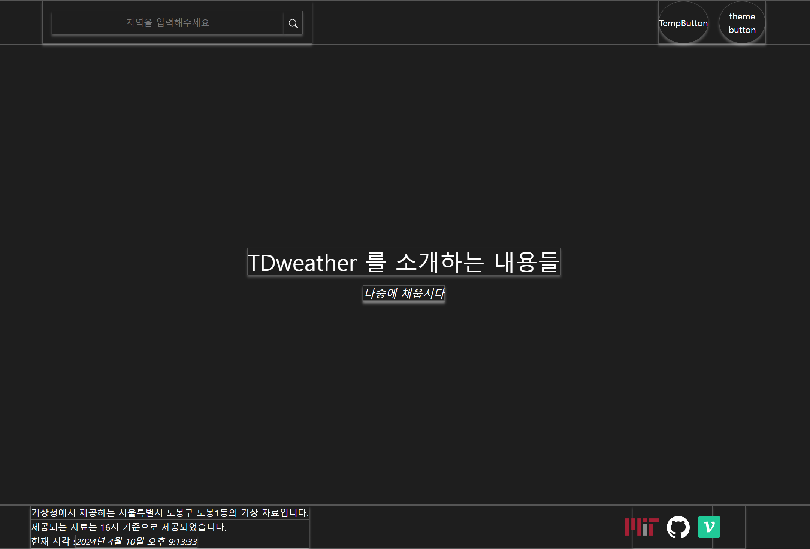
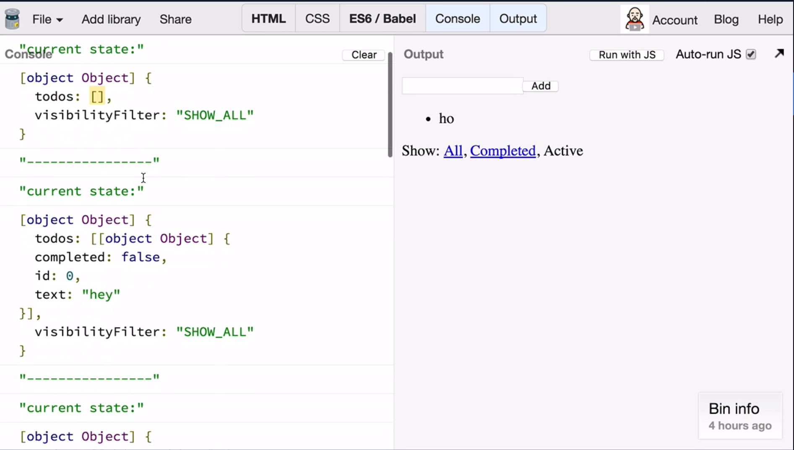

# 패칭 결과 전역 상태 관리

```jsx
import moduleCss from './Content.module.css';
import ContentHeader from './ContentHeader/ContentHeader';
import ContentMain from './ContentMain/ContentMain';
import ContentFooter from './ContentFooter/ContentFooter';

import useTheme from '../../hooks/useTheme';

const ContentLayout = () => {
  const { theme } = useTheme();
  return (
    <section style={{ ...theme.Default }} className={moduleCss.Content}>
      <ContentHeader />
      <ContentMain />
      <ContentFooter />
    </section>
  );
};

export default ContentLayout;
```



다음과 같은 영역에서 `ContentHeader` 레이아웃에서 검색어를 통해

검색어에 걸맞는 날씨 정보를 패칭해오는 것을 지난 `13docs` 에서 구현에 성공했다.

이제 `ContentHeader` 에서 패칭해온 데이터 정보를 `ContentMain` 으로 넘겨줘

`ContentMain` 에서 날씨와 관련된 정보를 카드 형태로 렌더링 할 수 있도록 넘겨줘야 한다.

`ContentHeader` 에서 패칭해온 정보를 `ContentMain` 으로 넘겨주기 위해선 다음과 같은 방법을 사용해야 할 것이다.

```jsx
const ContentLayout = () => {
  const { theme } = useTheme();
  return (
    <section style={{ ...theme.Default }} className={moduleCss.Content}>
      // 1. 상단에서 컨텍스트를 제공하고
      <WeatherContext.Provider value= {data, setData}>
      // 2. 패칭해온 정보를 이용해 setData(패칭해온 정보) 로 상태를 변경하고
        <ContentHeader />
      // 3. WeatherContext 에서 제공하는 컨텍스트를 받아와 렌더링 한다.
        <ContentMain />
        <ContentFooter />
      <>
    </section>
  );
};
```

그러면 , `ContentHeader` 에서 `ContentMain` 으로 넘겨줘야 할 정보는 어떤 것이 있을까 ?

- 날씨를 가져온 지역의 정보
- 가져온 날씨

결국 `ContentHeader` 에서 패칭해온 데이터 모두를 컨텍스트로 넘겨 받아야 한다.

사실 그냥 `Context` 로 관리해서 넘겨주면 되지만 기왕 토이프로젝트 해보면서 많이 배우려고 하는 만큼

전역 상태 관리 라이브러리를 사용해보도록 하자

# `Redux` 의 간략한 개념

https://ko.redux.js.org/tutorials/essentials/part-1-overview-concepts

우선 해당 글은 리덕스을 하향식으로 평가한 하나의 아티클만을 보고 작성하였다.

간략하게 적어보자

### `Why & When`

리덕스를 사용해야 해야 하는 몇 가지 이유는 다음과 같다.

1. 상태값이 한 컴포넌트가 아닌 여러 컴포넌트에서 참조하는 경우

여러 컴포넌트가 공유하는 상태 값을 `Redux` 에서 제공하는 `Store` 에 모두 저장해둔 후

여러 컴포넌트에게 `Store` 내부에 존재하는 상태값을 함으로서 상태값을 글로벌 하게 관리 할 수 있다.

2. 상태값의 변화가 `One way flow` 가 아닌 `Complex flow` 인 경우

어떤 상태의 값이 어떤 한 이벤트만으로 변화가 트리거 되는 것이 아닌

여러 곳에서의 이벤트로 상태 변화가 트리거 되는 경우 상태값의 변화 원인을 추적하는데 어려움이 있다.

이에 `Redux` 에서는 상태 변화 트리거를 표현하는 `action` 객체와 `action` 객체를 이용해 상태를 변화시키는 메소드인 `dispatch` 를 통해

상태 변화를 원활하게 추적하고 상태를 변화시킨다.

### `Tools`

`Redux` 에서는 다양한 도구를 제공한다.

- `React-Redux` : 리액트와 연동되는 라이브러리로 `<Provider>` 컴포넌트를 제공하고 `useSelector` , `useReducer` 와 같은 훅을 제공한다 .
- `Redux-Toolkit` : 리덕스를 이용하기 위한 도구들을 제공하는 라이브러리로 전체 상태를 관리하는 스토어 생성이나 리듀서 및 상태 변경을 야기하는 다양한 함수를 제공한다.
- `Redux DevTools` : 리덕스와 관련된 디버깅 툴을 제공한다.

### `Main Concept`


기본적인 컨셉은 다음과 같다.

`View` 는 상태 값에 따라 다른 모습을 렌더링 한다.

`View` 에서 상태값을 변화시키는 `action` 이 일어나면 `action` 은 `state` 를 변경시키고 `state` 는 `View` 를 변경시킨다.

### `Terminology`

#### `Action` 객체

```jsx
const addTodoAction = {
  type: 'todos/todoAdded',
  payload: 'Buy milk',
};
```

`Action` 객체는 `type , payloaded` 를 프로퍼티로 갖는 객체이다.
`type` 은 `Action` 객체를 표현하는 값을 넣고

`payloaded` 는 다음 상태값이 변경될 값이 포함된다.

#### `Action creators`

`Action creators` 는 `Action` 객체를 반환하는 함수로 매번 `Action` 객체를 생성 할 필요 없이 동일한 `type` 을 갖는 서로 다른 `payloaded` 를 가지는 `Action` 객체를 생성한다.

```jsx
const addTodo = (text) => {
  return {
    type: 'todos/todoAdded',
    payload: text,
  };
};
```

#### `Reducer`

`Reducer` 는 `(state , action) => new state` 의 형태로 생긴 함수로

`action` 객체를 인수로 받아 새로운 `state` 를 반환한다.

이 때 `Reducer` 는 몇 가지 조건으 만족해야 한다.

1. `new State` 는 `state , action` 에 기반하여 생성되어야 한다.
2. `state` 들은 항상 `immutable` 한 형태로 관리 되어야 한다.
3. 비동기적인 처리는 최대한 지양해야 한다. 비동기적 상태 변화는 예기치 못한 일을 일으킨다.

#### `Store`

`getStore` 와 같은 다양한 메소드를 가지는 객체로 `state` 를 저장하고 반환하는 등의 역할을 한다.

#### `dispatch`

`action` 객체를 인수로 받는 함수로 새로운 `state` 를 반환하는 함수이다.

#### `selector`

`Store` 에 저장되어 있는 상태의 값을 반환하는 함수이다.

### `Redux` 를 꼭 내가 써야 할까 ?

https://ko.redux.js.org/tutorials/essentials/part-1-overview-concepts

`Redux` 공식 홈페이지의 공식문서 한 페이지를 보고 느꼈는데 지금의 프로젝트를 위해

`Redux` 를 꼭 써야 할까 생각해봤을 때

현재 내 프로젝트에서 `Redux` 까지 필요한 것 같지는 않다.

`Redux` 에서 제공하는 개념 자체가 리액트의 `useReducer` 훅과 큰 차이를 느끼지 못했고

`state` 관리하는 `Store` 가 존재하고

`Store` 내에서 현재 `state` 값을 인수로 받아 새로운 `state` 로 만드는

`Immutable change` 기법이 예전 리액트 없이 바닐라 자바스크립트로 `SPA` 를 만들어본 경험에서 해봤던 것과 큰 차이가 없게 느껴졌기 때문이다.

그냥 차라리 전역 `Context` 를 생성하고 `Context` 내부에서 `useReducer` 를 사용하는 방식으로 해볼까 싶다.

지금은 야매로 만들어보고 `Redux` 혹은 `Recoil` 중 하나를 잡아 시간 내서 3~4일정도 공부해볼까 싶다.

### 30분정도 웹 서핑을 하고 생각을 바꿔먹었다.

사실 `Redux` 를 사용하지 않으려 하다가도

생각해보면 지금 아니면 또 언제 `Redux` 를 사용할까 싶었다.

그리고 전역 상태 관리 라이브러리가

`Redux -> Redux toolkit -> recoil .. ` 으로 바뀌어가는 상황에서

예전 기술을 써봐야 요즘 기술이 왜 좋은지를 알 수 있을 것 같아서

이번 기회에 `Redux` 를 사용해보도록 하자

다만 너무 많은 시간을 투자하지는 말자

---

# `Redux tutorial`

Ref : https://egghead.io/lessons/react-redux-the-single-immutable-state-tree

실제 리덕스 공식 문서에서 제공하는 튜토리얼은 아니지만

리덕스 공식문서에서 추천하는 강의 영상 링크를 보고 정리한다.

### `Descripbing State Changes with Actions`


기본적으로 `Redux` 에서는 다음과 같이 `View , State , Action` 의 흐름으로 진행된다 이야기 했었다.



앱이 복잡해짐에 따라 `state` 의 변화를 한 번에 하는 것이 아닌 , `type`과 `payload` 가 적힌 `action` 객체를 이용하는 것이 상태 변화를 추적하기 더 쉽게 만들어주었다.

### `Redux : The Reducer Function`

The Reducer function in Redux , given previous state and action object having type , payloaded properties

Reducer makes new state without changes previous state , thats why we called reducerr is pure function.

### `createStore Polyfill`
