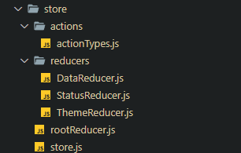
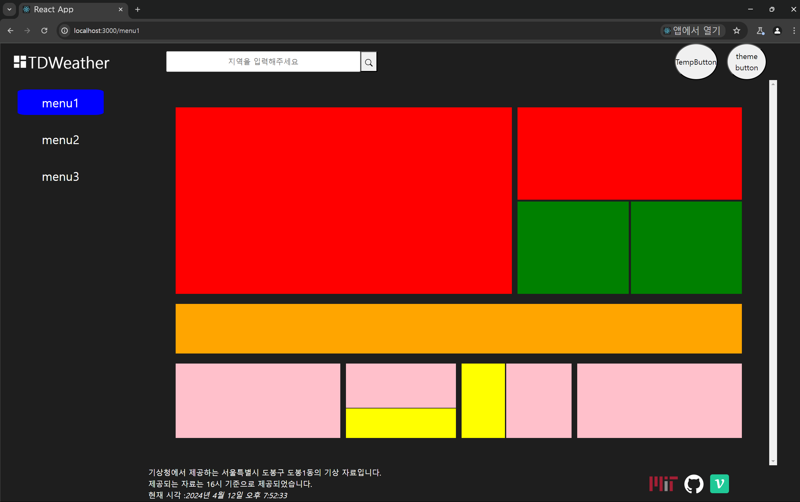

# Redux Store 생성하기



저번 `docs` 에선 적지 않았지만 `Redux` 와 관련된 여러 글을 보고 `store`까지 생성해주었다.

`Redux` 와 관련된 내용은 프로젝트가 모드 끝난 후 정리하기로 하자

## `action types`

### `store/actions/actionTypes.js`

```jsx
// DATA Fetching 을 위한 action Types
const SEARCH_DATA = 'SEARCH_DATA'; // KaKaO API 에서 가져온 정제된 양식의 텍스트
const FETCHING_DATA = 'FETCHING_DATA'; // 기상청 API 에서 가져온 날씨 데이터
// 테마 버튼을 위한 action Types
const TOGGLE_THEME = 'TOGGLE_THEME';

export { SEARCH_DATA, SEARCH_TEXT, FETCHING_DATA, TOGGLE_THEME };
```

`actionTypes.js` 에서는 `Reducer` 들에서 사용할 액션의 타입들을 정의해둔 파일이다.

`Reducer` 자체에서 문자열로 타이핑해줘도 되지만 따로 파일 구조에서 관리해줌으로서

더 관리에 용이하게 하였다.

## `Child Reducer`

### `store/reducers/DataReducer.js`

```jsx
import { SEARCH_DATA, FETCHING_DATA } from '../actions/actionTypes';

const dataReducer = (state = {}, action) => {
  switch (action.type) {
    case SEARCH_DATA:
      return { ...state, fethedLocation: action.payload };
    case FETCHING_DATA:
      return { ...state, fetchedWeather: action.payload };
    default:
      return state;
  }
};

export default dataReducer;
```

`DataReducer` 의 경우엔 컴포넌트들이 공유 할 데이터들을 처리하는 리듀서이다.

### `store/reducer/StatusReduer`

```jsx
import { API_STATUS } from '../actions/actionTypes';

const initalState = { status: 'OK' };
const statusReducer = (state = initalState, action) => {
  switch (action.type) {
    case API_STATUS:
      return { ...state, status: action.payload };
    default:
      return state;
  }
};
export default statusReducer;
```

`statusReducer` 는 `Fetching` 과 관련된 `status` 를 상태로 관리하는 리듀서이다.

각 `Reducer` 에서 관리 할 `type` 이 하나밖에 되지 않더라도 분기처리를 해줘야 한다.

그 이유는 분기처리가 되어있지 않는다면 추후 `RootReducer` 로 `combine` 하여 하나의 리듀서로 만들었을 때

`action.type` 에 따라 분기처리가 되지 않은 `reducer` 를 인식 할 수 없기 때문이다.

### `store/reducer/ThemeReducer`

```jsx
import { TOGGLE_THEME } from '../actions/actionTypes';

const initalState = {
  theme: window.localStorage.getItem('theme') || 'light',
};

const themeReducer = (state = initalState, action) => {
  switch (action.type) {
    case TOGGLE_THEME:
      const nextTheme = action.payload;
      window.localStorage.setItem('theme', nextTheme);
      return { ...state, theme: nextTheme };
    default:
      return state;
  }
};

export default themeReducer;
```

`store/reducer/ThemeReducer` 는 테마를 관리하는 리듀서이다.

해당 리듀서가 호출되면 `window.localStorage` 에 있는 `theme` 값을 설정하고 `theme state` 를 변경한다.

## `Root Reducer`

### `store/rootReducer.`

```jsx
import dataReducer from './reducers/DataReducer';
import statusReducer from './reducers/StatusReducer';
import themeReducer from './reducers/ThemeReducer';
import { combineReducers } from 'redux';

const rootReducer = combineReducers({
  status: statusReducer,
  data: dataReducer,
  theme: themeReducer,
});

export default rootReducer;
```

`rootReducer` 는 3가지의 리듀서를 하나로 `combine` 시킨 리듀서이다.

## `Store`

### `store/store`

```jsx
import { createStore } from 'redux';
import rootReducer from './rootReducer';

const store = createStore(rootReducer);

export default store;
```

여러 리듀서가 컴바인 된 `rootReducer` 를 이용해 `store` 를 생성해준다.

해당 리듀서를 이용하는 `store` 는 다음과 같이 생긴 `state` 를 갖게 된다.


## `Provider`

이제 컴포넌트들이 `store` 에 저장된 `state` 를 이용하고

`store` 의 메소드와 연동되는 `useSelector , useDispatch` 등을 이용하기 위해 전역 컴포넌트들을 `Provider` 컴포넌트로 감싸주자

```jsx
// import Context
import { Provider } from 'react-redux';

// import Component
import DashboardWrapper from './@components/UI/DashboardWrapper/DashboardWrapper';
// import Layout
import SidebarLayout from './layouts/SideBarLayout/SidebarLayout';
import ContentLayout from './layouts/ContentLayout/ContentLayout';
// import style
import './index.css';
// import store
import store from './store/store';

const Dashboard = () => {
  return (
    <Provider store={store}>
      <DashboardWrapper>
        <SidebarLayout />
        <ContentLayout />
      </DashboardWrapper>
    </Provider>
  );
};

export default Dashboard;
```

이를 통해 전역에 존재하는 컴포넌트들이 `store` 에 저장된 `state` 에 접근하고 수정하는 것이 가능하게 되었다.

# 전체 컴포넌트에 테마 상태 주입하기

```jsx
import { useSelector } from 'react-redux';

const useTheme = () => {
  const { theme } = useSelector((state) => state.theme);
  return theme;
};

export default useTheme;
```

이전 사용하던 `useTheme` 는 `Context` 에서 값을 가져왔다면

이번 수정된 `useTheme` 는 `store` 에 저장되어 있는 `state` 중 `theme` 값을 가져와

반환하도록 수정되었다.

또한 추가로 추가된 점은 이전엔 `theme` 와 관련된 스타일을 객체로 받아 모두 인라인으로 주입했으나

인라인 스타일은 성능에 악영향을 미치기 때문에 클래스 명을 반환하는 형태로 변경하였다.

**`src/theme.css`**

```css
.dark {
  background-color: #1e1e1e;
  border: 1px solid #555;
  color: white;
  box-shadow: 0px 4px 4px rgba(255, 255, 255, 0.25);
}

.light {
  background-color: #fafafa;
  border: 1px solid black;
  color: black;
  box-shadow: 5px 5px 5px gray;
}

/* TODO .dark-title 이나 light-title 과 같은 세부적인 스타일링 정하기  */
```

루트 폴더에 `theme.css` 를 추가해주고 엔트리파일인 `index.js` 에서 해당 스타일 시트를 가져오는 것으로 변경하였다.

### 잘 되나 확인하기

```jsx
// import Context
import { Provider } from 'react-redux';

// import Component
import DashboardWrapper from './@components/UI/DashboardWrapper/DashboardWrapper';
// import Layout
import SidebarLayout from './layouts/SideBarLayout/SidebarLayout';
import ContentLayout from './layouts/ContentLayout/ContentLayout';

// import store
import store from './store/store';

const Dashboard = () => {
  return (
    <Provider store={store}>
      <DashboardWrapper>
        <SidebarLayout />
        <ContentLayout />
      </DashboardWrapper>
    </Provider>
  );
};

export default Dashboard;
```

해당 전체 페이지 구조에서 `DashboardWrapper` 에서 클래스 명을 추가해주도록 하자

```jsx
import useTheme from '../../../hooks/useTheme';
import moduleCss from './DashboardWrapper.module.css';

const DashboardWrapper = ({ children }) => {
  const theme = useTheme();
  return (
    <section className={`${moduleCss.dashBoardWrapper} ${theme}`}>
      {children}
    </section>
  );
};

export default DashboardWrapper;
```

다음처럼 `useTheme` 를 이용해 테마를 가져오 클래스명에 테마를 추가해주니 잘 작동한다.

> 추후 모든 컴포넌트에 테마 별 클래스명을 생성해두고 붙여주도록 하자



# 테마 버튼에 이벤트 핸들러 부착하기

그럼 이제 `ThemeButton` 의 `onClick` 이벤트에 테마를 변경시키는 이벤트 핸들러를 부착해줘야 한다.

### `useDispatchTheme`

```jsx
import { TOGGLE_THEME } from '../store/actions/actionTypes';
import { useDispatch, useSelector } from 'react-redux';

const useDispatchTheme = () => {
  const { theme } = useSelector((state) => state.theme);
  const newTheme = theme === 'dark' ? 'light' : 'dark';
  const dispatch = useDispatch();
  const themeAction = { type: TOGGLE_THEME, payload: newTheme };

  return () => {
    dispatch(themeAction);
  };
};

export default useDispatchTheme;
```

`useDispatchTheme` 은 `useSelector` 훅을 이용하여 `store` 에 저장되어 있는 `state` 중 `theme state` 를 가져오고

가져온 `theme state` 를 이용해 다음 변경 예정인 `nextTheme` 을 지정하고

`useDispatch` 를 이용하여 다음으로 변경 될 `nextTheme` 을 기억하는 클로저 함수인 `handleTheme` 를 반환한다.

### 변경된 `ThemeButton`

```jsx
// import moduleCss
import moduleCss from './ThemeButton.module.css';
// import Component
import Button from '../Button/Button';
// import CustomHooks
import useDispatchTheme from '../../../hooks/useDispatchTheme';
const ThemeButton = () => {
  const handleTheme = useDispatchTheme();
  return (
    <Button
      item='theme button'
      className={moduleCss.themeButton}
      onClick={handleTheme}
    />
  );
};

export default ThemeButton;
```

`ThemeButton`의 `onClick` 이벤트 핸들러로 `handleTheme` 를 부착시켜주면

버튼을 누를 때 마다 `dispatch` 가 담긴 메소드가 재정의 , 호출되면서 테마가 잘 변경되는 모습을 볼 수 있다.
