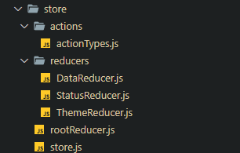

# Redux Store 생성하기



저번 `docs` 에선 적지 않았지만 `Redux` 와 관련된 여러 글을 보고 `store`까지 생성해주었다.

`Redux` 와 관련된 내용은 프로젝트가 모드 끝난 후 정리하기로 하자

## `action types`

### `store/actions/actionTypes.js`

```jsx
// DATA Fetching 을 위한 action Types
const SEARCH_DATA = 'SEARCH_DATA'; // KaKaO API 에서 가져온 정제된 양식의 텍스트
const FETCHING_DATA = 'FETCHING_DATA'; // 기상청 API 에서 가져온 날씨 데이터
// 테마 버튼을 위한 action Types
const TOGGLE_THEME = 'TOGGLE_THEME';

export { SEARCH_DATA, SEARCH_TEXT, FETCHING_DATA, TOGGLE_THEME };
```

`actionTypes.js` 에서는 `Reducer` 들에서 사용할 액션의 타입들을 정의해둔 파일이다.

`Reducer` 자체에서 문자열로 타이핑해줘도 되지만 따로 파일 구조에서 관리해줌으로서

더 관리에 용이하게 하였다.

## `Child Reducer`

### `store/reducers/DataReducer.js`

```jsx
import { SEARCH_DATA, FETCHING_DATA } from '../actions/actionTypes';

const dataReducer = (state = {}, action) => {
  switch (action.type) {
    case SEARCH_DATA:
      return { ...state, fethedLocation: action.payload };
    case FETCHING_DATA:
      return { ...state, fetchedWeather: action.payload };
    default:
      return state;
  }
};

export default dataReducer;
```

`DataReducer` 의 경우엔 컴포넌트들이 공유 할 데이터들을 처리하는 리듀서이다.

### `store/reducer/StatusReduer`

```jsx
import { API_STATUS } from '../actions/actionTypes';

const statusReducer = (state, action) => {
  switch (action.type) {
    case API_STATUS:
      return { ...state, status: action.payload };
    default:
      return state;
  }
};
export default statusReducer;
```

`statusReducer` 는 `Fetching` 과 관련된 `status` 를 상태로 관리하는 리듀서이다.

각 `Reducer` 에서 관리 할 `type` 이 하나밖에 되지 않더라도 분기처리를 해줘야 한다.

그 이유는 분기처리가 되어있지 않는다면 추후 `RootReducer` 로 `combine` 하여 하나의 리듀서로 만들었을 때

`action.type` 에 따라 분기처리가 되지 않은 `reducer` 를 인식 할 수 없기 때문이다.

### `store/reducer/ThemeReducer`

```jsx
import { TOGGLE_THEME } from '../actions/actionTypes';

const initalState = {
  theme: window.localStorage.getItem('theme') || 'light',
};

const themeReducer = (state = initalState, action) => {
  switch (action.type) {
    case TOGGLE_THEME:
      const nextTheme = action.payload;
      window.localStorage.setItem('theme', nextTheme);
      return { ...state, theme: nextTheme };
    default:
      return state;
  }
};

export default themeReducer;
```

`store/reducer/ThemeReducer` 는 테마를 관리하는 리듀서이다.

해당 리듀서가 호출되면 `window.localStorage` 에 있는 `theme` 값을 설정하고 `theme state` 를 변경한다.

## `Root Reducer`

### `store/rootReducer.`

```jsx
import dataReducer from './reducers/DataReducer';
import statusReducer from './reducers/StatusReducer';
import themeReducer from './reducers/ThemeReducer';
import { combineReducers } from 'redux';

const rootReducer = combineReducers({
  status: statusReducer,
  data: dataReducer,
  theme: themeReducer,
});

export default rootReducer;
```

`rootReducer` 는 3가지의 리듀서를 하나로 `combine` 시킨 리듀서이다.

해당 리듀서를 이용하는 `store` 는 다음과 같이 생긴 `state` 를 갖게 된다.

```jsx
state = {
  status: ...
  data: {fetchLocation : .. , fetchWeather : ..},
  theme: ...
};
```

## `Store`

### `store/store`

```jsx
import { createStore } from 'redux';
import rootReducer from './rootReducer';

const store = createStore(rootReducer);

export default store;
```

여러 리듀서가 컴바인 된 `rootReducer` 를 이용해 `store` 를 생성해준다.

## `Provider`

이제 컴포넌트들이 `store` 에 저장된 `state` 를 이용하고

`store` 의 메소드와 연동되는 `useSelector , useDispatch` 등을 이용하기 위해 전역 컴포넌트들을 `Provider` 컴포넌트로 감싸주자

```jsx
// import Context
import { Provider } from 'react-redux';

// import Component
import DashboardWrapper from './@components/UI/DashboardWrapper/DashboardWrapper';
// import Layout
import SidebarLayout from './layouts/SideBarLayout/SidebarLayout';
import ContentLayout from './layouts/ContentLayout/ContentLayout';
// import style
import './index.css';
// import store
import store from './store/store';

const Dashboard = () => {
  return (
    <Provider store={store}>
      <DashboardWrapper>
        <SidebarLayout />
        <ContentLayout />
      </DashboardWrapper>
    </Provider>
  );
};

export default Dashboard;
```

이를 통해 전역에 존재하는 컴포넌트들이 `store` 에 저장된 `state` 에 접근하고 수정하는 것이 가능하게 되었다.
