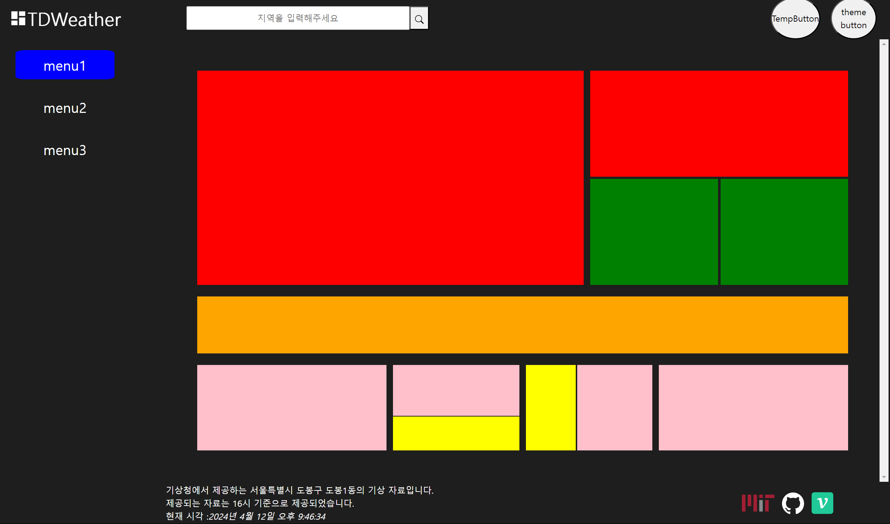

# API 패칭 결과 전역으로 옮겨야 할 필요성

### `기존의 useWeather`

```jsx
import { useState } from 'react';
import {
  fetchForecastFromLocation,
  fetchLocationFromString,
} from '../utils/ApiUtils';
import delay from '../utils/delay';
const DELAYTIME = 1000;

const useWeather = () => {
  const [weather, setWeather] = useState(null);
  const [error, setError] = useState(null);
  const [isLoading, setisLoading] = useState(false);

  const fetchWeather = async (locationString) => {
    try {
      setisLoading(true);
      // ! isLoading 상태를 보여주기 위한 delay 함수
      await delay(DELAYTIME);
      const locationObject = await fetchLocationFromString(locationString);
      const forecastWeater = await fetchForecastFromLocation(locationObject);
      setWeather(forecastWeater);
    } catch (e) {
      console.error(e);
      setError(e);
      setTimeout(() => {
        setError(null);
      }, DELAYTIME);
    } finally {
      setisLoading(false);
    }
  };

  return { fetchWeather, weather, error, isLoading };
};

export default useWeather;
```

이전 `SearchArea` 내부에서 검색어 (`locationString`) 를 이용해

- 지역 문자열 --> 지역 정보가 담긴 객체체 변경하고 (`locationObject`)
- 지역 정보가 담긴 객체 --> 기상청 API 요청 -> 날씨 정보가 담긴 객체 (`forecastWeather`)

로 변경하는 일련의 과정들을 완성했다.

해당 커스텀 훅내부에 정의된 `weather , isLoading , error` 상태 값들을 전역으로 옮길 필요가 있었는데

이는 `ContentHeader / SearchArea` 에서의 상태값은 `ContentMain` 에서도 사용되어야 했기 때문이다.

`weather` 데이터는 카드에서 정보를 담을 떄 필요하고
`isLoading , error` 상태는 카드의 로딩 중 혹은 에러 상태일 때의 카드 양상을 다르게 렌더링 해야 하기 때문이다.

상태 뿐이 아니라 `locationObject` 내부에 존재하는 주소값 또한 `ContentMain / ContentFooter` 로 넘겨 지역 정보를 표현해주어야 했다.

# `ConditionalSerachForm` 컴포넌트 자체를 모두 수정하자

```jsx
// import Components
import SearchForm from '../../Composite/SearchForm/SearchForm';
// import CustomHooks
import useWeather from '../../../hooks/useWeather';
import useSearchRef from '../../../hooks/useSearchRef';
const ConditionalSearchForm = () => {
  const inputRef = useSearchRef();
  // TODO LatLong 값 전역으로 빼기
  const { fetchWeather, weather, error, isLoading } = useWeather();

  const handleClick = () => {
    const locationString = inputRef.current?.value;
    if (locationString) fetchWeather(locationString);
  };

  if (isLoading) return <SearchForm.Loading />;
  if (error) return <SearchForm.Error error={error.message} />;
  return <SearchForm.Normal onClick={handleClick} />;
};

export default ConditionalSearchForm;
```

이전 `ContentHeader -> SearchArea` 내부에 존재하던 `ConditionalSearchForm` 의 모습은 다음과 같이 생겻다.

해당 컴포넌트는 `useWeather`훅으로부터 데이터를 패칭해오는 `fetchWeater` 함수와 렌더링 할 때 이용할 `API fetching` 과 관련된 `state` 인 `isLoading , error` 상태를 받는다.

> `isLoading , error` 의 상태는 `fetchWeather` 함수 내부에서 지속적으로 변경된다.

이제 우리는 `fetchWeather` 함수가 실행되며 생성되는 값들인

- 입력 정보와 관련된 지역 정보
- 입력된 지역의 날씨 정보

두 가지 정보를 전역으로 넘겨주어야 한다.

또한 검색창 외 하단의 메인 , 풋터 영역에도 지역 정보와 로딩 상태 또한 넘겨줘야 한다.


> 나는 로딩 상태에 따라 카드 컴포넌트가 렌더링 되는 모습도 다르게 하고 싶다.

이에 커스텀 훅들을 다시 만들어보자

## `Dispatch` 를 시키는 커스텀 훅

### `useDispatchWeather`

```jsx
import { useDispatch } from 'react-redux';
import { FETCHING_WEATHER } from '../store/actions/actionTypes';

const useDispatchWeather = () => {
  const dispatch = useDispatch();

  return (location) => {
    dispatch({ type: FETCHING_WEATHER, payload: location });
  };
};

export default useDispatchWeather;
```

### `useDispatchStatus`

```jsx
import { useDispatch } from 'react-redux';
import { API_STATUS } from '../store/actions/actionTypes';

const useDispatchStatus = () => {
  const dispatch = useDispatch();
  return (status) => {
    dispatch({ type: API_STATUS, payload: status });
  };
};

export default useDispatchStatus;
```

### `useDispatchLocation`

```jsx
import { useDispatch } from 'react-redux';
import { FETCHING_LOCATION } from '../store/actions/actionTypes';

const useDIspatchLocation = () => {
  const dispatch = useDispatch();

  return (location) => {
    dispatch({ type: FETCHING_LOCATION, payload: location });
  };
};

export default useDIspatchLocation;
```

다음처럼 전역 상태를 변경 시킬 수 있는 함수를 반환하는 커스텀 훅들을 생성해주었다.

함수를 반환하도록 만든 것은 커스텀훅이 아닌 일반적인 함수 내부에서 상태를 변경시키기 위함이였다.

## 정보를 가져오는 커스텀 훅

### `useAPIStatus`

```jsx
import { useSelector } from 'react-redux';

const useAPIStatus = () => {
  const { status } = useSelector((state) => state.status);
  return status;
};

export default useAPIStatus;
```

해당 커스텀훅은 데이터가 패칭되는 동안 패칭 과정과 관련된 상태 값을 `useSelector` 를 이용해 가져온 후 반환하는 메소드이다.

## 날씨 정보를 가져올 이벤트 핸들러 반환 커스텀훅 생성

### `useFetching`

```jsx
import useDIspatchLocation from './useDispatchLocation';
import useDispatchWeather from './useDIspatchWeather';
import useDispatchStatus from './useDisptachStatus';
import useSearchRef from './useSearchRef';

import delay from '../utils/delay';
import {
  fetchForecastFromLocation,
  fetchLocationFromString,
} from '../utils/ApiUtils';
import { getAddressName } from '../utils/CoordinateUtils';
const DELAYTIME = 1000;

const useFetching = () => {
  const dispatchWeather = useDispatchWeather();
  const disptachLocation = useDIspatchLocation();
  const disptachStatus = useDispatchStatus();
  const inputRef = useSearchRef();

  const fetchingWeather = async () => {
    if (!inputRef.current.value) return null;

    try {
      disptachStatus('LOADING');
      await delay(DELAYTIME);
      const locationString = inputRef.current.value;
      const locationObject = await fetchLocationFromString(locationString);
      const addressName = getAddressName(locationObject);
      const forecastWeater = await fetchForecastFromLocation(locationObject);
      disptachLocation(addressName);
      dispatchWeather(forecastWeater);
    } catch (e) {
      console.error(e);
      disptachStatus(e.message); // 에러시에는 에러 메시지를 status에 저장
      await delay(DELAYTIME);
    } finally {
      disptachStatus('OK');
    }
  };
  return fetchingWeather;
};

export default useFetching;
```

다음과 같이 전역 상태들을 변경시키며 데이터를 패칭해오는 함수 `fetchgWeather` 를 반환하는 훅인 `useFetching` 커스텀훅을 생성하였다.

> ### `getAddressName`
>
> 중간에 추가된 `getAddressName` 함수는 단순히 `locationObject` 에서 첫 번째 정보를 가져와 카카오 API 에서 제공하는 지역명을 뽑아내는 함수이다.
>
> ```jsx
> const getAddressName = ({ document }) => {
>   const address = document[0];
>   return address.address_name;
> };
> ```

## `ConditionalSerachForm` 을 통째로 바꿔버리자

```jsx
// import Components
import SearchForm from '../../Composite/SearchForm/SearchForm';
// import CustomHooks
import useAPIStatus from '../../../hooks/useAPIStatus';
const ConditionalSearchForm = () => {
  const status = useAPIStatus();
  switch (status) {
    case 'LOADING':
      return <SearchForm.Loading />;
    case 'OK':
      return <SearchForm.Normal />;
    default:
      return <SearchForm.Error />;
  }
};

export default ConditionalSearchForm;
```

리팩토링 된 `ConditionalSearchForm` 의 모습은 다음과 같다.

그저 단순히 `useAPIStatus` 커스텀훅으로 전역의 `status` 값을 받아와

`status` 값에 따라 서로 다른 영역을 렌더링 하는 컴포넌트로 변경되었다.

```jsx
const ConditionalSearchForm = () => {
  const inputRef = useSearchRef();
  // TODO LatLong 값 전역으로 빼기
  const { fetchWeather, weather, error, isLoading } = useWeather();

  const handleClick = () => {
    const locationString = inputRef.current?.value;
    if (locationString) fetchWeather(locationString);
  };

  if (isLoading) return <SearchForm.Loading />;
  if (error) return <SearchForm.Error error={error.message} />;
  return <SearchForm.Normal onClick={handleClick} />;
};
```

이전의 모습을 보면 `error , onClick` 등을 `props` 로 컴포넌트들에게 넘겨주었었는데

생각해보니 `SearchForm.Loading , Error , Normal` 모두 `status` 값에 따라

서로 독립적으로 렌더링 되는 컴포넌트이기 때문에

`error , onClick` 등을 컴포넌트 내부에서 호출해 부착해주었다.

```jsx
const SearchError = ({ width, height }) => {
  const error = useAPIStatus();
  return (
    <SearchForm>
      <SearchErrorInput error={error} />
      <SearchErrorButton width={(width, height)} />
    </SearchForm>
  );
};
```

`SearchError` 컴포넌트 내부에서 호출되는 `useAPIStatus` 의 반환값은 항상 에러메시지이다.

`useAPIStatus` 함수를 살펴보면 에러가 발생했을 땐 에러 객체의 `message` 를 `status` 값으로 저장한다.

```jsx
const SearchNormal = () => {
  const handleFetching = useFetching();

  return (
    <SearchForm>
      <SearchInput />
      <SearchButton onClick={handleFetching} />
    </SearchForm>
  );
};
```

이렇게 컴포넌트들을 모듈단위로 잘게 만들어두고

서로 독립적으로 만듦으로서 모듈을 조합한 컴포넌트가 그저 렌더링 로직에만 집중 할 수 있는

컴포넌트를 생성할 수 있게 되었다.
