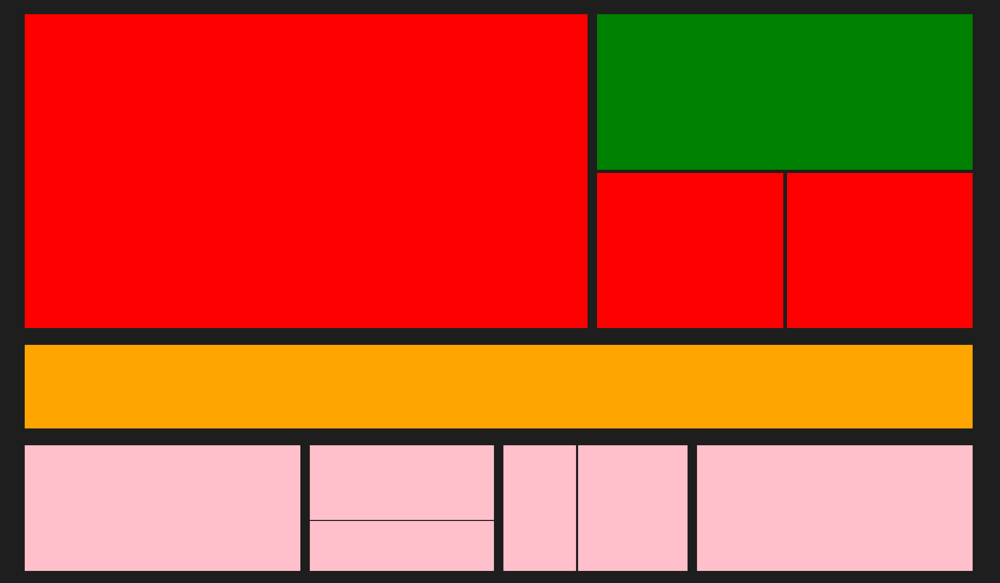
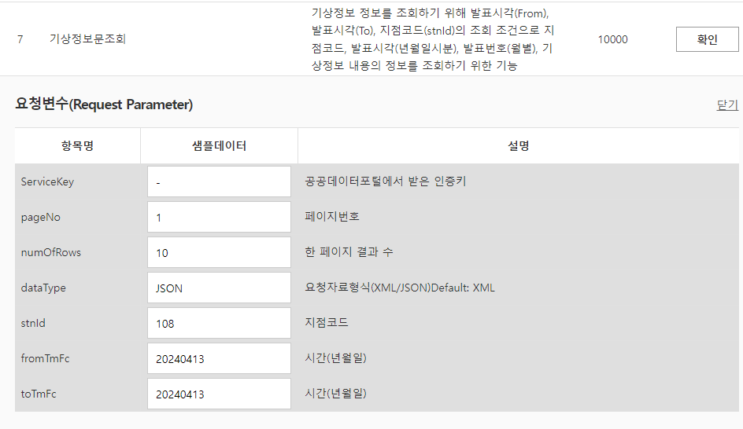

# 영역 별 필요한 데이터 정보 정리하기

메인 영역에 카드 컴포넌트들에 들어갈 정보들을 생각해보았다.

### 빨간색 영역

기상특보 단기 예보는 조회일 (현재 일) 로부터 앞으로 3일까지의 기온을 패칭해오는 것이 가능하다.



빨간색 영역에는 현재의 날씨를 담아주도록 하자

이후 두 개의 작은 빨간색 영역은 전일 대비 현 시각의 기온차이 , 자외선 지수를 넣어주도록 하자

빨간색 영역에선 `input[range]` 엘리먼트를 통해 현재 일자의 시간대 별 날씨를 볼 수 있도록

시간대를 지정해줄 수 있도록 하자

#### 필요한 기상청 데이터

- 기상청 단기 예보 조회
- 기상청 생활 기수 조회 서비스 (자외선)

### 초록색 영역

초록색 영역에는 현재 일자 별 기상 관련 텍스트를 넣어주도록 하자

뉴스처럼 말이다.

#### 필요한 기상청 데이터

- 기상 정보문 조회
  Ref : https://www.data.go.kr/iim/api/selectAPIAcountView.do

### 주황색 영역

주황색 영역은 현재 일로부터 앞으로 4일간의 최고 기온 , 최저 기온 , 오전 9시 기준 날씨 상태를 작은 카드 형태로 넣어주도록 하자

#### 필요한 기상청 데이터

- 기상청 단기 예보 조회

### 핑크색 영역

핑크색 영역은 미세먼지 관련 정보를 넣어주도록 하자

다만 미세먼지 관련 정보를 넣어주기 위해선 두 가지 단계를 거쳐야 한다.

1. 좌표를 이용해 `TM` 좌표로 변환하여 가장 가까운 측정소 명을 가져온다.

에어코리아\_측정소정보 API 를 이용하여 가장 근접한 측정소명 (`station name`) 을 가져와야 한다.

Ref : https://www.data.go.kr/iim/api/selectAPIAcountView.do

2. 근접한 `station name` 을 이용하여 측정소 별 실시간 측정 정보 조회를 이용하여 해당 측정소의 측정된 데이터를 가져온다.

Ref : https://www.data.go.kr/iim/api/selectAPIAcountView.do

- 대기질 예보 통보 조회를 이용해 `Text news` 형태로 미세먼지 관련 뉴스를 채워주도록 하자

# 영역 별 필요한 데이터 추가로 패칭해오기

### 기상청 생활 기수 조회 서비스

아 .. 기상청은 3시간 단위로만 조회가 가능하다.

자외선은 우선 나중에 하도록 하자

### 기상 정보문 조회

기상 정보문 조회는 기상과 관련된 정보를 텍스트 형태로 받아올 수 있다.



요청 파라미터는 다음과 같다.

```jsx
const weatherTextAPI = {
  APIKEY: 'API 키',
  URI: 'http://apis.data.go.kr/1360000/WthrWrnInfoService/getWthrInfo',
};

export { KaKaoAPI, weatherForecastAPI, weatherTextAPI };
```

다음과 같이 `_API.js` 파일에 `weatherText` 를 가져올 수 있도록 정보를 상수 형태로 저장해주고

```jsx
const fetchForecastText = async () => {
  const { APIKEY, URI } = weatherTextAPI;
  const { baseDate } = getCurrentTime();
  const searchParams = new URLSearchParams([
    ['ServiceKey', APIKEY],
    ['fromTmFc', baseDate],
    ['toTmFc', baseDate],
    ['dataType', 'JSON'],
    ['stnId', '108'],
    ['numOfRows', '10'],
  ]);
  const ENDPOINT = `${URI}?${searchParams.toString()}`;
  const response = await fetch(ENDPOINT);

  if (!response.ok)
    throw new Error('기상청 API 네트워크가 불안정합니다.다시 시도해주세요');

  const json = await response.json();
  const weatherRowText = json.response.body.items.item[0]['t1'];
  const weatherParsingText = weatherRowText
    .split('\n\n')[0]
    .split('(현황)')[1]
    .replace('-', '\n')
    .trim();
  return weatherParsingText;
};
```

다음과 같이 텍스트를 패칭해온 후 필요한 정보만 파싱해오는 `fetchForecastText` 함수를 생성해주자

이후 `actionTypes` 에 `FFETCHING_WEATHERTEXT` 를 정의해주고

`DataReducer` 에 해당 정보를 추가해주도록 하자

```jsx
import {
  FETCHING_LOCATION,
  FETCHING_WEATHER,
  FETCHING_WEATHERTEXT,
} from '../actions/actionTypes';
// TODO inital State localStorage 에서 가져오기

const dataReducer = (state = {}, action) => {
  switch (action.type) {
    case FETCHING_LOCATION:
      return { ...state, fethedLocation: action.payload };
    case FETCHING_WEATHER:
      return { ...state, fetchedWeather: action.payload };
    case FETCHING_WEATHERTEXT:
      return { ...state, fetchedWeatherText: action.payload };
    default:
      return state;
  }
};

export default dataReducer;
```

이후 해당 리듀서에게 액션 객체를 디스패칭 시키는 함수를 반환하는 `useDispatchForecastText` 훅을 생성해주고 해당 훅을 이용해

기존의 `useFetching` 훅 내부에서 호출해주자

```jsx
import { useDispatch } from 'react-redux';
import { FETCHING_WEATHERTEXT } from '../store/actions/actionTypes';

const useDispatchWeatherText = () => {
  const dispatch = useDispatch();

  return (weatherText) => {
    dispatch({ type: FETCHING_WEATHERTEXT, payload: weatherText });
  };
};

export default useDispatchWeatherText;
```

```jsx
import useDIspatchLocation from './useDispatchLocation';
import useDispatchWeather from './useDIspatchWeather';
import useDispatchStatus from './useDisptachStatus';
import useDispatchWeatherText from './useDispatchWeatherText';
import useSearchRef from './useSearchRef';

import delay from '../utils/delay';
import {
  fetchForecastFromLocation,
  fetchLocationFromString,
  fetchForecastText,
} from '../utils/ApiUtils';
import { getAddressName } from '../utils/CoordinateUtils';
const DELAYTIME = 1000;

const useFetching = () => {
  const dispatchWeather = useDispatchWeather();
  const dispatchWeatherText = useDispatchWeatherText();
  const disptachLocation = useDIspatchLocation();
  const disptachStatus = useDispatchStatus();
  const inputRef = useSearchRef();

  const fetchingWeather = async () => {
    if (!inputRef.current.value) return null;

    try {
      disptachStatus('LOADING');
      await delay(DELAYTIME);
      const locationString = inputRef.current.value;
      const locationObject = await fetchLocationFromString(locationString);
      const addressName = getAddressName(locationObject);
      const forecastWeather = await fetchForecastFromLocation(locationObject);
      const forecastText = await fetchForecastText();
      // TODO dispatch Promise All 로 변경하기
      disptachLocation(addressName);
      dispatchWeather(forecastWeather);
      dispatchWeatherText(forecastText);
    } catch (e) {
      console.error(e);
      disptachStatus(e.message); // 에러시에는 에러 메시지를 status에 저장
      // TODO 에러 타입 별 에러 메시지 정리하기
      await delay(DELAYTIME);
    } finally {
      disptachStatus('OK');
    }
  };
  return fetchingWeather;
};

export default useFetching;
```
