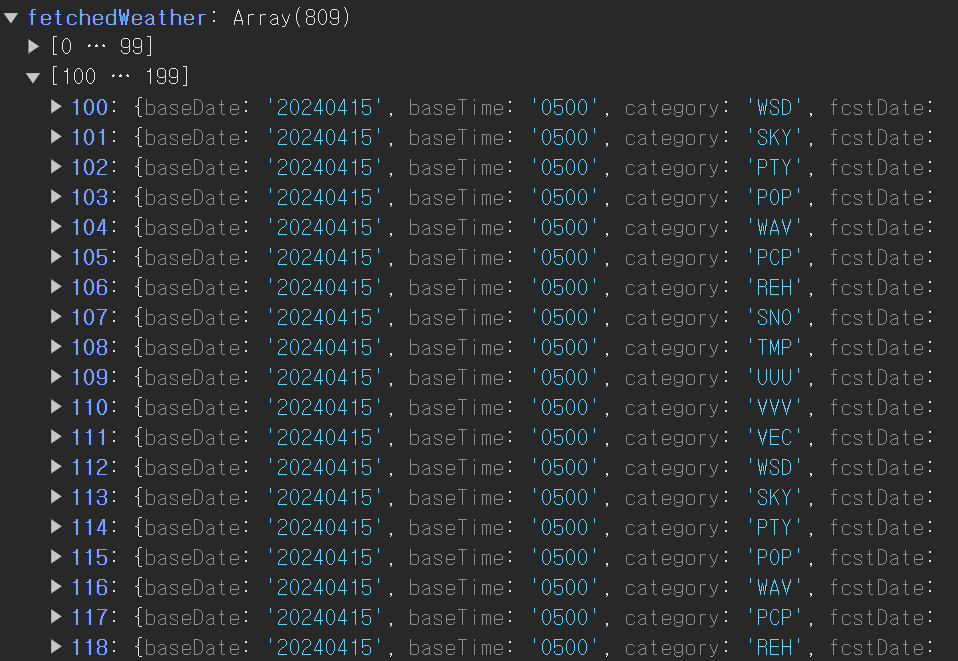
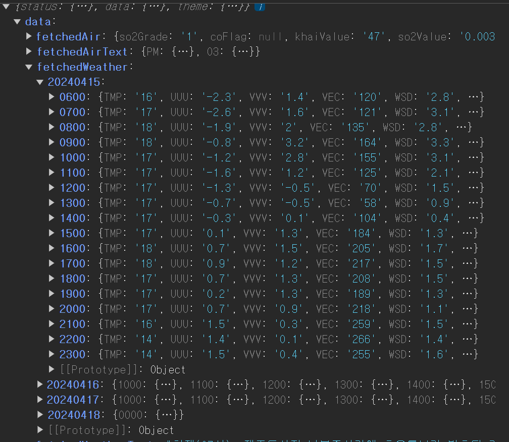
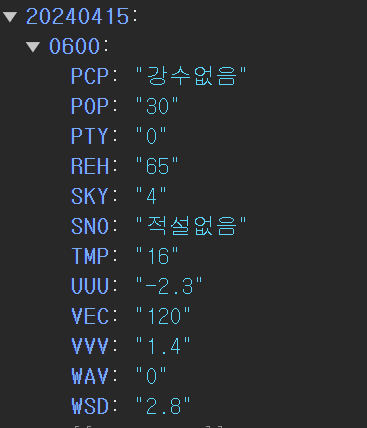
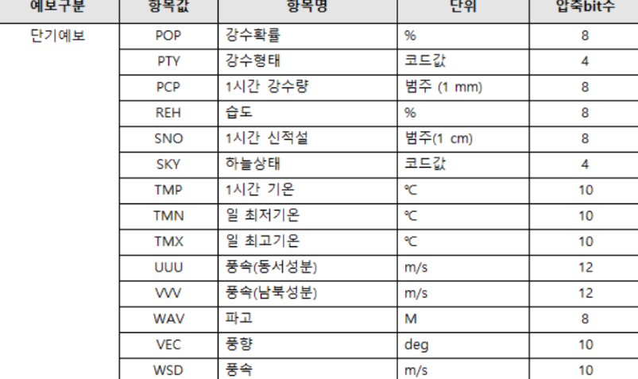
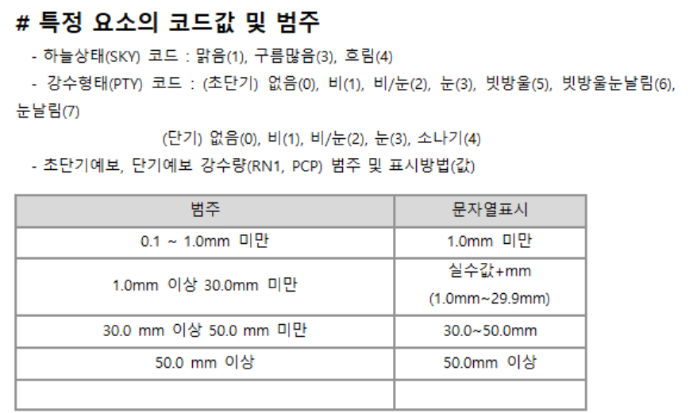

# `Fetching` 메소드의 역할 충돌

저번 `docs`에서 여러 `API` 를 호출해오는 메소드들을

`uitls/ApiUtils.js` 에서 정의해주었다.

이 때 각 메소드들은 인수를 받아 `API GET` 요청을 보내도록 설계되었는데

```jsx
const fetchForecastFromLocation = async (locationObject) => {
  ...
  return weatherData;
};

const fetchForecastText = async () => {
  ...
  const weatherParsingText = weatherRowText
    .split('\n\n')[0]
    .split('(현황)')[1]
    .replace('-', '\n')
    .trim();
  return weatherParsingText;
};

const fetchAirData = async (stationName) => {
  ...
  return json.response.body.items[0];
};

const fetchAirTextPM = async () => {
  ...
  return json.response.body.items[0];
};
const fetchAirTextO3 = async () => {
  ...
  return json.response.body.items[0];
};
```

다음들 처럼 페칭해오는 메소드들 내부에서 응답 값을 전처리 하여 반환하는 로직이 섞여있다.

이는 함수의 이름처럼 데이터를 `fetching` 해오는 것 뿐이 아니라

`Reducer` 들에게 `dispatching` 시키기 위한 `action` 객체를 전처리 하는 로직까지 포함되어 있다.

이는 단일 역할 책임을 지키지 못한 아키텍쳐라 생각이 들어

`fetcing method` 들은 단순히 `fetching` 을 시키기만 하도록 하기로 하였다.

또한 추후 여러 개의 `fetching method` 들을 조합하여 요청을 병럴적으로 보내도록 리팩토링 할 예정이기 때문에

더더욱 개별적인 `fetching method` 들은 오로지 `fetcing` 행위에만 집중 하도록 수정해줘야겠다.

### `fetching method` 들을 단순히 `json` 파일을 반환하도록 변경

```jsx
import {
  KaKaoAPI,
  weatherForecastAPI,
  weatherTextAPI,
  tmCoordAPI,
  airAPI,
  airTextAPI,
} from '../@constants/_API';
import { getNxNyFromLatLong, getTMCoord } from './CoordinateUtils';
import { getCurrentTime } from './DateUtils';

/**
 * 함수는 문자열로 이뤄진 문자열을 받아 카카오 API를 이용해 위치 정보가 담긴 객체를 반환하는 함수
 * @param {String} locationString - 위치를 의미하는 문자열
 * @returns {Object} - KaKao API 에서 제공하는 위치 정보가 담긴 객체
 */
const fetchLocationFromString = async (locationString) => {
  const { APIKEY, URI } = KaKaoAPI;
  const encodeQuery = encodeURIComponent(locationString);
  const ENDPOINT = `${URI}?query=${encodeQuery}`;
  const response = await fetch(ENDPOINT, {
    headers: {
      Authorization: APIKEY,
    },
  });

  if (!response.ok)
    throw new Error('카카오 API 네트워크가 불안정합니다. 다시 시도해주세요');

  const json = await response.json();
  if (!json.meta.total_count) {
    // ! 카카오 API 는 올바른 검색 결과값이 아니더라도 200 상태코드와 함께 빈 데이터를 보내준다.
    // ! 우리는 404 상태 코드를 보내주기로 하자
    const error = new Error('올바른 지역명 검색 양식이 아닙니다');
    error.status = 404;
    throw error;
  }

  return json;
};

/**
 * 이 함수는 카카오 API 를 통해 얻은 locationObject 를 인수로 받아 기상청 API로 요청을 보내 날씨 정보를 가져온다.
 * 함수 내에선 locationObject 내부에 존재하는 위경도 좌표를 nx,ny 좌표로 변경한 후 사용한다.
 * @param {Object} locationObject - location 에 대한 정보가 담긴 객체, 주로 카카오API에서 제공하는 location 객체
 * @returns {Object} - 날씨와 관련된 JSON 데이터로 기상청 API 단기예보를 사용하였음
 */
const fetchForecastFromLocation = async (locationObject) => {
  const { APIKEY, URI } = weatherForecastAPI;
  const { nx, ny } = getNxNyFromLatLong(locationObject);
  const { baseDate } = getCurrentTime();
  const searchParams = new URLSearchParams([
    ['serviceKey', APIKEY],
    ['base_date', baseDate],
    ['nx', nx],
    ['ny', ny],
    ['base_time', '0500'], // ! 기상청의 baseTime 은 항상 해당 일 0500 으로 고정
    ['pageNo', 1],
    ['numOfRows', 1000],
    ['dataType', 'JSON'],
  ]);

  const ENDPOINT = `${URI}?${searchParams.toString()}`;
  const response = await fetch(ENDPOINT);

  if (!response.ok)
    throw new Error('기상청 API 네트워크가 불안정합니다. 다시 시도해주세요');

  const json = await response.json();
  return json;
};

const fetchForecastText = async () => {
  const { APIKEY, URI } = weatherTextAPI;
  const { baseDate } = getCurrentTime();
  const searchParams = new URLSearchParams([
    ['ServiceKey', APIKEY],
    ['fromTmFc', baseDate],
    ['toTmFc', baseDate],
    ['dataType', 'JSON'],
    ['stnId', '108'],
    ['numOfRows', '10'],
  ]);
  const ENDPOINT = `${URI}?${searchParams.toString()}`;
  const response = await fetch(ENDPOINT);

  if (!response.ok)
    throw new Error('기상청 API 네트워크가 불안정합니다.다시 시도해주세요');

  const json = await response.json();
  return json;
};

const fetchNearstStationName = async (locationObject) => {
  const { APIKEY, URI } = tmCoordAPI;
  const [tmX, tmY] = getTMCoord(locationObject);
  const searchParams = new URLSearchParams([
    ['serviceKey', APIKEY],
    ['returnType', 'JSON'],
    ['tmX', tmX],
    ['tmY', tmY],
    ['ver', '1.1'],
  ]);
  const ENDPOINT = `${URI}?${searchParams.toString()}`;
  const response = await fetch(ENDPOINT);
  const json = await response.json();
  return json;
};

const fetchAirData = async (stationResponse) => {
  const { APIKEY, URI } = airAPI;
  const { stationName } = stationResponse.response.body.items[0];
  const searchParams = new URLSearchParams([
    ['serviceKey', APIKEY],
    ['returnType', 'JSON'],
    ['numOfRows', '1'],
    ['stationName', stationName],
    ['dataTerm', 'DAILY'],
    ['ver', '1.0'],
  ]);
  const ENDPOINT = `${URI}?${searchParams.toString()}`;
  const response = await fetch(ENDPOINT);
  if (!response.ok) throw new Error('에어코리아 API 네트워크가 불안정합니다');

  const json = await response.json();
  return json;
};

const fetchAirTextPM = async () => {
  const { APIKEY, URI } = airTextAPI;
  const { searchDate } = getCurrentTime();
  const searchParams = new URLSearchParams([
    ['serviceKey', APIKEY],
    ['returnType', 'JSON'],
    ['numOfRows', '100'],
    ['searchDate', searchDate], // ex : 2024-04-15
    ['informCode', 'PM25'],
  ]);
  const ENDPOINT = `${URI}?${searchParams.toString()}`;
  const response = await fetch(ENDPOINT);
  if (!response.ok) throw new Error('에어코리아 API 네트워크가 불안정합니다');
  const json = await response.json();
  return json;
};
const fetchAirTextO3 = async () => {
  const { APIKEY, URI } = airTextAPI;
  const { searchDate } = getCurrentTime();
  const searchParams = new URLSearchParams([
    ['serviceKey', APIKEY],
    ['returnType', 'JSON'],
    ['numOfRows', '100'],
    ['searchDate', searchDate], // ex : 2024-04-15
    ['informCode', 'O3'],
  ]);
  const ENDPOINT = `${URI}?${searchParams.toString()}`;
  const response = await fetch(ENDPOINT);
  if (!response.ok) throw new Error('에어코리아 API 네트워크가 불안정합니다');
  const json = await response.json();
  return json;
};

export {
  fetchLocationFromString,
  fetchForecastFromLocation,
  fetchForecastText,
  fetchNearstStationName,
  fetchAirData,
  fetchAirTextPM,
  fetchAirTextO3,
};
```

### `DataReducer` 에서 `json` 객체를 받아 전처리 하도록 수정

이후 `store/reducers/utils.js` 파일을 만들어 준 후 해당 파일에서

데이터 전처리 로직을 담은 메소드들을 선언해준다.

```jsx
const getWeatherData = (json) => {
  return json.response.body.items.item;
};

const getAirData = (json) => {
  return json.response.body.items[0];
};

const getParsingWeatherText = (json) => {
  const item = json.response.body.items.item[0];
  const weatherText = item.t1;
  const stringParsed = weatherText
    .split('\n\n')[0]
    .split('(현황)')[1]
    .replace('-', '\n')
    .trim();
  return stringParsed;
};

const spliter = (string, baseword) => {
  const [, ...afterword] = string.split(baseword);
  return afterword.join('').trim();
};

const getParsingAirText = (josnObject) => {
  const { PM, O3 } = josnObject;
  const { informCause: pmCasue, informOverall: pmOverall } =
    PM.response.body.items[0];
  const { informCause: O3Casue, informOverall: O3Overall } =
    O3.response.body.items[0];

  return {
    PM: {
      informCause: spliter(pmCasue, '[미세먼지]'),
      informOverall: spliter(pmOverall, '[미세먼지]'),
    },
    O3: {
      informCause: spliter(O3Casue, '[오존]'),
      informOverall: spliter(O3Overall, '[오존]'),
    },
  };
};

export { getWeatherData, getAirData, getParsingWeatherText, getParsingAirText };
```

이후 해당 메소드들을 이용해 `DataReducer` 파트에서 `action.type` 별로 `action.payload` 를 전처리 하여 전역 `store` 에 저장해주도록 한다.

```jsx
import {
  FETCHING_AIR,
  FETCHING_AIRTEXT,
  FETCHING_LOCATION,
  FETCHING_WEATHER,
  FETCHING_WEATHERTEXT,
} from '../actions/actionTypes';
// TODO inital State localStorage 에서 가져오기

import {
  getWeatherData,
  getAirData,
  getParsingWeatherText,
  getParsingAirText,
} from './utils';

const dataReducer = (state = {}, action) => {
  const { type, payload } = action;
  switch (type) {
    case FETCHING_LOCATION:
      const fethedLocation = payload;
      return { ...state, fethedLocation };
    case FETCHING_WEATHER:
      const fetchedWeather = getWeatherData(payload);
      return { ...state, fetchedWeather };
    case FETCHING_WEATHERTEXT:
      const fetchedWeatherText = getParsingWeatherText(payload);
      return { ...state, fetchedWeatherText };
    case FETCHING_AIR:
      const fetchedAir = getAirData(payload);
      return { ...state, fetchedAir };
    case FETCHING_AIRTEXT:
      const fetchedAirText = getParsingAirText(payload);
      return { ...state, fetchedAirText };
    default:
      return state;
  }
};

export default dataReducer;
```

### `FETCHING_WEATHER` 부분 렌더링에 용이하게 전처리 로직 추가



현재 전역 상태 저장소인 `store` 에서 `store.state.fetchedWeather` 같은 경우

기상청에서 받은 데이터의 양식대로 저장하고 있다.

하지만 내가 원하는 상태에 따른 렌더링 로직을 위해선 다음과 같은 형태가 적합 할 것이다.

```json
{20240414 : {
  0000 : {
    WSD : 어쩌구 저쩌구,
    UUU : 어쩌구 저쩌구,
    ...
  2300 : {
    어쩌구저쩌구 ..
    ,
  20240415 : {
    ...
  }
```

다음처럼 `fcstDate` 를 첫 번째 `depth` 로 하고

`fcstTime` 을 두 번째 `depth`

`category`를 세 번째 `depth` 역할을 하도록 수정해주자

```jsx
const getWeatherData = (json) => {
  const rawData = json.response.body.items.item;
  const result = {};

  rawData.forEach(({ fcstDate, fcstTime, category, fcstValue }) => {
    if (!result[fcstDate]) {
      result[fcstDate] = {};
    }
    if (!result[fcstDate][fcstTime]) {
      result[fcstDate][fcstTime] = {};
    }

    result[fcstDate][fcstTime][category] = fcstValue;
  });
  return result;
};
```



이를 통해 조회일로부터 3일 이후까지의 기상 정보를

시간대 별로 정리해주었다.



이제 시간대 별 프로퍼티 키 값들을 렌더링 시 명확히 할 수 있도록 키 이름을 변경해주도록 하자




