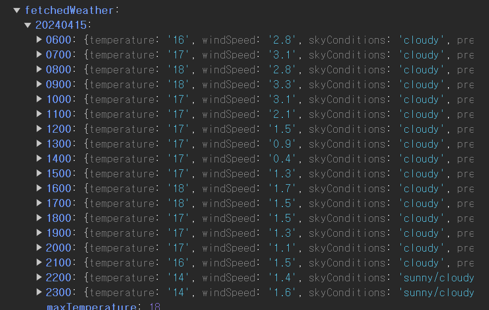
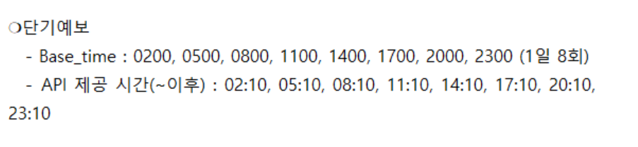
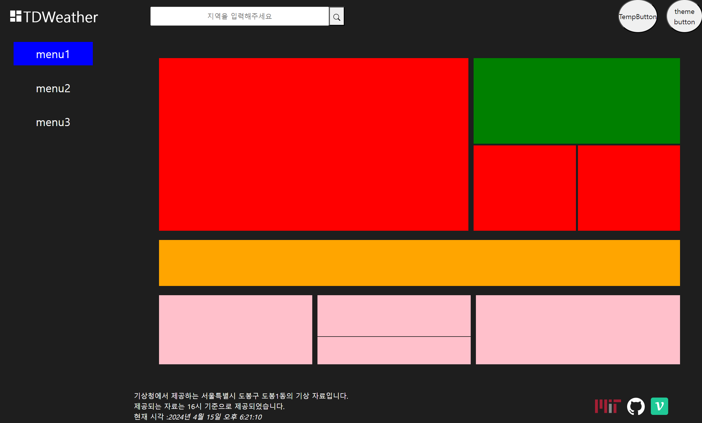
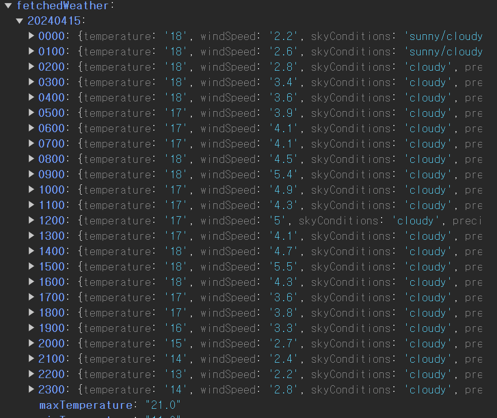
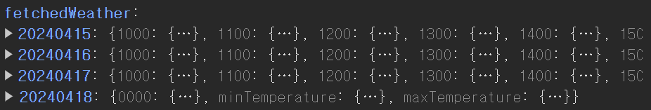

# `baseDate , baseTime` 로직 수정하기

나는 기상청에서 조회일로부터 3일간의 날씨 정보를 가져올 때 사용가능한 `baseTime` 이 단순히 `0500` 만 존재하는줄 알았다.

```jsx
const fetchForecastFromLocation = async (locationObject) => {
  const { APIKEY, URI } = weatherForecastAPI;
  const { nx, ny } = getNxNyFromLatLong(locationObject);
  const { baseDate } = getCurrentTime();
  const searchParams = new URLSearchParams([
    ['serviceKey', APIKEY],
    ['base_date', baseDate],
    ['nx', nx],
    ['ny', ny],
    ['base_time', '0500'], // ! 기상청의 baseTime 은 항상 해당 일 0500 으로 고정
    ['pageNo', 1],
    ['numOfRows', 1000],
    ['dataType', 'JSON'],
  ]);

  const ENDPOINT = `${URI}?${searchParams.toString()}`;
  const response = await fetch(ENDPOINT);

  if (!response.ok)
    throw new Error('기상청 API 네트워크가 불안정합니다. 다시 시도해주세요');

  const json = await response.json();
  return json;
};
```

이로인해 `fetchForecastFromLocation` 메소드에서 `base_time` 을 `0500` 으로 고정시켜두고 사용했었다.

다만 이렇게 하면 문제가 존재한다.

### 문제1. `00~05` 사이 요청이 불가능하다.

예를 들어 내가 `2024-04-16 00` 시에 요청을 보낼 경우

`2024-04-16 00` 시에 받을 수 있는 응답은 `2024-04-15` 의 가장 마지막 발표일 것이다.

하지만 현재의 로직을 사용한다면 `2024-04-16 05` 에 발표된 데이터를 요청하게 되는데

이는 발표되지 않는 요청을 요구하는 것이기 때문에 오류가 발생한다.

### 문제2. 최저기온을 패칭하는 것이 불가능하다.

24시간 단위로 데이터를 패칭 해올 때 기상청은 예상 최저 기온과 예상 최고 기온을

예상되는 한 `base_time` 에 프로퍼티로 추가해 제공한다.

예를 들어 `0400` 이 최저기온이라면 해당 객체의 `value` 에는 `minTempvalue : 7` 이런식으로 값이 존재하고

최저기온이 아닌 `base_time` 들에는 해당 프로퍼티가 존재하지 않는다.

하지만 만약 `0500` 을 기준으로 데이터를 패칭해온다면 해당 일, 해당 시간 이후의 데이터들이 패칭되기 때문에 `0500` 이전 시간들의 날씨 정보를 가져 올 수 없다.


실제로 그렇다. `0500` 이전의 데이터들은 가져올 수 없다.

# 명세서를 잘 확인하자



명세서를 살펴보면 사용 가능한 `base_time` 은 하루에 8회씩 존재한다.

## 문제 해결 전략 생각하기



나는 주황색 영역에 현재 일과 2일 후의 최고 기온 , 최저 기온 , 그 날의 날씨를 아이콘으로 넣어두려고 한다.

그럼 내게 필요한 정보인 최저 기온을 얻기 위해선 해당 일의 `00`시 부터의 데이터가 필요하다.

그렇다면 항상 `base_date` 는 조회일로부터 무조건 하루 전 ,

`base_time` 은 `2300` 으로 고정시켜보자

```jsx
const getCurrentTime = () => {
  const time = new Date();
  const currentTime = time
    .toLocaleString()
    .split('.')
    .map((str) => str.trim());
  // currentTime 예시 [ '2024', '4', '3', '오후 2:58:40' ]
  const previousDate = new Date(time.getTime() - 24 * 60 * 60 * 1000);
  const baseDate = previousDate // baseDate 는 하루 이전으로 설정
    .toLocaleDateString()
    .split('.')
    .slice(0, 3)
    .map((str) => str.trim().padStart(2, 0))
    .join('');

  const baseTime = '2300'; // baseTime 은 2300 으로 고정

  const searchDate = time
    .toLocaleDateString()
    .split('.')
    .slice(0, 3)
    .map((str) => str.trim().padStart(2, 0))
    .join('-');

  return 정정
    year: currentTime[0],
    month: currentTime[1],
    date: currentTime[2],
    time: currentTime[3],
    baseDate, // ex : 20240403
    baseTime, // ex: 12 or 09
    searchDate, // ex: 2024-04-03
  };
};

export { getCurrentTime };
```

이렇게 `baseDate` 를 조회일로부터 하루 이전으로 생성해주고 `baseTime` 또한 `2300` 을 기준으로 하여 조회하였다.



오케이 ~~ 그날 몇시에 조회하든 그 날의 `00 ~ 23` 사이에 모든 일들이 조회가 가능하고



조회일로부터 3일 이후의 정보들까지 패칭이 가능하다.
