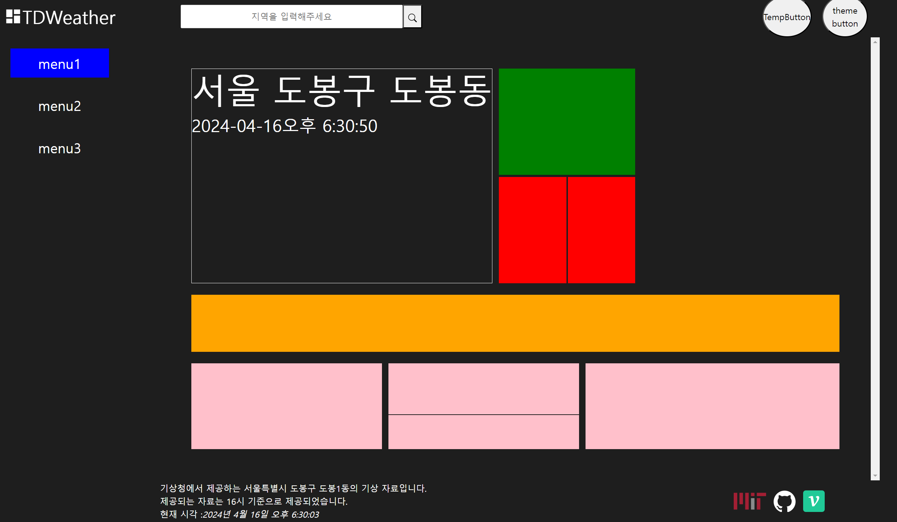

# 전역 상태 추가의 필요성



카드 컴포넌트들을 러프하게 그리고 있는데

하다보니 현재의 날짜와 시간을 전역 상태로 관리해야 할 필요성을 느꼈다.

### 날짜 상태 추가의 필요성

주황색 부분에선 앞으로의 3일간의 날씨들을 보여줄 것이고

주황색 부분에서 특정 일자의 카드의 클릭하면 해당 일의 날씨를 표현하도록 할 것이였다.

그러니 특정 일자의 카드를 클릭하면 해당 일자의 날씨 관련하여 렌더링을 변경할 것이기 때문에

일자를 전역 상태로 관리해야 한다.

또한 공유도 가능 하도록 해당 일자로 라우팅 시키도록 해야겠다.

`.../date=20240416` 이런식으로 말이다.

### 시간 상태 추가의 필요성

메인 카드 영역에선 `input[range]` 엘리먼트를 이용해 시간대 별 날씨를 다르게 페이지를 렌더링 하려고 한다.

그렇기 때문에 `input[range]` 에서 `onChange` 로 변경시킬 시간대도 전역 상태로 관리해야 한다.

# 액션 타입 추가

```jsx
// DATA Fetching 을 위한 action Types
const FETCHING_LOCATION = 'FETCHING_LOCATION'; // KaKaO API 에서 가져온 정제된 양식의 텍스트
const FETCHING_WEATHER = 'FETCHING_WEATHER'; // 기상청 API 에서 가져온 날씨 데이터
const FETCHING_WEATHERTEXT = 'FETCHING_WEATHERTEXT'; // 기상청 API 에서 가져온 날씨 정보 텍스트;
const FETCHING_AIR = 'FETCHING_AIR'; // 에어코리아에서 제공하는 미세먼지 실시간 측정 정보
const FETCHING_AIRTEXT = 'FETCHING_AIRTEXT'; // 에어코리아에서 제공하는 PM2.5 , O3 통보 텍스트
// 테마 버튼을 위한 action Types
const TOGGLE_THEME = 'TOGGLE_THEME';
// fetching status 와 관련된 action Types
const API_STATUS = 'API_STATUS';
// 시간 , 날짜 변경과 관련된 action Types
const CHANGE_DATE = 'CHANGE_DATE';
const CHANGE_TIME = 'CHANGE_TIME';

export {
  FETCHING_LOCATION,
  FETCHING_WEATHER,
  FETCHING_WEATHERTEXT,
  TOGGLE_THEME,
  API_STATUS,
  FETCHING_AIR,
  FETCHING_AIRTEXT,
  CHANGE_DATE,
  CHANGE_TIME,
};
```

다음처럼 `CHANGE_DATE , CHANGE_TIME` 이란 `actionType` 들을 생성해주자

# 리듀서 추가

```jsx
import { CHANGE_DATE, CHANGE_TIME } from '../actions/actionTypes';

const dateReducer = (state = {}, action) => {
  const { type, payload } = action;
  // TODO payload 관련 메소드 추가하기
  switch (type) {
    case CHANGE_DATE:
      return { ...state, date: payload };
    case CHANGE_TIME:
      return { ...state, time: payload };
    default:
      break;
  }
};

export default dateReducer;
```

이후 `dateReducer` 를 추가해주고 해당 리듀서를 루트 리듀서에 추가해주도록 하자

# 루트 리듀서에 리듀서 추가하기

```jsx
import dataReducer from './reducers/DataReducer';
import statusReducer from './reducers/StatusReducer';
import themeReducer from './reducers/ThemeReducer';
import dateReducer from './reducers/DateReducer';
import { combineReducers } from 'redux';

const rootReducer = combineReducers({
  status: statusReducer,
  data: dataReducer,
  date: dateReducer,
  theme: themeReducer,
});

export default rootReducer;
```

앞으로 관리 할 전역 상태는 `status , data , date ,theme` 로 4가지가 되었다.
