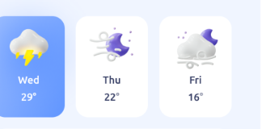

# 카드 컴포넌트 생성하기

지난 2주간 필요한 데이터를 패칭해오고 전역 상태도 생성했기 때문에

이제 전역 상태에 있는 값들을 이용해 렌더링 할 수 있는 카드 컴포넌트들을 생성해보자

# 문제점 확인하기 : `Wrapper` 컴포넌트의 작동 방식이 너무 구려요


현재 카드 컴포넌트 양식들을 만들다가 가장 느낀 문제점은

이전에 만들었던 `Wrapper` 컴포넌트가 작동하지 않는다는 점이다.

```jsx
// import util function
import { makeFlexchildren } from '../../../utils/WrapperUtils.js';
// import style
import moduleCss from './Wrapper.module.css';
const Horizontal = ({ ratio, children, style, height, className }) => {
  const flexChildren = makeFlexchildren(ratio, children);
  return (
    <section
      style={{
        flexDirection: 'row',
        height: height,
        ...style,
      }}
      className={className || moduleCss.Wrapper}
    >
      {flexChildren}
    </section>
  );
};

export default Horizontal;
```

이처럼 `ratio` 를 `props` 로 받아 하위 컴포넌트들에게 `flex-grow` 를 정해주었지만

`flex-grow` 속성은 해당 컴포넌트가 비어있을 때에만 유효하지

컴포넌트 내부에 다른 태그들이 존재 할 때에는 작동하지 않는다.

우선 가장 큰 이유는 `Wrapper` 컴포넌트 내부에서 호출되는 `makeFlexChildren` 메소드는

`children` 으로 들어오는 엘리먼트가 `HTMLElement` 일 것이라 생각하고 직접적으로 `style props` 에 접근하여 `flex-grow` 를 주입하는데

개발이 되갈수록 카드 컴포넌트들은 `JSX` 객체 형태로 `Wrapper` 의 하위 컴포넌트로 들어가게 된다.

이에 `flex-grow` 주입이 원활하게 일어나지 않는다.

또, 시간이 지나 생각해보니 `Wrapper` 컴포넌트의 동작이 너무 무겁기도 하고 사용법이 너무 어렵다.

내가 만들었음에도 불구하고 말이다.

이에 카드 컴포넌트들을 감싸주는 `Wrapper` 컴포넌트들을 다시 생성해주도록 해야겠다.

처음에 생각했던 카드 컴포넌트들의 크기를 `Wrapper` 컴포넌트에서 결정해주기로 했던 내 이론은

폐기하기로 했다.

어떤 컴포넌트의 특징을 상위 컴포넌트에서 결정해주는 것은 각 컴포넌트 간의 의존성을 높히기 때문이였다.

이렇게 높아진 의존성 문제로 인해 카드 컴포넌트를 내 마음대로 수정하는 것이 어려웠다.


이미 열흘 전에 문제점을 내가 파악했었다.

# 어떻게 해결할까 ? : 새로운 컴포넌트를 생성하자

우선 기존의 `menuPage` 의 더러운 코드를 모두 비워주도록 하자


깔~끔

### `FlexRow,  FlexColumn` 컴포넌트 생성

```jsx
import moduleStyle from './Flex.module.css';

const FlexColumn = ({ children, width }) => {
  return (
    <section style={{ width }} className={moduleStyle.flexColumn}>
      {children}
    </section>
  );
};

const FlexRow = ({ children, width }) => {
  return (
    <section style={{ width }} className={moduleStyle.flexRow}>
      {children}
    </section>
  );
};

export { FlexColumn, FlexRow };
```

```css
.flexRow {
  display: flex;
  flex-direction: row;
}

.flexColumn {
  display: flex;
  flex-direction: column;
}
```

다음처럼 단순하게 `section` 태그에 `flex-direction` 을 다르게 한 `flex-box` 를 생성해준다.

# `Typography` 컴포넌트 생성

이후 카드 컴포넌트에서 문장들을 넣기 위해 `Typohgrapy` 컴포넌트를 생성해준다.

```jsx
import React from 'react';
import moduleStyle from './Typography.module.css'; // Ensure the path is correct

const Typography = ({ children }) => {
  if (!children) {
    throw new Error('Typography 컴포넌트는 혼자 사용될 수 없습니다.');
  }
  return <span>{children}</span>;
};

Typography.MainTitle = ({ children }) => {
  return <h1 className={moduleStyle.mainTitle}>{children}</h1>;
};

Typography.SubTitle = ({ children }) => {
  return <h2 className={moduleStyle.subTitle}>{children}</h2>;
};

Typography.MainText = ({ children }) => {
  return <p className={moduleStyle.mainText}>{children}</p>;
};

Typography.SubText = ({ children }) => {
  return <p className={moduleStyle.subText}>{children}</p>;
};

Typography.Label = ({ children }) => {
  return <p className={moduleStyle.label}>{children}</p>;
};

export default Typography;
```

합성 컴포넌트 형태로 생성해주었다.

`props` 로 넘겨줄까도 생각해봤는데 우선 이번 컨셉이 합성 컴포넌트를 잘 사용하는거였으니까

합성 컴포넌트 사용해보도록 하자

> 다만 나는 쓰면서 좋은점보다 불편한점이 더 느껴진다.

# 내가 생성해야 할 카드 컴포넌트들을 정의하자

나는 어떤 카드 컴포넌트들을 생성해야 할까 ?

### 메인 카드 컴포넌트

메인 카드 컴포넌트는 컨텐츠 영역을 가장 많이 차지하면서 다양한 정보들을 담고 있어야 한다.

- 현재 검색 지역 정보
- 조회 기준 일, 시간
- 시간을 변경 시킬 수 있는 컴포넌트 (`input[range]` 를 사용 하려 했던)
- 현재 날씨 아이콘
- 기상 정보
  - 현재 기온
  - 현재 습도
  - 강수 확률
  - 강수량
  - 풍속 ?

원래는 다양한 정보들을 여러 카드에 남아 담으려고 했으나 그러면 정보 전달 차원에서 좋지 않을 것 같았기에

동일한 관심사의 정보들을 한 컴포넌트 내부에서 모두 처리하자

### 서브 카드 컴포넌트

그런데 뭐 메인 카드 컴포넌트에서 모든 정보를 처리하는 것보다

한 카드 컴포넌트당 하나의 정보를 처리하는 것이 더 이쁠 수도 있기 때문에 구상은 해두자

서브 카드 컴포넌트는

- 조회하고자 하는 날씨의 정보
- 날씨의 값
- 적절한 아이콘

이정도만 존재하면 될 것이다.

### 텍스트 뉴스 컴포넌트

텍스트 뉴스 컴포넌트는 단순하게

제목과 본문만 존재하게 해주자.

뭐 경우에 따라 해당 뉴스 주제에 맞는 적절한 아이콘정도만 구현하자

### 일자별 날씨 카드 컴포넌트

일자별 날씨 카드 컴포넌트는 해당 일의 날씨와 아이콘만 존재하도록 할 것이다.

또한 해당 카드를 클릭하면 , 해당 일로 라우팅 되거나 , 페이지의 정보가 변경되게 할 것이다.

레페런스를 찾자면 마치 이런식으로 말이다.



# 카드 컴포넌트 디자인 하기

디자인을 미리 해두지 않고 개발하려고 하니 되게 막막했다.

전일은 디자인 안해두고 개발부터 하려고 하니 손이 안갔다.
