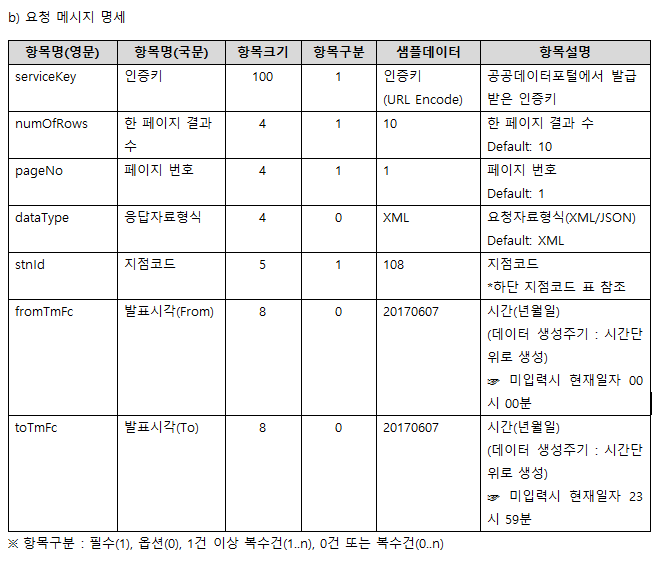

## InCover Date : 2024-04-17

## Fixed Date : YYYY-MM-DD

### **Describe the bug**

#### 데이터가 잘못 전역 상태에 저장되고 있었다.

`store` 에 저장되는 데이터 중 `store.data.FETCHING_WEATHERTEXT` 부분에서 데이터가 잘못 처리 되고 있었다.


패칭되어 날아오는 데이터는 다음과 같이 여러 종류 별 날씨와 관련된 텍스트를 보내주는데 현재 나의 코드에서는

단순히 첫 번째 텍스트를 받아와 파싱해온다.

```jsx
const getParsingWeatherText = (json) => {
  const item = json.response.body.items.item[0];
  const weatherText = item.t1;
  const stringParsed = weatherText
    .split('\n\n')[1]
    .split('(현황)')[1]
    .replace('-', '\n')
    .trim();
  return stringParsed;
};
```

아마 이 때 이렇게 했던 이유는 검색을 했을 때에는 첫 번째 데이터가 날씨와 관련된 데이터였거나, 첫 번째 값만 존재했을 것이다.


명세서를 살펴보면 되게 다양한 정보가 존재하기에 이 중 필요한 정보들을 잘 필터링 해야겠다.

#### `FETCHING_WEATHERTEXT` 는 현재 시각으로 데이터를 패칭해야 한다.

위 이미지를 보면 알 수 있겠지만 기상정보문 조회는 조회기준으로부터 해당 시간 이전에 발표된 조회문들을 반환한다.

현재 나는 **baseDate : 조회일 -1 , baseTime : 2300** 으로 고정해두고 패칭하고 있었는데

이렇게 되니 `FETCHING_WEATHERTEXT` 는 이전 일의 기상 정보들을 패칭해온다.

### **Steps to reproduce the behavior**

1. 패칭에 쓰일 `fromTmFc, toTmFc` 의 쿼리를 변경하여 적절한 정보를 조회해오자
2. 텍스트 뉴스에 사용 할 수 있도록 정보들을 적절하게 파싱해와야 한다.

### `fromTmFc , toTmFc` 수정하기

`fromTmFc` 는 파싱해올 정보문의 발표일을 의미하며 시간은 매번 `0000` 으로 정의된다.
그러니 `20240417` 로 작성하면 `202404170000` 이후부터 발표 된 정보문을 가져온다.

`toTmFc` 는 파싱해올 정보문의 상한성을 의미하며 시간은 `2359` 로 정의된다.
그러니 `20240417` 로 작성하면 `202404172359` 로 정의된다.

**현재 나는 `fromTmFc , toTmFc` 를 어떻게 정의하고 있는가 ?**

```jsx
const fetchForecastText = async () => {
  const { APIKEY, URI } = weatherTextAPI;
  const { baseDate } = getCurrentTime();
  const searchParams = new URLSearchParams([
    ['ServiceKey', APIKEY],
    ['fromTmFc', baseDate],
    ['toTmFc', baseDate],
    ['dataType', 'JSON'],
    ['stnId', '108'],
    ['numOfRows', '10'],
  ]);
  const ENDPOINT = `${URI}?${searchParams.toString()}`;
  const response = await fetch(ENDPOINT);

  if (!response.ok)
    throw new Error('기상청 API 네트워크가 불안정합니다.다시 시도해주세요');

  const json = await response.json();
  return json;
};
```

현재 나는 `getCurrentTime` 에서 반환하는 `baseDate` 를 이용하여 파싱해오고 있다.

현재 내가 사용하는 `baseDate` 는 조회일 하루 이전으로 설정되어있기 때문에 내가 파싱해오는 날씨 정보문은 하루 이전의 정보문을 조회해오고 있기 때문에 문제가 존재한다.

**`fromTmFc , toTmFc` 의 범위는 어디까지 될까?**

그럼 한 번 `fromTmFc , toTmFc` 는 어디까지 조회 가능한지 살펴보자

나에게 가장 베스트 시나리오는 현재일로부터 3일 뒤까지의 정보문이 조회 가능 한 것이다.

```jsx
const searchParams = new URLSearchParams([
  ['ServiceKey', APIKEY],
  ['fromTmFc', '20240417'], // 조회일로부터
  ['toTmFc', '20240419'], // 3일간의 정보를 가져올 수 있을까 ?
  ['dataType', 'JSON'],
  ['stnId', '108'],
  ['numOfRows', '10'],
]);
const ENDPOINT = `${URI}?${searchParams.toString()}`;
const response = await fetch(ENDPOINT);
```


매우 안타깝게도 날씨 정보문 조회는 현재일로부터 하루 단위로만 가능한 것 같다.

이 부분에서 생각이 든 점은 날씨 텍스트 뉴스 컴포넌트가 메인 카드 컴포넌트와 함께 있으면 안될 것 같다는 생각이 들었다.

왜냐면 메인 카드 컴포넌트가 있는 페이지에서는 다양한 날짜와 시간 별 날씨를 보여줄 것인데

텍스트 뉴스는 현재일자에 고정되어 있으면 혼란스러울 것 같았기 때문이다.

나는 다음 날의 날씨를 보고 있는데 텍스트 뉴스는 현재 날의 텍스트 뉴스라면 이 텍스트 뉴스가 언제에 대한 날씨인지 ? 헷갈릴 것 같았다.

그럼 텍스트 뉴스와 관련된 페이지를 별도로 만들어줘야겠다.

**`fromTmFc , toTmFc` 를 패칭해올 때 사용할 쿼리문을 변경하자**

명세서를 살펴보면 아주 고맙게도 해당 쿼리문을 사용하지 않으면 자동으로 현재 일자를 조회해준다고 한다.



야호 ~~

그럼 나는 그저 단순히 저 쿼리문을 이용하지 않으면 될 것이다.

### **Exprected Behavior**

### **ScreenShot**
