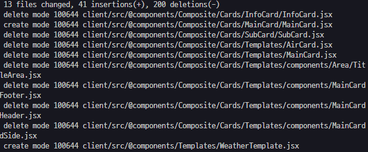
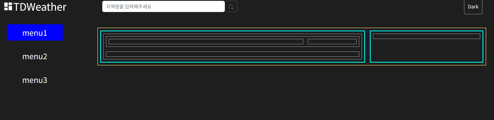
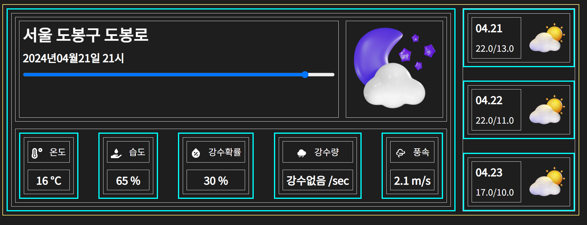
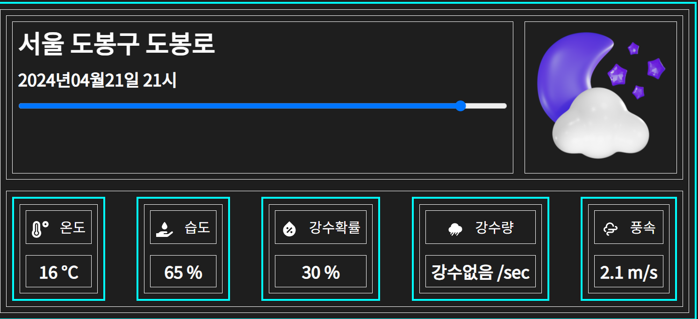
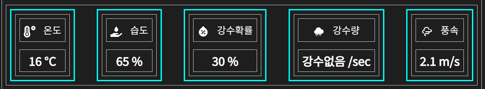
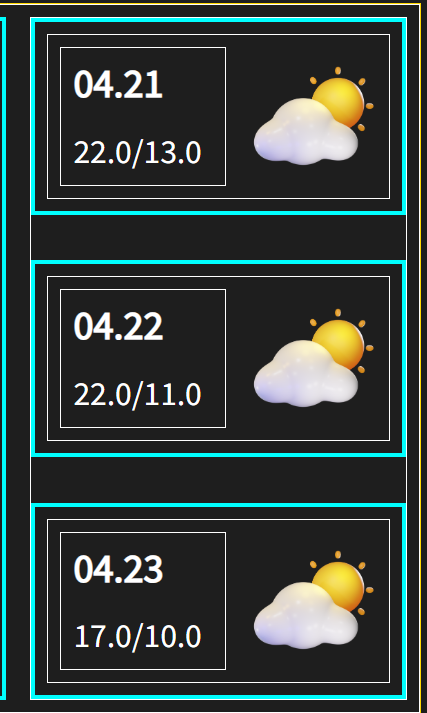

# 생성한 카드 컴포넌트들로 페이지 구성하기

## 전부 밀어버려

사실 `docs` 에 작성하지 않은 채로 어떻게든 카드 컴포넌트들을 조합해서

페이지를 구성했었는데 완성작을 보니

내 컴포넌트들의 계층 구조가 이게 뭐지 .. ?

이런 생각이 들을정도로 아주 개판이였다.

완성하기 급급해서

합성 컴포넌트를 만들어놓고도 합성 컴포넌트의 용도에 맞지 않게 사용하거나

각 컴포넌트 조합 덩어리들이 어떤 것은 `section` 으로 묶여있고

어떤 것은 `FlexColumn` 으로 묶여있고 아~주 개판이라

시원하게 밀어버리고 다시 만들었다.



## `Templates` 폴더 생성

나는 컴포넌트들을 조합해 `Menu Page` 에 들어갈 컴포넌트를 담을

`Templates` 폴더를 생성했다.

해당 폴더에선 카드 컴포넌트들, 혹은 카드 컴포넌트를 조합한 어떠한 영역 (`Area`) 들을 한 덩어리로 하여 `Templates` 컴포넌트라고 하기로 하였다.

### `WeatherTemplate` 템플릿 생성

해당 템플릿은 날씨 정보와 관련된 정보들을 담을 템플릿이다.

이전에 디자인 해놨던 양식이 있었기 때문에 이전 디자인의 기억을 더듬어가며 생성해주었다.

```jsx
import { FlexColumn, FlexRow } from '../../UI/Flex/Flex';
import Card from '../../Composite/Cards/Card';

import moduleStyle from './WeatherTemplate.module.css';

const WeatherTemplate = () => {
  // TODO section 에 style module 추가하기
  return (
    <section className={moduleStyle.template}>
      <FlexRow flexRatio={[0.7, 0.3]}>
        <Card>
          {/* Main Card 영역 */}
          <FlexColumn flexRatio={[0.5, 0.5]}>
            <FlexRow flexRatio={[0.8, 0.2]}>
              <FlexColumn>{/* Title , Location , ChangeBar 영역 */}</FlexColumn>
              <FlexRow>{/* Icon 영역 */}</FlexRow>
            </FlexRow>
            <FlexRow justifyContent='space-around'>
              <div>{/* info Card */}</div>
            </FlexRow>
          </FlexColumn>
        </Card>
        {/* SideCard 영역 */}
        <Card>
          <FlexColumn>{/*sideBar */}</FlexColumn>
        </Card>
      </FlexRow>
    </section>
  );
};

export default WeatherTemplate;
```



좌측 영역에는 날짜와 관련된 컴포넌트들을 담을 예정이고

우측 영역에는 이후 날짜들의 최고,최저기온들과 `NavLink` 를 이용한 사이드바를 생성할 예정이다.

이전에는 `FlexRow , FlexColumn` 컴포넌트들이 컴포넌트들을 정렬시키는 컨테이너 역할만 한 것이 아닌

실제 렌더링과 관련된 역할까지 하고 있었다.

예를 들어 `FlexRow` 는 내부에서 아이템들을 담는 컨테이너 역할을 하면서 가장 부모 컴포넌트로도 존재하여 해당 `FlexRow` 컴포넌트에 스타일을 입히게 되면

카드들을 담는 컨테이너 역할을 하는 모든 `FlexRow` 컴포넌트들 마저도 스타일링이 되어버렸다.

그렇기에 이번에는 `FlexRow , Column` 컴포넌트들은 단순하게 아이템들을 담는 컨테이너 역할만 하도록 하고

스타일링을 필요로 하는 부모 컨테이너 컴포넌트를 명확하게 하였다.

그래서 위 컴포넌트를 보면 `section` 엘리먼트가 가장 최상단에 존재함으로서

스타일링을 최상단에 존재하는 `section` 엘리먼트와 내부에 존재하는 `Card` 컴포넌트들에만 집중해주기로 하였다.

# 폭풍 생성 가보자고

### `WeatherTemplate.jsx`



```jsx
import { FlexColumn, FlexRow } from '../../UI/Flex/Flex';
import WeatherMainCard from '../Cards/WeatherMainCard/WeatherMainCard';
import WeatherSideCard from '../Cards/WeatherMainCard/WeatherSideCard';
import moduleStyle from './WeatherTemplate.module.css';
import useWeatherState from '../../../hooks/useWeatherState';

const WeatherTemplate = () => {
  const fetchedWeather = useWeatherState();
  const toDateArr = Object.keys(fetchedWeather).slice(0, 3);

  // TODO section 에 style module 추가하기
  return (
    <section className={moduleStyle.template}>
      <FlexRow flexRatio={[0.8, 0.2]}>
        <WeatherMainCard />
        <FlexColumn justifyContent='space-between' padding='0px'>
          {toDateArr.map((toDate) => (
            <WeatherSideCard toDate={toDate} key={toDate} />
          ))}
        </FlexColumn>
      </FlexRow>
    </section>
  );
```

템플릿 컴포넌트는 다음처럼 변경되었다.

템플릿 컴포넌트에는 `WeatherMainCard` 컴포넌트와 `WeatherSideCard` 들이 모여있는 컴포넌트 두 덩어리를 가지고 있다.

### `WeatherMainCard.jsx`



```jsx
import { FlexRow, FlexColumn } from '../../../UI/Flex/Flex';
import Card from '../../../Composite/Cards/Card';
import WeatherInfoCard from './WeatherInfoCard/WeatherInfoCard';
import useTimeState from '../../../../hooks/useTimeState';

const InfoNames = [
  'temperature',
  'humidity',
  'precipitationProbability',
  'oneHourPrecipitation',
  'windSpeed',
];

const WeatherMainCard = (props) => {
  const { date, time } = useTimeState();
  return (
    <Card {...props}>
      {/* Main Card 영역 */}
      <FlexColumn flexRatio={[0.5, 0.5]}>
        <FlexRow flexRatio={[0.8, 0.2]}>
          <FlexColumn>
            <Card.LocationTitle />
            <Card.DateTitle />
            <Card.ChangeBar />
          </FlexColumn>
          <FlexRow>
            <Card.WeatherIcon date={date} time={time} />
          </FlexRow>
        </FlexRow>
        <FlexRow justifyContent='space-around'>
          {InfoNames.map((infoName) => (
            <WeatherInfoCard infoName={infoName} />
          ))}
        </FlexRow>
      </FlexColumn>
    </Card>
  );
};

export default WeatherMainCard;
```

`WeatherMainCard` 는 두 가지 영역으로 나뉜다.

상단의 지역, 시간, 날씨 아이콘 , 상태 변경 바가 존재하는 영역과

밑에 `WeatherInfoCard` 들이 생성된 영역으로 말이다.

전역에 존재하는 `date , time state` 를 받아 렌더링 하도록 만들어져있으며

컴포넌트 외부에 존재하는 `InfoNames` 자료구조를 통해 해당 `date , time` 에 해당되는 `WeatherInfoCard` 를 생성하여 렌더링 한다.

### `WeatherInfoCard.jsx`



```jsx
import useTimeState from '../../../../../hooks/useTimeState';
import useWeatherIcon from '../../../../../hooks/useWeatherIcon';
import useWeatherState from '../../../../../hooks/useWeatherState';
import Card from '../../../../Composite/Cards/Card';
import Typography from '../../../../Composite/Typography/Typography';
import { FlexColumn, FlexRow } from '../../../../UI/Flex/Flex';
const keyTitleMap = {
  temperature: '온도',
  humidity: '습도',
  precipitationProbability: '강수확률',
  oneHourPrecipitation: '강수량',
  windSpeed: '풍속',
};

const UnitMap = {
  temperature: '°C',
  humidity: '%',
  precipitationProbability: '%',
  oneHourPrecipitation: '/sec',
  windSpeed: 'm/s',
};

const WeatherInfoCard = ({ infoName }) => {
  const { date, time } = useTimeState();
  const infoTitle = keyTitleMap[infoName];
  const infoIcon = useWeatherIcon(infoName);
  const value = useWeatherState(date, time)[infoName];
  const unit = UnitMap[infoName];

  return (
    <Card>
      <FlexColumn>
        <FlexRow justifyContent='center' alignItems='center'>
          <Typography.SubTitle>{infoIcon}</Typography.SubTitle>
          <Typography.MainText>{infoTitle}</Typography.MainText>
        </FlexRow>
        <FlexRow justifyContent='center'>
          <Typography.SubTitle>
            {value} {unit}
          </Typography.SubTitle>
        </FlexRow>
      </FlexColumn>
    </Card>
  );
};

export default WeatherInfoCard;
```

`WeatherInfoCard` 의 경우 카드 컴포넌트이기 때문에 최상단은 `Card` 컴포넌트로 감싸주도록 하고
필요한 컴포넌트들을 내부에서 생성해준다.

이 때 컴포넌트 외부에 렌더링에 사용할 `Map` 객체들을 생성해준다.

> 엄연히 말하면 `Map` 객체가 아닌 일반 객체이지만 역할은 `Map` 객체와 같으니 이렇게 표현했다.

### `WeatherSideCard`



```jsx
import useWeatherState from '../../../../hooks/useWeatherState';
import Card from '../../../Composite/Cards/Card';
import { FlexRow, FlexColumn } from '../../../UI/Flex/Flex';
import Typography from '../../../Composite/Typography/Typography';
import useDispatchDate from '../../../../hooks/useDispatchDate';
const WeatherSideCard = ({ toDate, time = '0900' }) => {
  const fetchedWeather = useWeatherState(toDate);
  const { minTemperature, maxTemperature } = fetchedWeather;
  const month = toDate.substring(4, 6);
  const day = toDate.substring(6);
  const dispatchDate = useDispatchDate(toDate);

  return (
    <Card onClick={dispatchDate}>
      <FlexRow justifyContent='center' alignItems='center'>
        <FlexColumn>
          <Typography.SubTitle>
            {month}.{day}
          </Typography.SubTitle>
          <Typography.MainText>
            {maxTemperature}/{minTemperature}
          </Typography.MainText>
        </FlexColumn>
        <Card.WeatherIcon date={toDate} time={time} width='40%' height='60%' />
      </FlexRow>
    </Card>
  );
};

export default WeatherSideCard;
```

`WeatherSideCard` 는 `toDate` 를 `props` 로 받아 `toDate` 에 해당하는 날짜의

최저기온 , 최고기온, `time = 0900` 에 해당하는 날씨 아이콘을 렌더링 한다.

이 때 이름이 `toDate` 인 이유는 해당 카드 컴포넌트를 클릭하면 전역 상태인 `date state` 를 `toDate` 로 변경해주기 때문이다.

### `Card`

```jsx
import DateTitle from './UI/Title/DateTitle';
import ChangeBar from './UI/ChangeBar/ChangeBar';
import WeatherIcon from './UI/WeatherIcon/WeatherIcon';
const Card = ({ children, onClick, ...props }) => {
  // TODO 테마 넣어줘야 하나 ?
  if (!children)
    throw new Error('카드 컴포넌트는 하위 컴포넌트 없이 사용 될 수 없습니다.');
  return (
    <section
      style={{ ...props }}
      className={moduleTheme.card}
      onClick={onClick}
    >
      {children}
    </section>
  );
```

카드 컴포넌트에 `onClick` 이벤트를 부착해줄 수 있도록 `props` 로 추가해주었다.

이를 통해 현재 날짜 뿐이 아닌 추후 3일간의 날씨까지 불러오는 것이 가능해졌다.


