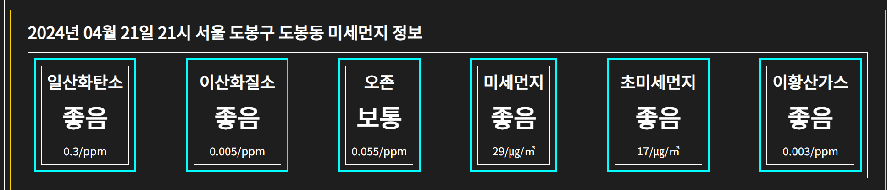
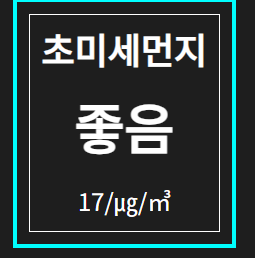

# 미세먼지 템플릿 생성하기

저번 `docs` 에서 `WeatherTemplate` 생성했듯 미세먼지 관련된 데이터인 `AirTemplate` 도 생성해주자

### `AirTemplate.jsx`



```jsx
import moduleStyle from './Template.module.css';
import Typography from '../../Composite/Typography/Typography';
import { FlexRow, FlexColumn } from '../../UI/Flex/Flex';
import AirInfoCard from '../Cards/AirInfoCard/AirInfoCard';
import { getCurrentTime } from '../../../utils/DateUtils';
import useLocation from '../../../hooks/useLocation';

const airKeyArr = ['co', 'no2', 'o3', 'pm10', 'pm25', 'so2'];

const AirTemplate = () => {
  const { stringDate, stringTime } = getCurrentTime();
  const location = useLocation();
  return (
    <section className={moduleStyle.template}>
      <FlexRow>
        <FlexColumn width='100%' padding='8px 16px'>
          {/* TODO DateTitle 말고 currentTime 쓰기 */}
          <Typography.SubTitle>
            {stringDate} {stringTime} {location} 미세먼지 정보
          </Typography.SubTitle>
          <FlexRow justifyContent='space-between'>
            {airKeyArr.map((name) => (
              <AirInfoCard name={name} key={name} />
            ))}
          </FlexRow>
        </FlexColumn>
      </FlexRow>
    </section>
  );
};

export default AirTemplate;
```

해당 템플릿은 제목과 함께 `AirInfoCard` 컴포넌트가 렌더링 되는 영역이다.

위에 존재하는 `WeatherTemplate` 과 균형을 맞추기 위해 `props` 로 `padding` 값을 `8px` 더해주었다.

### `AirInfoCard.jsx`



```jsx
import useAirState from '../../../../hooks/useAirState';
import Card from '../../../Composite/Cards/Card';
import { FlexColumn } from '../../../UI/Flex/Flex';
import Typography from '../../../Composite/Typography/Typography';
const gradeMap = {
  1: '좋음',
  2: '보통',
  3: '나쁨',
  4: '매우나쁨',
};

const airUnitMap = {
  co: 'ppm',
  no2: 'ppm',
  o3: 'ppm',
  so2: 'ppm',
  pm10: '㎍/㎥',
  pm25: '㎍/㎥',
};

const airNameMap = {
  co: '일산화탄소',
  no2: '이산화질소',
  o3: '오존',
  so2: '이황산가스',
  pm10: '미세먼지',
  pm25: '초미세먼지',
};

const AirInfoCard = ({ name }) => {
  const fetchedAir = useAirState();
  const grade = fetchedAir[`${name}Grade`];
  const value = fetchedAir[`${name}Value`];
  const unit = airUnitMap[name];
  return (
    <Card>
      <FlexColumn alignItems='center'>
        <Typography.SubTitle>{airNameMap[name]}</Typography.SubTitle>
        <Typography.MainTitle>{gradeMap[grade]}</Typography.MainTitle>
        <Typography.SubText>
          {value}/{unit}
        </Typography.SubText>
      </FlexColumn>
    </Card>
  );
};

export default AirInfoCard;
```

`AirInfoCard` 컴포넌트는 `props` 로 받은 `name` 값을 적절하게 전역 `state` 에서 값을 가져오고

가져온 값을 변경하여 렌더링 하는 역할을 한다.
