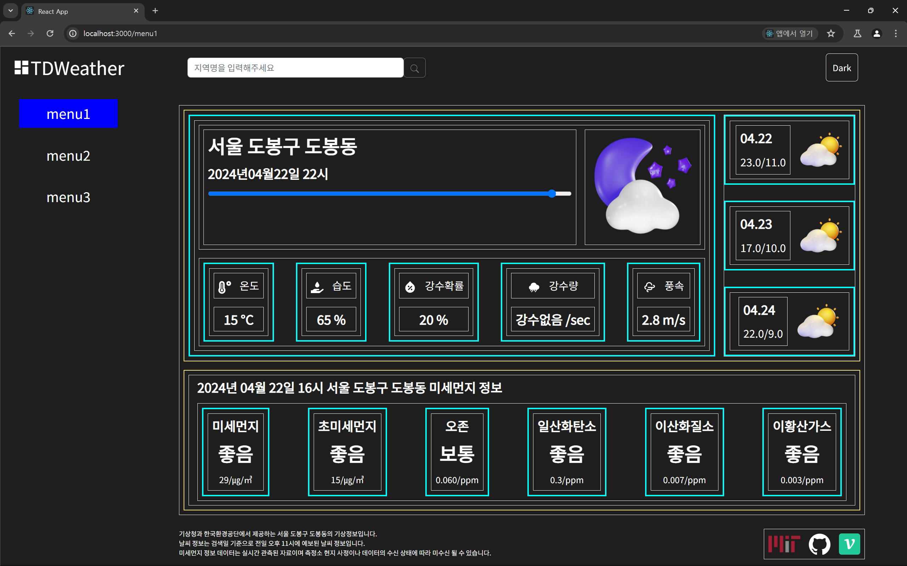
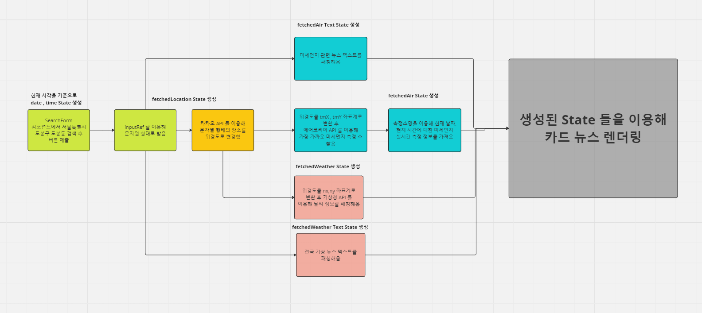
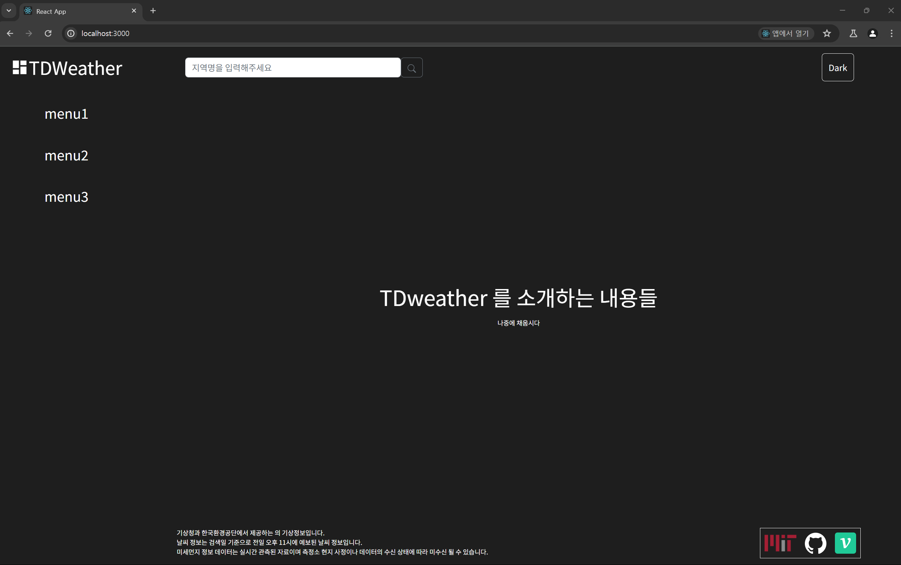
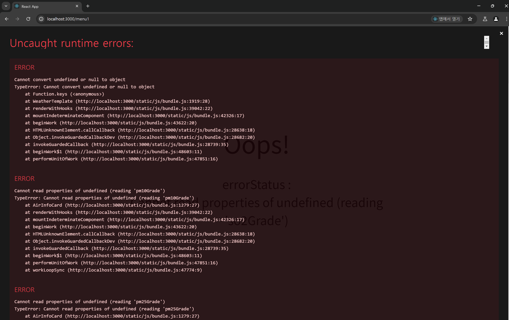
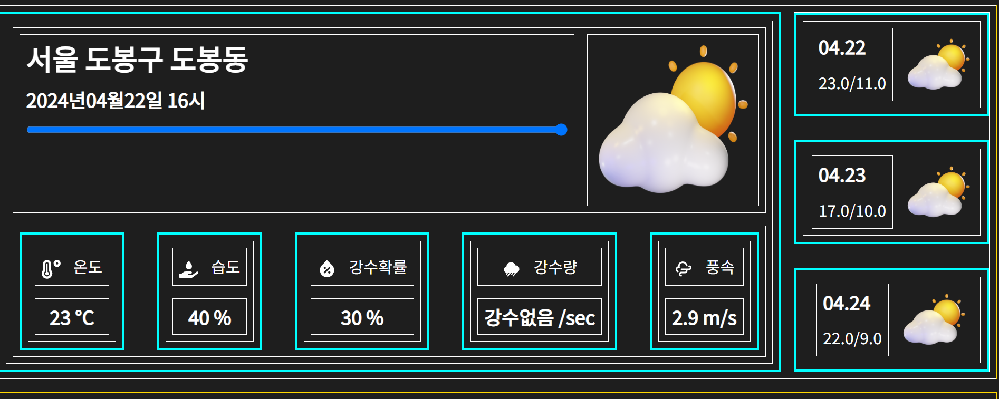

# 라우팅 기능과 패칭 기능 분리

## 문제 정의



현재 대시보드의 전체적인 윤곽은 디자인을 제외하고 모두 만들어졌다.

현재 대시보드에서 카드 뉴스 페이지를 렌더링 하기 위한 플로우 차트는 다음과 같다.



현재 이 과정의 문제점은 세 가지가 있다.

### 패칭 이후의 액션이 존재하지 않는다.



현재 `/` 경로에 대한 페이지는 다음과 같이 생겼으며

검색을 하여 모든 데이터를 패칭 해온 이후엔 직접 수동으로

사이드바에 존재하는 `menu1` 을 클릭하여 카드 뉴스 컴포넌트가 존재하는 페이지로 이동해야 한다.

### 패칭이 일어나지 않은 채 `menu1` 에 접근하면 런타임 에러가 발생한다.



`menu1` 페이지로 들어갔을 경우 `react-router-dom` 에서 렌더링 되는 `page` 컴포넌트는

전역 `state` 에 존재하는 여러 `fetched .. state` 들을 이용해 컴포넌트를 구성하는데

패칭이 일어나지 않았다면 전역 상태 값도 비어있기 때문에 런타임 에러가 발생한다.

### 해당 날씨 정보 데이터를 공유하기가 불가능하다.

현재 나는 어떤 시간, 어떤 장소와 상관 없이 모두 `/menu1` 경로에서 정보를 렌더링 하고 있다.

이에 **서울특별시 도봉구 도봉동** 을 입력한 사용자와 **제주도 특별자치시 애월읍** 을 입력한 사용자 모두 동일한 경로를 가졌다는 것이며

해당 페이지 경로를 아무리 공유해도 정보를 공유하는 것이 불가능하단 것을 의미한다.

## 문제 해결 방법 모색

### `Redux` 에 존재하는 상태 `URL query parameter` 로 변경하기

페이지를 공유 가능하게 하기 위해서

`Redux` 내부에서 저장되는 전역 상태 중 일부를 `URL` 의 쿼리 파라미터로 변경해줘야겠다.

날씨 정보 공유와 가장 상관있는 전역 상태는 아무래도 일자와 장소일 것이다.

그래서 쿼리 파라미터로 `date , lat , lon` 을 추가해주기로 했다.

> 위경도가 아닌 `location` 인 문자열로 해줄까도 생각했지만
> 인코딩되어 `%E6%A7....` 이런식으로 뚱뚱하고 못생긴 경로를 생각하니 끔찍했다.
> 그래서 `lat , lon` 으로 변경해주기로 했다.

그러면 아마 카드 컴포넌트가 렌더링 되는 경로는 `/menu1?date=20240422&lat=127&lon=37` 이런식일 것이다.

### 컴포넌트들의 이벤트 핸들러 책임 분리

#### `SearchArea / Button`


현재 `SearchArea` 컴포넌트 내부에 존재하는 버튼 컴포넌트는 온클릭 이벤트로

`useFetching` 훅을 이용해 모든 데이터를 패칭해온다.

하지만 이제 해당 버튼은 카카오 API 를 이용해 문자열로 된 위치 정보를 위경도 좌표로 받아온 후

`URL query parameter` 인 `lat , lon` 에 넣어 `react-router-dom` 의 `useNavigate` 혹은 `redirect` 를 이용해 리다이렉트 시키는 역할만 할 것이다.

#### `SideCard`



해당 영역 우측에 존재하는 `SideCard` 컴포넌트는 본래 온클릭 이벤트로

`Redux` 내부 전역 상태에 존재하던 `date` 상태값을 변경해주었다.

하지만 이제는 `URL query paramter` 인 `date` 의 값을 변경해 `redirect` 시키도록 변경해주자

### `API` 패칭은 `react-router-dom loader` 메소드가 아닌 `useEffect` 를 이용하자

라우팅을 하려고 하니 그럼 패칭도 `react-router-dom` 의 `loader` 함수로 지정해서 할까 ? 생각했었는데

현재 내 컴포넌트들은 `APIstatus state` 에 따라 렌더링 되는 양상이 다르다.

현재는 `SearchArea` 에 존재하는 버튼이 로딩중일 때엔 빙글빙글 돌아가며 추후에는 카드 컴포넌트 들도 로딩중일 땐 로딩 화면이 뜨게 변경하려고 한다.

`react-router-dom` 의 `loader` 메소드를 이용하게 되면 `Redux` 내부에 저장되어 있는 상태값들을 변경하는 것이 불가능하다.

그러니 `SearchArea` 내부에서 `useEffect` 를 이용해 데이터들을 패칭해오고

`Redux` 내부에 존재하는 여러 상태값들을 변경해주도록 하자

## 문제 해결 과정

### `router` 경로를 따로 생성해야 하나 ?

```jsx
const router = createBrowserRouter([
  {
    path: '/',
    element: <Dashboard />,
    errorElement: <ErrorPage />,
    children: [
      {
        index: true,
        element: <AboutPage />,
      },
      {
        path: '/:menuId',
        element: <MenuPage />,
      },
    ],
  },
]);
```

현재 나의 `router` 경로는 다음과 같이 생겼다.

나는 쿼리 파라미터들도 따로 `router` 내부에 정의해줘야 하나 하고 공식문서를 찾아보니

따로 지정해줄 필요 없이 `router` 에선 `/:parameter` 만 지정해주고

쿼리 파라미터들은 `useSearchParams` 를 이용해 직접적으로 접근해야 한다고 한다.

### `useFetching` 훅 1차 수정하기

```jsx
import useEveryDispatcher from './useEveryDispatcher';
import useSearchRef from './useSearchRef';

import delay from '../utils/delay';
import {
  fetchForecastFromLocation,
  fetchLocationFromString,
  fetchForecastText,
  fetchNearstStationName,
  fetchAirData,
  fetchAirTextPM,
  fetchAirTextO3,
} from '../utils/ApiUtils';
import { getAddressName } from '../utils/CoordinateUtils';

const DELAYTIME = 1000;

const useFetching = () => {
  const {
    dispatchWeather,
    dispatchWeatherText,
    disptachLocation,
    disptachStatus,
    dispatchAir,
    dispatchAirText,
  } = useEveryDispatcher();

  const inputRef = useSearchRef();

  const fetchingWeather = async () => {
    if (!inputRef.current.value) return null;

    try {
      disptachStatus('LOADING');
      await delay(DELAYTIME);
      // TODO Promise.all 로 모두 변경하칭칭
      const locationString = inputRef.current.value;

      //  카카오 API 패칭
      const locationObject = await fetchLocationFromString(locationString);
      const addressName = getAddressName(locationObject);

      // 기상청 , 에어코리아 패칭
      const stationResponse = await fetchNearstStationName(locationObject);
      const forecastWeather = await fetchForecastFromLocation(locationObject);
      const forecastWeatherText = await fetchForecastText();
      const forecastAir = await fetchAirData(stationResponse);
      const airPMText = await fetchAirTextPM();
      const airO3Text = await fetchAirTextO3();

      // TODO dispatch  All 로 변경하기
      disptachLocation(addressName);
      dispatchWeather(forecastWeather);
      dispatchWeatherText(forecastWeatherText);
      dispatchAir(forecastAir);
      dispatchAirText({ PM: airPMText, O3: airO3Text });
    } catch (e) {
      console.error(e);
      disptachStatus(e.message); // 에러시에는 에러 메시지를 status에 저장
      // TODO 에러 타입 별 에러 메시지 정리하기
      await delay(DELAYTIME);
    } finally {
      disptachStatus('OK');
    }
  };
  return fetchingWeather;
};

export default useFetching;
```

현재 데이터를 패칭해오는 `useFetching` 훅은 카카오 API 패칭, 기상청 API 패칭 , 에어코리아 API 패칭 세 가지 모든 일을 동시에 하고 있다.

나는 현재 라우팅을 위해 카카오 API 패칭과 기상청 , 에어코리아 API 패칭 두 가지 영역으로 분리한 후

각각 다른 시점에 패칭을 하고자 한다.

우선 `useFetching` 훅을 분리하기 전 리팩토링을 통해 각 메소드 별 의존성을 제거해주도록 하자

예를 들어 `FetchingWeather` 메소드 내부 중

```jsx
// 카카오 API 패칭
const locationObject = await fetchLocationFromString(locationString);
const addressName = getAddressName(locationObject);

// 기상청 , 에어코리아 패칭
const stationResponse = await fetchNearstStationName(locationObject);
const forecastWeather = await fetchForecastFromLocation(locationObject);
```

이 부분에서 기상청 , 에어코리아 패칭 부분에서 카카오 API패칭의 결과값인 `locationObject` 을 인수로 받고 있기 때문에

두 메소드는 분리 하기가 힘들다.

하지만 메소드 내부를 살펴보면 `fetchNearstStationName` , `fetchForecastFromLocation` 메소드 모두 `locationObject` 내부에 존재하는 위경도 값만을 이용한다.

추후 나는 `fetchNearstStationName` , `fetchForecastFromLocation` 메소드를 호출 할 때 `lat , lon query params` 를 이용해줄 것이기 때문에

기상청, 에어코리아 패칭 부분에서 인수로 `lat , lon` 을 받아주도록 변경해주자

```jsx
// 카카오 API 패칭
const locationString = inputRef.current.value;
const { addressName, lat, lon } = await fetchLocationFromString(locationString);
// 기상청,  에어코리아 API 패칭
const stationResponse = await fetchNearstStationName(lat, lon);
const forecastWeather = await fetchForecastFromLocation(lat, lon);
```

메소드 내부를 변경하여 `fetchLocationFromString` 메소드가 `locationObject` 가 아니라 `addressName , lat , lon` 들을 반환하도록 변경해주었다.

이를 통해 `fetchingWeather` 메소드를 분리해 줄 준비는 모두 끝났다.
