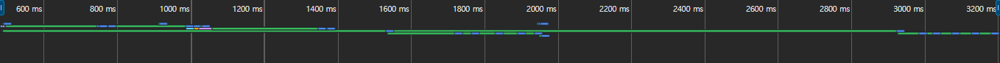
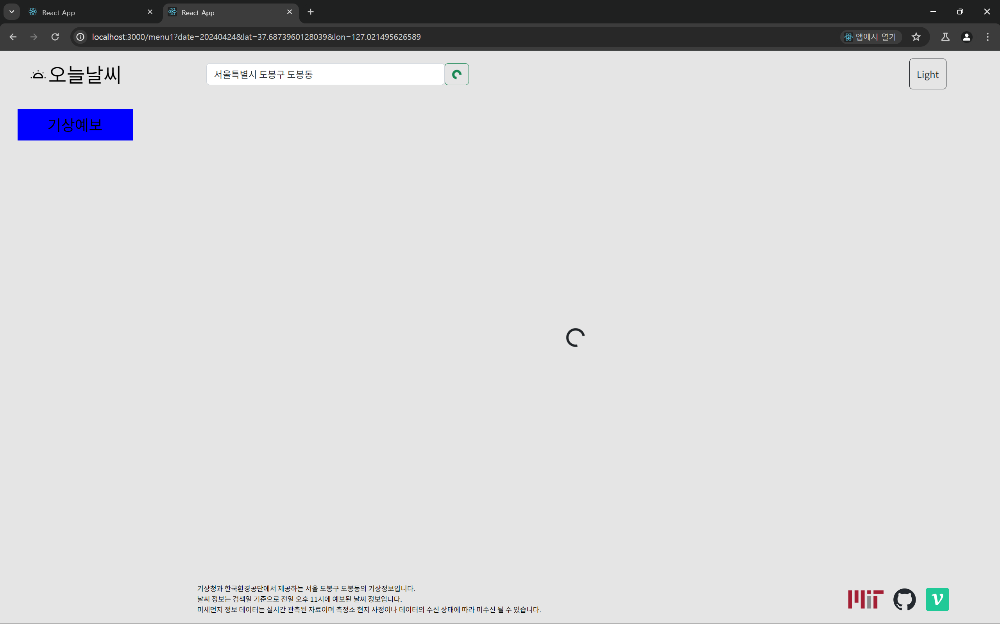
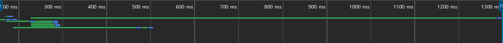

# 문제 정의

나의 웹 페이지에서는 데이터 요청을 다음과 같은 경우들에 보낸다.

### 검색 장소에서 특정 장소명이 검색 되었을 경우


```jsx
import { fetchLocationFromString } from '../utils/ApiUtils';
import { getCurrentTime } from '../utils/DateUtils';
import useEveryDispatcher from './useEveryDispatcher';
import useSearchRef from './useSearchRef';

import { useNavigate } from 'react-router-dom';

// 서울특별시 종로구의 위경도
const BASE_LAT = 37.5735042429813;
const BASE_LON = 126.978989954189;

const useHandleClick = () => {
  const inputRef = useSearchRef();
  const navigate = useNavigate();
  const { disptachLocation, disptachStatus } = useEveryDispatcher();

  const { fullDate } = getCurrentTime();

  const searchParams = new URLSearchParams([
    ['date', fullDate],
    ['lat', BASE_LAT],
    ['lon', BASE_LON],
  ]);

  const fetchingLocation = async () => {
    if (!inputRef.current?.value) return null;
    try {
      disptachStatus('LOADING');
      const locationName = inputRef.current.value;
      const { addressName, lat, lon } = await fetchLocationFromString(
        locationName,
      );

      searchParams.set('lat', lat);
      searchParams.set('lon', lon);
      disptachLocation({ addressName, lat, lon });
    } catch (e) {
      disptachStatus(e.message);
      console.error(e);
    }
  };

  const navigateToCardPage = () => {
    navigate(`/menu1?${searchParams.toString()}`);
  };

  return { fetchingLocation, navigateToCardPage };
};

export default useHandleClick;
```

해당 경우는 단순하게 카카오 API 한 곳에 한 번만의 데이터 요청이 일어나기 때문에

특별하게 리팩토링 할 부분이 없다.

### 날씨 정보 가져오는 경우

```jsx
import { useEffect } from 'react';
import {
  fetchAirData,
  fetchAirTextO3,
  fetchAirTextPM,
  fetchForecastFromLocation,
  fetchForecastText,
  fetchNearstStationName,
} from '../utils/ApiUtils';
import useEveryDispatcher from './useEveryDispatcher';
import useLocation from './useLocation';

import { useNavigate } from 'react-router-dom';
import delay from '../utils/delay';
const DELAY_TIME = 1000;

const useFetchingWeatherAir = () => {
  const { lat, lon } = useLocation();
  const navigate = useNavigate();
  const {
    dispatchWeather,
    dispatchWeatherText,
    disptachStatus,
    dispatchAir,
    dispatchAirText,
  } = useEveryDispatcher();

  useEffect(() => {
    // ! TODO useEffect 가 두번씩 호출되는 이유가 뭘까 ?
    // ! 의존성 배열은 잘 들어가있는 것 같은데
    const fetchingWeatherAir = async () => {
      try {
        const forecastWeather = await fetchForecastFromLocation(lat, lon);
        const forecastWeatherText = await fetchForecastText(lat, lon);

        const stationName = await fetchNearstStationName(lat, lon);
        const forecastAir = await fetchAirData(stationName);
        const airPMText = await fetchAirTextPM();
        const airO3Text = await fetchAirTextO3();

        dispatchWeather(forecastWeather);
        dispatchWeatherText(forecastWeatherText);
        dispatchAir(forecastAir);
        dispatchAirText({ PM: airPMText, O3: airO3Text });
        disptachStatus('OK');
      } catch (e) {
        console.error(e);
        disptachStatus(e.message);
        await delay(DELAY_TIME);
        navigate('/');
        disptachStatus('OK');
      }
    };
    fetchingWeatherAir();
  }, [lat, lon]);
};

export default useFetchingWeatherAir;
```

해당 `useFetchingWeatherAir` 훅은 6개의 서로 다른 엔드포인트에 `API` 요청을 보낸다.

이 때 `async , await` 문법으로 인해 각 `fetching` 과정들이 순차적으로 진행된다.



이로 인해 전체 소요시간이 약 `3000ms` 정도가 걸리며

소요되는 `3000ms` 동안은 다음과 같은 로딩페이지가 보인다는 것이다.



이를 해결하기 위해 `async/await` 로 범벅이 되어있는 해당 함수를

`Promise.all` 을 이용해 병렬처리 해주도록 하자

# 문제 해결 과정

### `Promise.all` 을 사용 가능한 경우와 불가능한 경우

```jsx
// 불가능
const stationName = await fetchNearstStationName(lat, lon);

// 가능
const forecastWeather = await fetchForecastFromLocation(lat, lon);
const forecastWeatherText = await fetchForecastText(lat, lon);
const forecastAir = await fetchAirData(stationName);
const airPMText = await fetchAirTextPM();
const airO3Text = await fetchAirTextO3();
```

각 과정에서 `stationName` 을 가져오는 부분은 다른 것들과 `Promise.all` 로 병렬처리 하는 것이 불가능하다.

`fetchNearstStationName` 함수의 반환값이 `fetchAirData` 의 매개변수로 사용되기 때문이다.

해당 부분들을 `Promise.all` 을 이용해 변경해주자

```jsx
    const fetchingWeatherAir = async () => {
      try {
        const stationName = await fetchNearstStationName(lat, lon);

        const [
          forecastWeather,
          forecastWeatherText,
          forecastAir,
          airPMText,
          airO3Text,
        ] = await Promise.all([
          fetchForecastFromLocation(lat, lon),
          fetchForecastText(lat, lon),
          fetchAirData(stationName),
          fetchAirTextPM(),
          fetchAirTextO3(),
        ]);
        ...
      }
```

다음처럼 변경해주었을 때의 모습은 다음과 같다.



이전 `3000ms` 에서 `1300ms` 까지 짧은 시간으로 단축 시킨 모습을 볼 수 있다.

가장 오랜 응답 시간이 걸렸던 (`1000ms`) 요청은 3일간의 예상 날씨를 패칭해오는

`fetchForecastFromLocation` 메소드였다.
