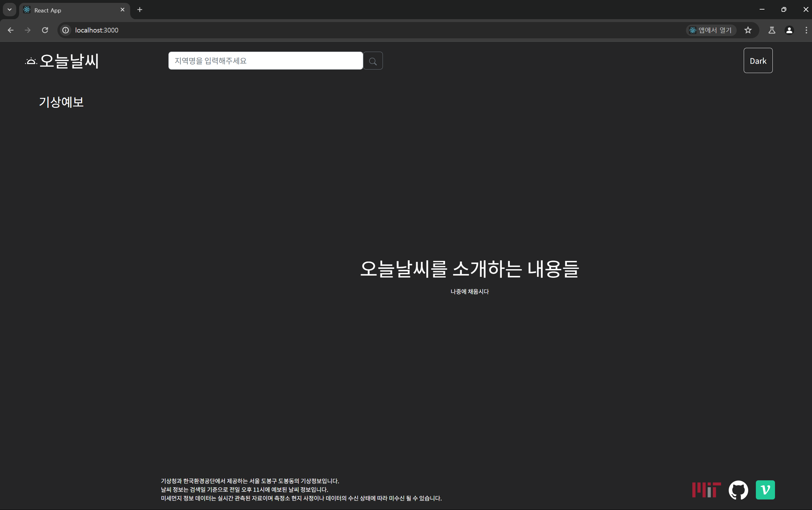
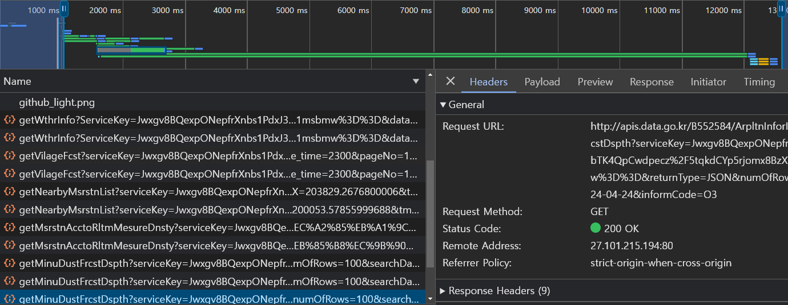
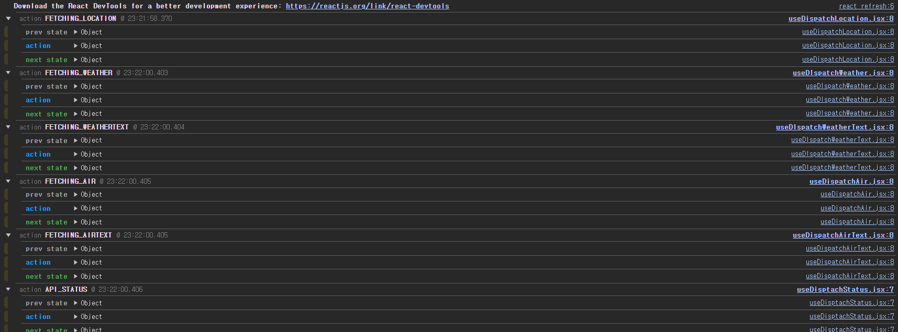

# 사용자가 쿼리문을 통해 직접적으로 접근했을 때 `useEffect` 추가하기


현재는 사용자가 `/` 경로에 접근한 후 `SearchArea` 에서 지역명을 입력해야

전역 상태 중 하나인 `lat , lon , addreeName` 이 업데이트 되는구조이다.

이 때 `addressName` 은 카드뉴스의 제목과 `ContentFooter` 영역의 설명글에 사용되는 상태값이다.

이 때 만약 사용자가 `/` 경로에 접근하는 것이 아니라 바로 `/menu1?date , query ..` 에 접근하게 된다면

`lat , lon  , addressName` 상태값은 쿼리문에 존재하는 값이 아닌

`dataReducer` 를 생성 할 때 사용된 `initalState` 값을 사용하게 된다.

```jsx
const initalLocation = {
  lat:
    sessionStorage.getItem('lat') ||
    localStorage.getItem('lat') ||
    '37.5868624440018',
  lon:
    sessionStorage.getItem('lon') ||
    localStorage.getItem('lon') ||
    '127.00060686405',
  addressName:
    sessionStorage.getItem('addressName') ||
    localStorage.getItem('addressName') ||
    '서울특별시 종로구 혜화동',
};

const inistalState = {
  fetchedLocation: initalLocation,
};
```

이 때 만약 사용자가 접근한 쿼리문의 `lat , lon` 이 `initalLocation` 에 존재하는 `lat , lon` 값과 다르다면

쿼리문에 해당하는 `lat , lon , addreeName` 으로 데이터 패칭 및 렌더링이 일어나는 것이 아닌

`initalLocation` 에 저장된 값으로 패칭과 렌더링이 일어난다.

이에, 쿼리문에 적힌 `lat , lon` 과 초기 `Redux` 에 저장된 `lat , lon  ,addressName` 이 다르다면

`lat , lon , addreeName state` 를 변경시키는 로직을 추가해주도록 하자

```jsx
/**
 * 해당 함수는 urlSearchParams로 적힌 lat , lon 쿼리 파라미터가
 * Redux initalState 로 저장된 lat , lon 과 값이 다를 때 호출되는 함수
 */
const fetchLocationFromCoord = async (p_lat, p_lon) => {
  try {
    const { APIKEY, URI } = initalKaKaoAPI;
    const ENDPOINT = `${URI}?x=${p_lon}&y=${p_lat}`;
    const response = await fetch(ENDPOINT, {
      headers: { Authorization: APIKEY },
    });

    if (!response.ok) {
      throw new Error('카카오 API 네트워크가 불안정합니다. 다시 시도해주세요');
    }
    const json = await response.json();
    const addressObject = json.documents[0];
    const addressName = addressObject['address_name'];
    const { x: lon, y: lat } = addressObject;
    return { addressName, lat, lon };
  } catch (e) {
    console.error(e);
  }
};
```

다음과 같이 `p_lat , p_lon` 을 매개변수로 받아 해당 `lat, lon` 값에 맞춰 카카오 `API` 에 요청을 보내

주소 정보를 페칭해오는 함수를 생성해주자

`p` 라는 접두사가 붙은 이유는 `URL` 의 `search param` 인 `lat , lon` 을 인수로 받을 것이기 때문이다.

이후 해당 함수를 호출하는 커스텀 훅을 생성해주자

```jsx
import useLocation from './useLocation';
import useDispatchLocation from './useDispatchLocation';
import { useEffect } from 'react';
import { fetchLocationFromCoord } from '../utils/ApiUtils';
const useUpdateInitalLocation = () => {
  const { lat, lon } = useLocation();
  const dispatchLocation = useDispatchLocation();

  useEffect(() => {
    const searchParams = new URLSearchParams(window.location.search);
    const p_lat = searchParams.get('lat');
    const p_lon = searchParams.get('lon');

    if (!p_lat || !p_lon) return;
    if ((p_lat === lat) & (p_lon === lon)) return;

    const updateInitalLocationState = async () => {
      const initalLocation = await fetchLocationFromCoord(p_lat, p_lon);
      dispatchLocation(initalLocation);
    };
    updateInitalLocationState();
  }, []);
};

export default useUpdateInitalLocation;
```

`useUpdateInitalLocation` 훅은 `Redux` 가 처음 생성될 때 설정된 `inital lat , lon` 값과

사용자가 접속 할 때 이용한 `p_lat , p_lon` 의 값을 비교한다.

만약 `Redux` 에 저장된 `inital lat , lon` 값과 `p_lat , p_lon` 값이 다를 경우 `fetchLocationFromCoord` 함수를 통해 해당 `p_lat , p_lon` 의 `addressName` 까지 구해오고

구해온 해당 정보를 `Redux` 에 업데이트 한다.

이후 해당 훅은 `ContentMain` 에 존재하는 `SearchForm` 내부에서 호출해주도록 한다.

```jsx
const SearchForm = ({ children }) => {
  useUpdateInitalLocation();
  return <Form className={moduleCss.searchForm}>{children}</Form>;
};
```

이렇게 되면 `Redux` 내부에 존재하는 초기 `lat , lon` 값과 사용자가 직접 입력해서 들어온 `lat , lon` 값이 다를 경우 , 사용자가 입력한 `lat , lon` 값에 맞춰 적절한 값을 패칭해올 수 있다.

---

하지만 해결해야 할 문제가 생겼다.

진짜 오마이갓



그것은 바로 `p_lat , p_lon` 값과 `lat , lon` 값이 다를 경우

`lat , lon` 값으로 한 번 패칭을 먼저 보내고

그 이후 `p_lat , p_lon` 값으로 패칭을 한 번 더 보낸다는 것이다.

---

해결됐다.

우선 처음 들어올 때 `initalstate` 의 `lat , lon` 의 값을 `query parameter` 에서 우선적으로 가져오도록 하였다.

```jsx
const searchParams = new URLSearchParams(window.location.search);
const searchLat = searchParams.get('lat');
const searchLon = searchParams.get('lon');

const initalLocation = {
  lat:
    Number(searchLat) ||
    sessionStorage.getItem('lat') ||
    localStorage.getItem('lat') ||
    '37.5868624440018',
  lon:
    Number(searchLon) ||
    sessionStorage.getItem('lon') ||
    localStorage.getItem('lon') ||
    '127.00060686405',
  addressName:
    sessionStorage.getItem('addressName') ||
    localStorage.getItem('addressName') ||
    '서울특별시 종로구 혜화동',
};
```

이 때 `Redux` 에 저장되는 `lat , lon` 의 타입은 `Number` 타입이기 때문에 `Number` 로 맵핑하여 해주었다.

이를 통해 `lat , lon` 이 입력된 쿼리문으로 직접 들어올 때에도 `FETCH_LOCATION` 액션이 먼저 시행 된 후

날씨 정보를 패칭해올 수 있게 되었다.


