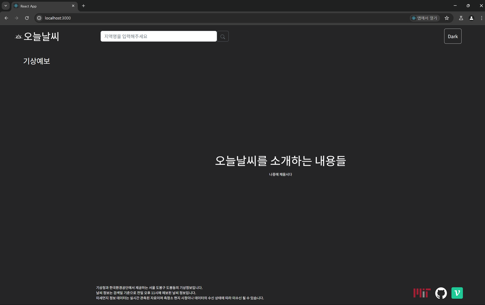

# 사용자의 현재 위치 조회 추가하기



해당 페이지를 처음 들어온 사용자가 아무런 위치 정보를 검색하지 않아도

기상 예보 버튼을 클릭했을 때 가장 기대하는 화면은 본인의 현재 위치의 날씨일 것이다.

이에 `window.navigator` 객체를 활용하여 사용자의 현재 위치를 조회하도록 해주자

현재 `Redux` 에서 사용자의 초기 위치 정보를 셋팅하는 `inital State` 는 다음과 같이 생겼다.

```jsx
const inistalState = {
  fetchedLocation: {
    lat:
      new URLSearchParams(window.location.search).get('lat') ||
      sessionStorage.getItem('lat') ||
      localStorage.getItem('lat') ||
      '37.5868624440018',
    lon:
      new URLSearchParams(window.location.search).get('lon') ||
      sessionStorage.getItem('lon') ||
      localStorage.getItem('lon') ||
      '127.00060686405',
    // TODO addressName 도 따로 가져오도록 변경하기
    addressName:
      sessionStorage.getItem('addressName') ||
      localStorage.getItem('addressName') ||
      '서울특별시 종로구 혜화동',
  },
};
```
